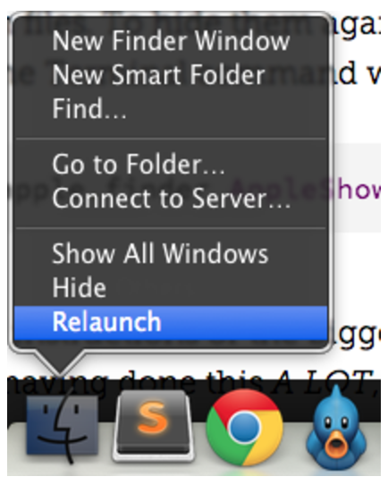

# Display hidden files on MacOS

**Step 1.**

Open `Terminal`.

**Step 2.**

In Terminal, paste the following:

```
defaults write com.apple.finder AppleShowAllFiles YES
```

**Step 3.**

Press `return`.

**Step 4.**

Hold the `'Option/alt'` key, then `right click` on the `Finder` icon in the dock and click `Relaunch`.

