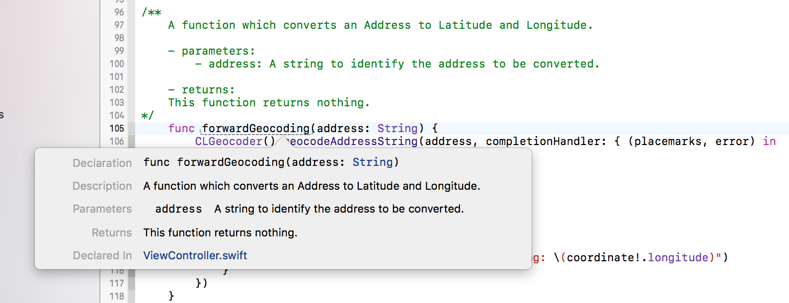
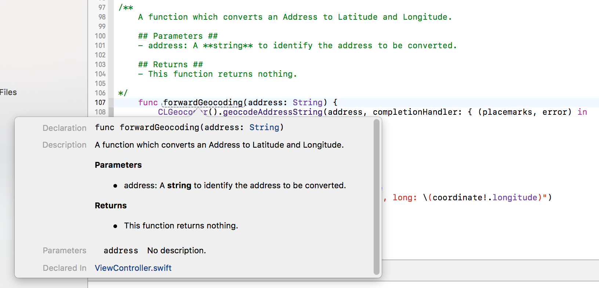

# Documenting your code in Xcode (Inline Documentation Guide)

Documentation plays an important role while development, as it makes your code more readable and other developers in the team can find it easy to understand the functionality of a piece of code.

Every Class and every Method of the component should have an inline documentation regarding it's functionality. It comes handy when the user using the component does **"Option + Click"** on the class name or method name, and a popover containing all the documentation is shown to him/her.

There can be **`Class Level Documentation`** as well as **`Method Level Documentation`**.

### Approach 1


Now when the user "Option + Click" on the ```forwardGeocoding``` method, he/she gets to see a pop over like:



### Approach 2



### Approach 3

```
/// - Parameter title:
/// Accepts title of alert.
/// - Parameter message:
/// Accepts message of alert.
/// - Parameter viewController:
/// Accepts the current viewController where we want to show the alert.
    
public class func showErrorMessage(_ title: String,
                                       message: String,
                                       viewController: UIViewController) {
    let ac = UIAlertController(title: title,
                                   message: message,
                                   preferredStyle: UIAlertControllerStyle.alert)

    let handler = { (action: UIAlertAction) -> Void in
            ac.dismiss(animated: true, completion: nil)
    }
    let acAction = UIAlertAction(title: NSLocalizedString("Okay", comment: "Okay"),
                                     style: UIAlertActionStyle.default,
                                     handler: handler)
    ac.addAction(acAction)
    viewController.present(ac, animated: true, completion: nil)
}
```