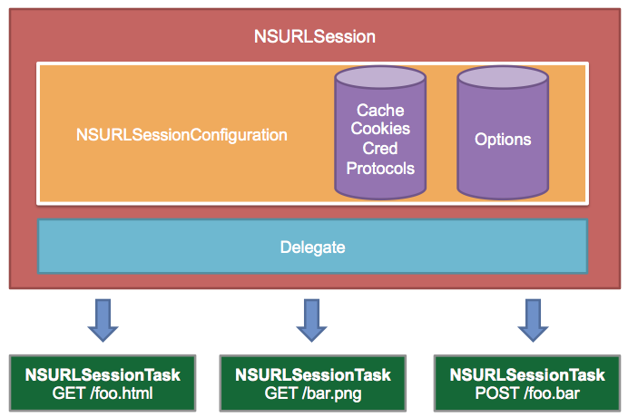
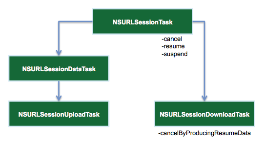
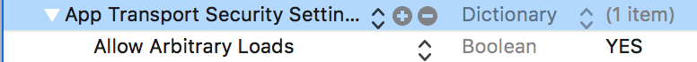
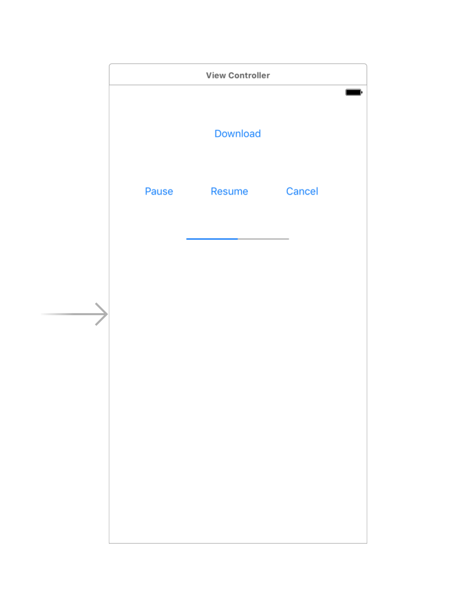
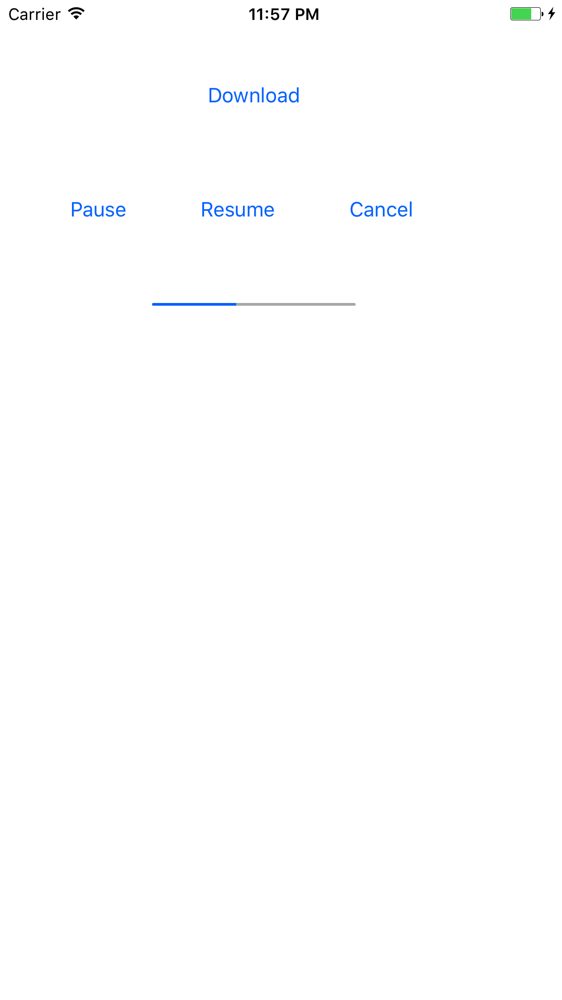
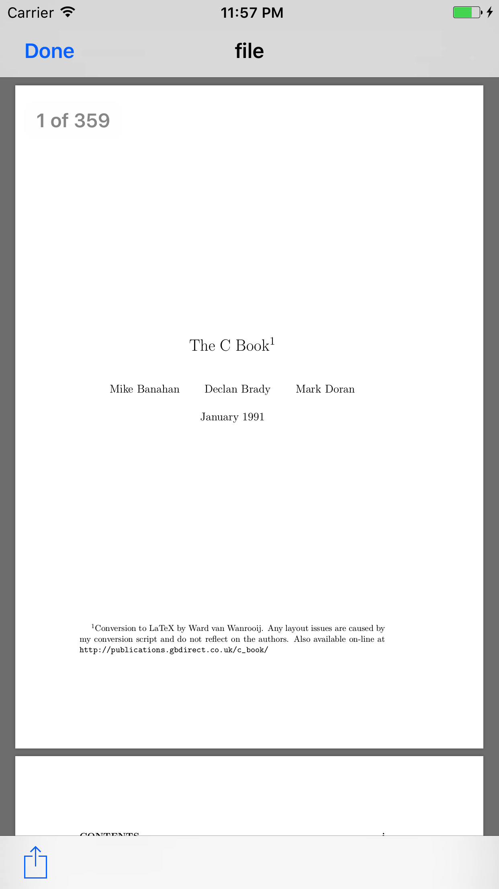

# Downloading a file using URLSession

### Introduction

You will often need to download content to use in your app. `NSURLConnection` used to be a great interface to perform networking tasks along with `NSURLSession`. But since it’s deprecated in iOS 9, Apple recommends you use the `URLSession` class from now on for all server operations, like http requests, ftp operations and file download/upload tasks.

### Overview of NSURLSession

`NSURLSession` is technically both a class and a `suite of classes` for handling HTTP/HTTPS-based requests:



`NSURLSession` is the key object responsible for sending and receiving HTTP requests.

You create it via `NSURLSessionConfiguration`, which comes in three flavors:

- `defaultSessionConfiguration`: Creates a default configuration object that uses the disk-persisted global cache, credential and cookie storage objects.

- `ephemeralSessionConfiguration`: Similar to the default configuration, except that all session-related data is stored in memory. Think of this as a “private” session.

- `backgroundSessionConfiguration`: Lets the session perform upload or download tasks in the background. Transfers continue even when the app itself is suspended or terminated.

`NSURLSessionConfiguration` also lets you configure session properties such as timeout values, caching policies and additional HTTP headers.

`NSURLSessionTask` is an abstract class that denotes a task object. A session creates a task, which does the actual work of fetching data and downloading or uploading files.

There are three types of concrete session tasks in this context:

- `NSURLSessionDataTask`: Use this task for HTTP GET requests to retrieve data from servers to memory.

- `NSURLSessionUploadTask`: Use this task to upload a file from disk to a web service, typically via a HTTP POST or PUT method.

- `NSURLSessionDownloadTask`: Use this task to download a file from a remote service to a temporary file location.



You can also suspend, resume and cancel tasks.

`NSURLSessionDownloadTask` has the additional ability to pause for future resumption.

Generally, `NSURLSession` returns data in two ways:

- via a completion handler when a task finishes either successfully or with an error.

- by calling methods on a delegate that you set upon session creation.

----

### Example

**Step 1**

Create a project `DownloadManager`.

**Step 2**

In it's `Info.plist`, add:



We disable the App Transport Security so that it won’t block access to the URL.

**Step 3**

In the storyboard, add 4 button and 1 progress view.



Create an @IBOutlet for the progress view and @IBAction for the buttons in the `ViewController.swift`.

**Step 4**

Inside `ViewController.swift`, write:

```
import UIKit

class ViewController: UIViewController, URLSessionDownloadDelegate, UIDocumentInteractionControllerDelegate {
    
    var downloadTask: URLSessionDownloadTask!
    var backgroundSession: URLSession!
    
    @IBAction func startDownload(_ sender: UIButton) {
        let url = URL(string: "http://publications.gbdirect.co.uk/c_book/thecbook.pdf")!
        //let url = URL(string: "http://a907.phobos.apple.com/us/r30/Music3/v4/b8/b3/7a/b8b37a93-2154-34da-74fc-8e8a316979a8/mzaf_7991652075174454658.plus.aac.p.m4a")!
        //let url = URL(string: "http://www.planwallpaper.com/static/images/79438-blue-world-map_nJEOoUQ.jpg")!
        downloadTask = backgroundSession.downloadTask(with: url)
        downloadTask.resume()
    }
    
    @IBAction func pause(_ sender: UIButton) {
        
        if downloadTask != nil{
            downloadTask.suspend()
        }
    }
    
    @IBAction func resume(_ sender: UIButton) {
        if downloadTask != nil{
            downloadTask.resume()
        }
    }
    
    @IBAction func cancel(_ sender: UIButton) {
        if downloadTask != nil{
            downloadTask.cancel()
        }
    }
    
    @IBOutlet weak var progressView: UIProgressView!
    
    override func viewDidLoad() {
        super.viewDidLoad()
        // Do any additional setup after loading the view, typically from a nib.
        
        let backgroundSessionConfiguration = URLSessionConfiguration.background(withIdentifier: "backgroundSession")
        backgroundSession = Foundation.URLSession(configuration: backgroundSessionConfiguration, delegate: self, delegateQueue: OperationQueue.main)
        progressView.setProgress(0.0, animated: false)
        
        
    }
    
    //MARK: URLSessionDownloadDelegate
    
    // Delegate Method1 of URLSessionDownloadDelegate
    func urlSession(_ session: URLSession,
                    downloadTask: URLSessionDownloadTask,
                    didFinishDownloadingTo location: URL){
        
        let path = NSSearchPathForDirectoriesInDomains(FileManager.SearchPathDirectory.documentDirectory, FileManager.SearchPathDomainMask.userDomainMask, true)
        let documentDirectoryPath:String = path[0]
        let fileManager = FileManager()
        let destinationURLForFile = URL(fileURLWithPath: documentDirectoryPath.appendingFormat("/file.pdf"))
        //let destinationURLForFile = URL(fileURLWithPath: documentDirectoryPath.appendingFormat("/song.m4a"))
        //let destinationURLForFile = URL(fileURLWithPath: documentDirectoryPath.appendingFormat("/img.jpg"))
        if fileManager.fileExists(atPath: destinationURLForFile.path){
            showFileWithPath(path: destinationURLForFile.path)
        }
        else{
            do {
                try fileManager.moveItem(at: location, to: destinationURLForFile)
                // show file
                showFileWithPath(path: destinationURLForFile.path)
            }catch{
                print("An error occurred while moving file to destination url")
            }
        }
    }
    
    // Delegate Method2 of URLSessionDownloadDelegate
    func urlSession(_ session: URLSession,
                    downloadTask: URLSessionDownloadTask,
                    didWriteData bytesWritten: Int64,
                    totalBytesWritten: Int64,
                    totalBytesExpectedToWrite: Int64){
        progressView.setProgress(Float(totalBytesWritten)/Float(totalBytesExpectedToWrite), animated: true)
    }
    
    //MARK: URLSessionTaskDelegate
    
    func urlSession(_ session: URLSession,
                    task: URLSessionTask,
                    didCompleteWithError error: Error?){
        downloadTask = nil
        progressView.setProgress(0.0, animated: true)
        if (error != nil) {
            print(error!.localizedDescription)
            
        }else{
            print("The task finished transferring data successfully")
        }
    }
    
    // Method to open the File in a Document Controller
    func showFileWithPath(path: String){
        let isFileFound:Bool? = FileManager.default.fileExists(atPath: path)
        if isFileFound == true{
            let viewer = UIDocumentInteractionController(url: URL(fileURLWithPath: path))
            viewer.delegate = self
            viewer.presentPreview(animated: true)
        }
    }
    
    //MARK: UIDocumentInteractionControllerDelegate
    
    // Delegate Method of UIDocumentInteractionControllerDelegate
    func documentInteractionControllerViewControllerForPreview(_ controller: UIDocumentInteractionController) -> UIViewController
    {
        return self
    }
    
    override func didReceiveMemoryWarning() {
        super.didReceiveMemoryWarning()
        // Dispose of any resources that can be recreated.
    }
}
```

### Explaination

The project you will build by the end of this tutorial will download a PDF file and load it on the screen.

If you take a look at the user interface in the project, there is already four buttons to manage the download operation. The common states for a download task are the pause/resume/stop/start actions. There is also a progress view to report the download progress instantly to the user.

The `URLSession` hierarchy requires a specific configuration. When a session object is about to be created, it needs a configuration object that define the behavior and policies to use when uploading and downloading content. In this tutorial, you gonna use a background session configuration in order to allow HTTP download to be performed in the background.

Select the `ViewController.swift` file from the Project navigator view and add the following properties declarations:

```
var downloadTask: URLSessionDownloadTask!
var backgroundSession: URLSession!
```

The properties above are declared as `implicitly unwrapped optionals` which explains why you put the exclamation mark after their types. Declaring the properties this way will relieve us from using the question mark (?) each time you use the property to unwrap its value, since we know the property value is confirmed to exist immediately after the optional is first defined.

Next, locate the `viewDidLoad` method and implement the following code inside:

```
let backgroundSessionConfiguration = URLSessionConfiguration.background(withIdentifier: "backgroundSession")
backgroundSession = Foundation.URLSession(configuration: backgroundSessionConfiguration, delegate: self, delegateQueue: OperationQueue.main)
progressView.setProgress(0.0, animated: false)
```

The code above will instantiate a background session configuration object and use it to create an URLSession instance. As I said earlier, the background session configuration is what enables the session object to carry on the download in the background.

You also set the progress property of the UIProgressView object to 0 to get ready for the download operation.

Good, now locate the `startDownload` action method and copy the following code inside:

```
let url = URL(string: "http://publications.gbdirect.co.uk/c_book/thecbook.pdf")!
//let url = URL(string: "http://a907.phobos.apple.com/us/r30/Music3/v4/b8/b3/7a/b8b37a93-2154-34da-74fc-8e8a316979a8/mzaf_7991652075174454658.plus.aac.p.m4a")!
//let url = URL(string: "http://www.planwallpaper.com/static/images/79438-blue-world-map_nJEOoUQ.jpg")!
downloadTask = backgroundSession.downloadTask(with: url)
downloadTask.resume()
```

This will construct an URL object for a “PDF ebook”. Then it will instantiate an `URLSessionDownloadTask` object to initiate and manage the download operation of the file. Calling the resume method will start the download task immediately.

It works for image and music files as well.

Starting the download operation will imply some events to be raised by the download task object (i.e: Bytes are being downloaded, file did finish downloading, etc). To react to such events accordingly, you will need to implement some protocol methods.

First, make the class conform to the `URLSessionDownloadDelegate` protocol by changing the class declaration to the following:

```
class ViewController: UIViewController, URLSessionDownloadDelegate {
```

Next, implement the following `URLSessionDownloadDelegate` protocol methods before the class closing bracket:

```
// Delegate Method1 of URLSessionDownloadDelegate
func urlSession(_ session: URLSession,
                downloadTask: URLSessionDownloadTask,
                didFinishDownloadingTo location: URL){
    
    let path = NSSearchPathForDirectoriesInDomains(FileManager.SearchPathDirectory.documentDirectory, FileManager.SearchPathDomainMask.userDomainMask, true)
    let documentDirectoryPath:String = path[0]
    let fileManager = FileManager()
    let destinationURLForFile = URL(fileURLWithPath: documentDirectoryPath.appendingFormat("/file.pdf"))
    //let destinationURLForFile = URL(fileURLWithPath: documentDirectoryPath.appendingFormat("/song.m4a"))
    //let destinationURLForFile = URL(fileURLWithPath: documentDirectoryPath.appendingFormat("/img.jpg"))
    if fileManager.fileExists(atPath: destinationURLForFile.path){
        showFileWithPath(path: destinationURLForFile.path)
    }
    else{
        do {
            try fileManager.moveItem(at: location, to: destinationURLForFile)
            // show file
            showFileWithPath(path: destinationURLForFile.path)
        }catch{
            print("An error occurred while moving file to destination url")
        }
    }
}
    
// Delegate Method2 of URLSessionDownloadDelegate
func urlSession(_ session: URLSession,
                downloadTask: URLSessionDownloadTask,
                didWriteData bytesWritten: Int64,
                totalBytesWritten: Int64,
                totalBytesExpectedToWrite: Int64){
    progressView.setProgress(Float(totalBytesWritten)/Float(totalBytesExpectedToWrite), animated: true)
}
```

Let’s breakdown the code above:

// 1: This protocol method will tell the delegate that the download task has finished downloading. You just checked whether the file already exists. If so, the code will load the file immediately, otherwise, it will move it to a new location before loading it.

Embedding the `moveItem` method inside a do-catch bloc is mandatory since this method may throw errors.

// 2: Here you just benefit from the useful informations this protocol method gives you. Precisely the `totalBytesWritten` and `totalBytesExpectedToWrite` parameters. As the method periodically informs the delegate about the download progress, you just calculated the downloaded bytes and updated the progress view accordingly.

Let’s implement the `showFileWithPath` method which will load the PDF file once it’s downloaded. Copy the following code inside the class:

```
func showFileWithPath(path: String){
let isFileFound:Bool? = FileManager.default.fileExists(atPath: path)
if isFileFound == true{
    let viewer = UIDocumentInteractionController(url: URL(fileURLWithPath: path))
    viewer.delegate = self
    viewer.presentPreview(animated: true)
}
}
```

The method above will use the `path` string to load the file using the `UIDocumentInteractionController` class.

`UIDocumentInteractionController` requires a delegate as well as implementing a `UIDocumentInteractionControllerDelegate` protocol method in order to be able to load a preview screen for the file.

Copy the following protocol method before the class closing bracket:

```
func documentInteractionControllerViewControllerForPreview(_ controller: UIDocumentInteractionController) -> UIViewController
{
return self
}
```

The method above will return the current view controller as the preview controller of the PDF file.

Next, change the class declaration to the following:

```
class ViewController: UIViewController, URLSessionDownloadDelegate, UIDocumentInteractionControllerDelegate {
```

Each `URLSession` task may encounter an issue and end up with an error, it’s recommended that we react to such scenario accordingly. To do so, copy the following `URLSessionTaskDelegate` protocol method inside the class:

```
func urlSession(_ session: URLSession,
             task: URLSessionTask,
             didCompleteWithError error: Error?){
downloadTask = nil
progressView.setProgress(0.0, animated: true)
if (error != nil) {
   print(error!.localizedDescription)
}else{
   print("The task finished transferring data successfully")
}
}
```

Let’s finish up by implementing the remaining action methods for the pause/resume/cancel operations.

Change the pause, the resume and the cancel methods implementations to the following:

```
@IBAction func pause(sender: AnyObject) {
        if downloadTask != nil{
            downloadTask.suspend()
        }
}
@IBAction func resume(sender: AnyObject) {
        if downloadTask != nil{
            downloadTask.resume()
        }
}
@IBAction func cancel(sender: AnyObject) {
        if downloadTask != nil{
            downloadTask.cancel()
        }
}
```

### Output





### Refer

[https://www.raywenderlich.com/110458/nsurlsession-tutorial-getting-started](https://www.raywenderlich.com/110458/nsurlsession-tutorial-getting-started)