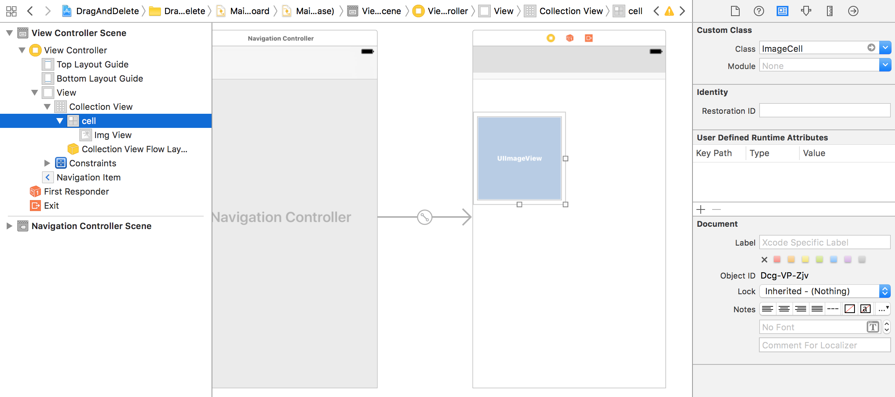
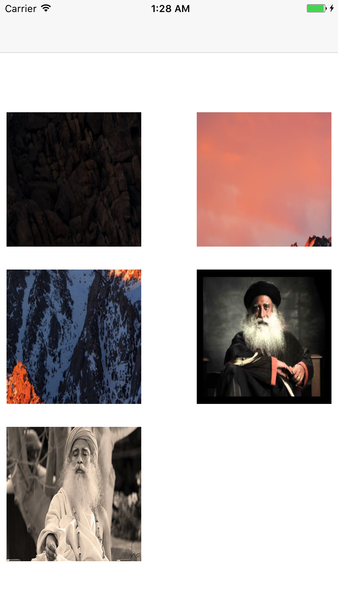
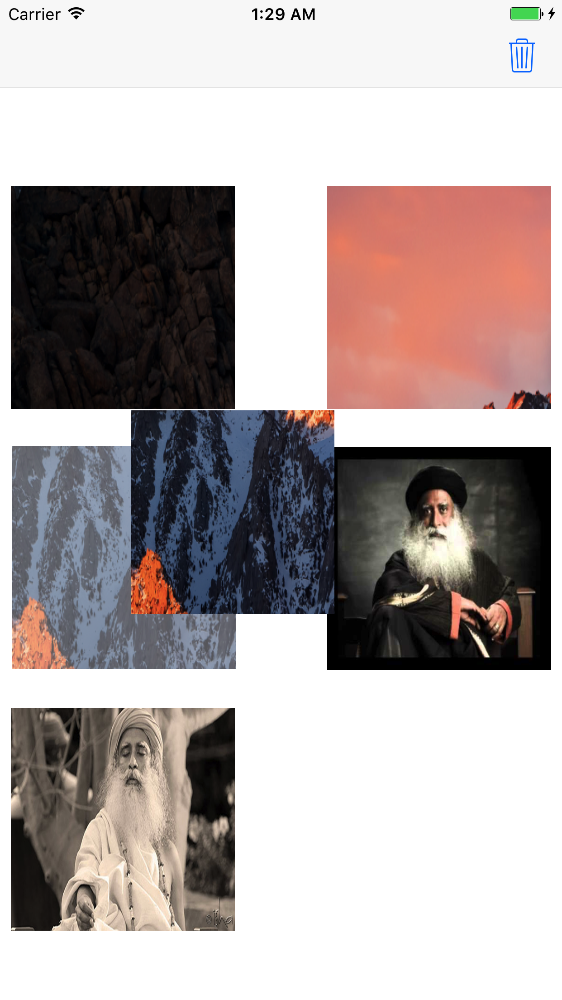
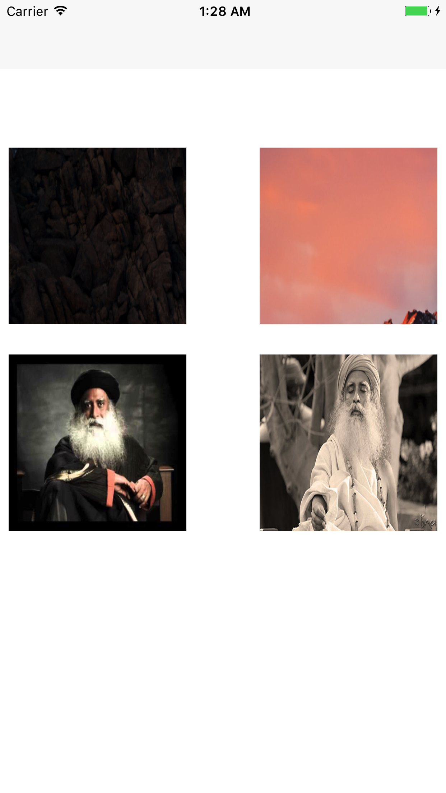

# Drag and Delete Cell In Collection View

Create a project `DragAndDelete`.

Create a Swift class `ImageCell`.

In the storyboard, embed the ViewController in a NavigationController.

Drag and drop a CollectionView into the ViewController.

Add an ImageView over the Cell of the CollectionView.

Add an identifier to the cell as `cell`.


Change the class of the CollectionViewCell from Storyboard to `ImageCell`.



Inside the `ImageCell.swift`, write:

```
import UIKit

class ImageCell: UICollectionViewCell {
    
    @IBOutlet weak var imgView: UIImageView!
}
```

Inside the `ViewController.swift`, write:

```
import UIKit

class ViewController: UIViewController {

    @IBOutlet weak var collectionView: UICollectionView!
    var imageArray = ["a.png", "b.png", "c.png", "f.jpg", "e.jpg"] //Here, you can use any random images
    var draggableView = UIView()
    var indexOfDeletingCell: Int = -1
    let animation = CABasicAnimation(keyPath: "position")
    override func viewDidLoad() {
        super.viewDidLoad()
        // Do any additional setup after loading the view, typically from a nib.
    }

    override func didReceiveMemoryWarning() {
        super.didReceiveMemoryWarning()
        // Dispose of any resources that can be recreated.
    }

    func deleteCell(sender: UILongPressGestureRecognizer) {
        print(sender.state)
        
        if sender.state == UIGestureRecognizerState.began {
            print("Long Press")
            let cell = sender.view?.superview?.superview as! ImageCell
            let indexPath: IndexPath! = self.collectionView.indexPath(for: cell)
            indexOfDeletingCell = indexPath.row
            print(indexPath.row)
            print(indexOfDeletingCell)
            let touchLocation = sender.location(in: self.collectionView)
            draggableView = UIView(frame: CGRect(x:touchLocation.x , y: touchLocation.y, width: 150, height: 150))
            draggableView.backgroundColor = UIColor.gray
            cell.alpha = 0.6
            self.navigationItem.rightBarButtonItem = UIBarButtonItem(barButtonSystemItem: UIBarButtonSystemItem.trash, target: self, action: #selector(self.deleteCellData))
            let imgView = UIImageView(frame: draggableView.bounds)
            imgView.image = UIImage(named: imageArray[indexPath.row])
            draggableView.addSubview(imgView)
            UIApplication.shared.keyWindow?.addSubview(draggableView)
           
            sender.view?.layer.add(startShakingAnimation(sender: sender), forKey: "position")
            
            
        } else if sender.state == UIGestureRecognizerState.ended {
            draggableView.removeFromSuperview()
            indexOfDeletingCell = -1
            self.navigationItem.rightBarButtonItem = nil
            let cell = sender.view?.superview?.superview as! ImageCell
            cell.alpha = 1
            sender.view?.layer.removeAllAnimations()
        } else if sender.state == UIGestureRecognizerState.changed {
            let touchLocation = sender.location(in: self.collectionView)
            draggableView.frame.origin.x = touchLocation.x
            draggableView.frame.origin.y = touchLocation.y
            if touchLocation.x >= 250 && (touchLocation.y >= -10 && touchLocation.y <= 0){
                if indexOfDeletingCell != -1 {
                    if indexOfDeletingCell < imageArray.count {
                        print(indexOfDeletingCell)
                        print(imageArray[indexOfDeletingCell])
                        imageArray.remove(at: indexOfDeletingCell)
                        draggableView.removeFromSuperview()
                        indexOfDeletingCell = -1
                        self.collectionView.reloadData()
                        sender.view?.layer.removeAllAnimations()
                        return
                    }
                }
            }
        }
    }
    
    func startShakingAnimation(sender: UILongPressGestureRecognizer) -> CABasicAnimation{
        // Shaking animation
        animation.duration = 0.9
        animation.repeatCount = 1000
        animation.autoreverses = true
        animation.speed = 10
        animation.fromValue = NSValue(cgPoint: CGPoint(x: (sender.view?.center.x)! - 0.9, y: (sender.view?.center.y)! + 0.9))
        animation.toValue = NSValue(cgPoint: CGPoint(x: (sender.view?.center.x)! + 0.9, y: (sender.view?.center.y)! - 0.9))
        return animation
    }
    
    func deleteCellData() {
    }
    
}

extension ViewController: UICollectionViewDataSource {
    func collectionView(_ collectionView: UICollectionView, numberOfItemsInSection section: Int) -> Int {
        return imageArray.count
    }
    
    func collectionView(_ collectionView: UICollectionView, cellForItemAt indexPath: IndexPath) -> UICollectionViewCell {
        let cell = collectionView.dequeueReusableCell(withReuseIdentifier: "cell", for: indexPath) as? ImageCell
        if let cell = cell {
            cell.imgView.image = UIImage(named:imageArray[indexPath.row])
        }
        cell?.imgView.isUserInteractionEnabled = true
        cell?.imgView.tag = indexPath.row
        let longPress = UILongPressGestureRecognizer(target: self, action: #selector(self.deleteCell))
        longPress.numberOfTouchesRequired = 1
        longPress.minimumPressDuration = 2.0
        cell?.imgView.addGestureRecognizer(longPress)
        return cell!
    }
}

extension ViewController: UICollectionViewDelegateFlowLayout {
    func collectionView(_ collectionView: UICollectionView, didSelectItemAt indexPath: IndexPath) {
        print("did selected :\(indexPath.row)")
    }
}
```

### Output





