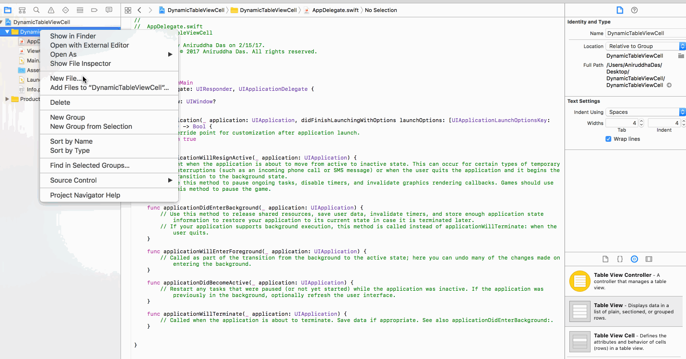
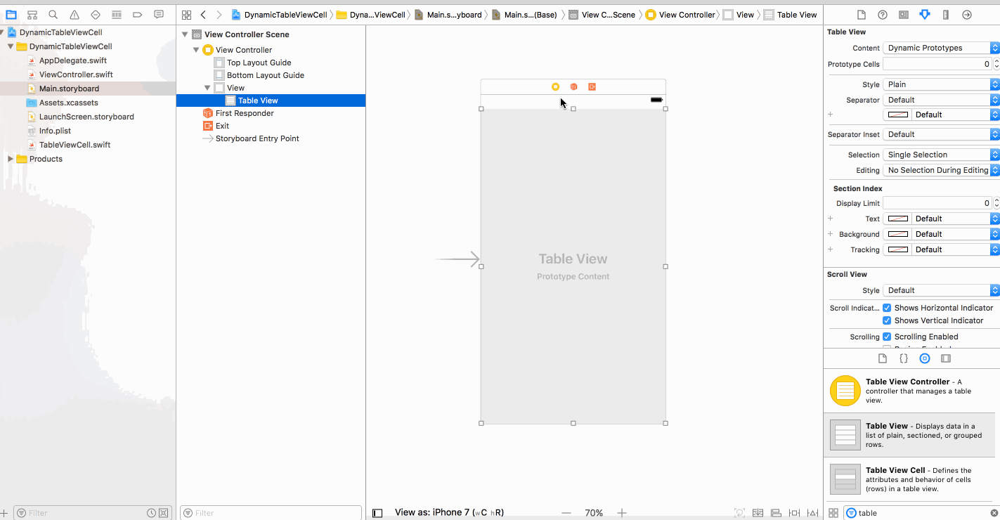
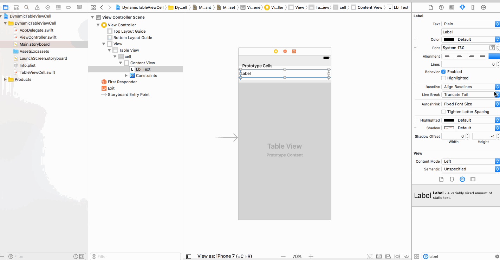
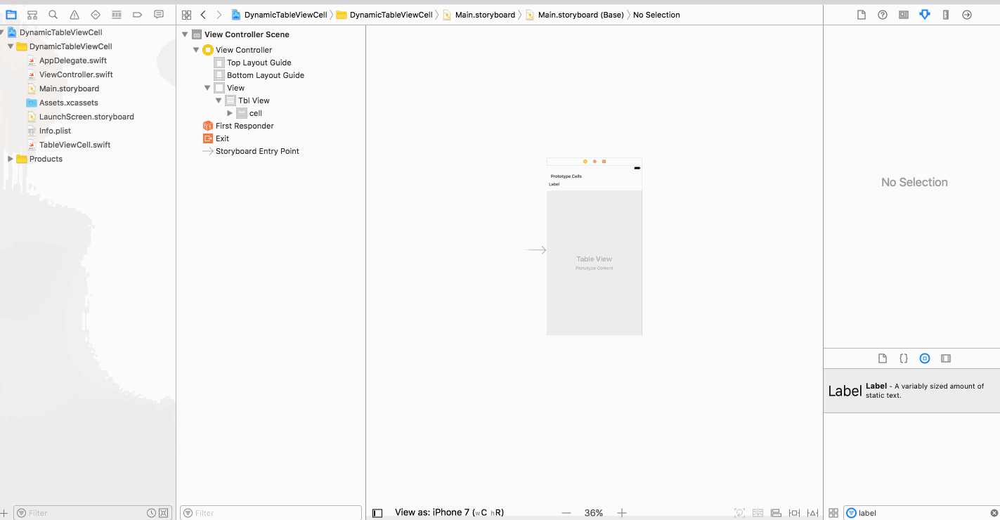
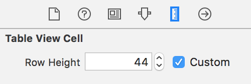
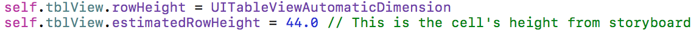
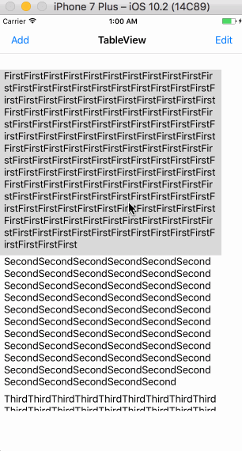

# Dynamic / Resizable TableView Cell depending on the content of the cell

**Step 1**

Create a project `DynamicTableViewCell`.

**Step 2**

Create a CocoaTouch Class of Type UITableViewCell and name it as `TableViewCell.swift`. Then drag a TableView onto your view controller on storyboard.



**Step 3**



**Step 4**

In the `TableViewCell.swift`, write:

```
import UIKit

class TableViewCell: UITableViewCell {
    @IBOutlet weak var lblText: UILabel!

    override func awakeFromNib() {
        super.awakeFromNib()
        // Initialization code
    }
    
    func setContent(_ text: String){
        
        self.lblText.text = text
    }

    override func setSelected(_ selected: Bool, animated: Bool) {
        super.setSelected(selected, animated: animated)

        // Configure the view for the selected state
    }

}
```

**Step 5**

Make the `numberOfLines` of the UILabel as `0` and the `lineBreak` as `Word Wrap`.



**Step 6**

Embed your view controller in a navigation controller.

**Optionally**, you can uncheck `Adjust Scroll View Insets`, if you feel the gap between the first cell of the table view and the navigation bar is way too much.



**Step 7**

In the `ViewController.swift`, write:

```
import UIKit

class ViewController: UIViewController {

    @IBOutlet weak var tblView: UITableView!
    var arr = ["FirstFirstFirstFirstFirstFirstFirstFirstFirstFirstFirstFirstFirstFirstFirstFirstFirstFirstFirstFirstFirstFirstFirstFirstFirstFirstFirstFirstFirstFirstFirstFirstFirstFirstFirstFirstFirstFirstFirstFirstFirstFirstFirstFirstFirstFirstFirstFirstFirstFirstFirstFirstFirstFirstFirstFirstFirstFirstFirstFirstFirstFirstFirstFirstFirstFirstFirstFirstFirstFirstFirstFirstFirstFirstFirstFirstFirstFirstFirstFirstFirstFirstFirstFirstFirstFirstFirstFirstFirstFirstFirstFirstFirstFirstFirstFirstFirstFirstFirstFirstFirstFirstFirstFirstFirstFirstFirstFirstFirstFirstFirstFirstFirstFirstFirstFirstFirstFirstFirstFirstFirstFirstFirstFirstFirstFirstFirstFirstFirstFirstFirstFirstFirstFirstFirstFirstFirstFirstFirstFirstFirstFirstFirstFirstFirstFirstFirstFirstFirstFirstFirstFirstFirst", "SecondSecondSecondSecondSecondSecondSecondSecondSecondSecondSecondSecondSecondSecondSecondSecondSecondSecondSecondSecondSecondSecondSecondSecondSecondSecondSecondSecondSecondSecondSecondSecondSecondSecondSecondSecondSecondSecondSecondSecondSecondSecondSecondSecondSecondSecondSecondSecondSecondSecondSecondSecondSecondSecondSecondSecondSecondSecondSecondSecondSecondSecondSecondSecondSecond", "ThirdThirdThirdThirdThirdThirdThirdThirdThirdThirdThirdThirdThirdThirdThirdThirdThirdThird", "FourthFourthFourthFourthFourthFourthFourthFourthFourthFourthFourthFourthFourthFourthFourthFourthFourthFourthFourthFourthFourthFourthFourthFourthFourthFourthFourthFourth", "Fifth"]
    
    override func viewDidLoad() {
        super.viewDidLoad()
        self.title = "TableView"
        self.tblView.delegate = self
        self.tblView.dataSource = self
        self.navigationItem.rightBarButtonItem  = UIBarButtonItem(title: "Edit", style: .plain, target: self, action: #selector(self.editClicked))
        self.navigationItem.leftBarButtonItem  = UIBarButtonItem(title: "Add", style: .plain, target: self, action: #selector(self.addClicked))
        self.tblView.rowHeight = UITableViewAutomaticDimension
        self.tblView.estimatedRowHeight = 44.0 // This is the cell's height from storyboard
    }
    
    override func didReceiveMemoryWarning() {
        super.didReceiveMemoryWarning()
        // Dispose of any resources that can be recreated.
    }
    
    //MARK: Actions
    func editClicked() {
        print("editClicked")
        self.navigationItem.rightBarButtonItem = UIBarButtonItem(title: "Done", style: .plain, target: self, action: #selector(self.doneClicked))
        self.tblView.setEditing(true, animated: true)
    }
    
    func doneClicked() {
        print("doneClicked")
        self.navigationItem.rightBarButtonItem  = UIBarButtonItem(title: "Edit", style: .plain, target: self, action: #selector(self.editClicked))
        self.tblView.setEditing(false, animated: true)
    }
    
    func addClicked() {
        arr.append("NewElement")
        self.tblView.reloadData()
    }
}

extension ViewController: UITableViewDataSource {
    func tableView(_ tableView: UITableView, numberOfRowsInSection section: Int) -> Int {
        return arr.count
    }
    
    func tableView(_ tableView: UITableView, cellForRowAt indexPath: IndexPath) -> UITableViewCell {
        let cell = tableView.dequeueReusableCell(withIdentifier: "cell", for: indexPath) as! TableViewCell
        //cell.textLabel?.text = arr[indexPath.row]
        cell.setContent(arr[indexPath.row])
        return cell
    }
    func tableView(_ tableView: UITableView, canEditRowAt indexPath: IndexPath) -> Bool {
        if indexPath.row == 0 {
            return false
        }
        return true
    }
    func tableView(_ tableView: UITableView, canMoveRowAt indexPath: IndexPath) -> Bool {
        return true
    }
}

extension ViewController: UITableViewDelegate {
    func tableView(_ tableView: UITableView, didSelectRowAt indexPath: IndexPath) {
        print(arr[indexPath.row])
    }
    
    func tableView(_ tableView: UITableView, commit editingStyle: UITableViewCellEditingStyle, forRowAt indexPath: IndexPath) {
        if editingStyle == .delete {
            arr.remove(at: indexPath.row)
        }
        self.tblView.reloadData()
    }
    
    func tableView(_ tableView: UITableView, moveRowAt sourceIndexPath: IndexPath, to destinationIndexPath: IndexPath) {
        
    }
    
}
```

**Note:**

By selecting the cell in storyboard, whatever height you see, you need to use the same in:





**Do not ever try to fix this height.**

**Step 8**

If you run the app, you would see:

