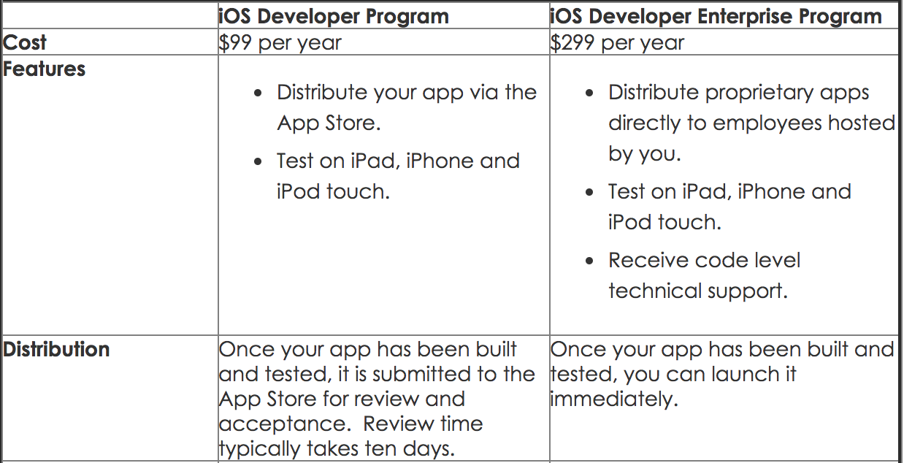

# Difference between a company & individual account

**Apple Enterprise Developer Account** - It is issued with the name of a company. We need to upload DUNS number of the company while creating the account. It charges 299 dollars per year, and supports only 100 test devices. You can't distribute to client using an enterprise account, but you can only distribute to internal employees.

**Apple Individual Developer Account** - It is issued with the name of an individual. It charges 99 dollars per year, and supports any number of devices. You can distribute to client using an individual account.

