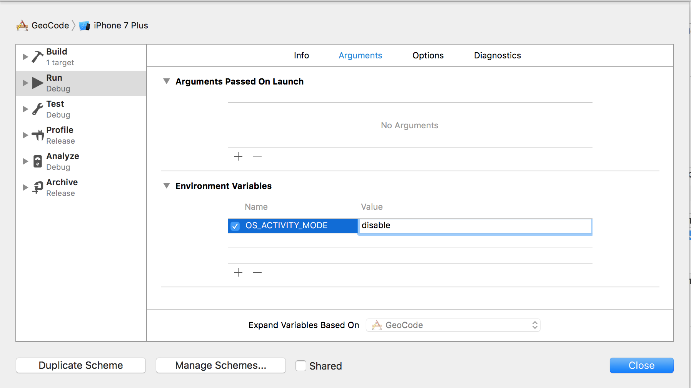

# How to hide unwanted logs in Xcode?

#### Step 1

From Xcode Menu, open: ```Product -> Scheme -> Edit Scheme```

#### Step 2

On your ```Environment Variables```, set **OS_ACTIVITY_MODE = disable**



Then, click on ```Close```