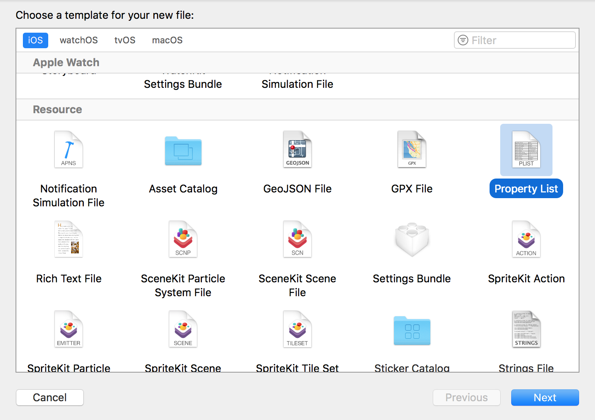
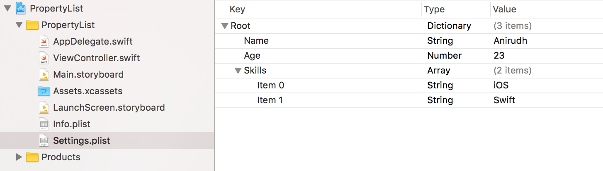
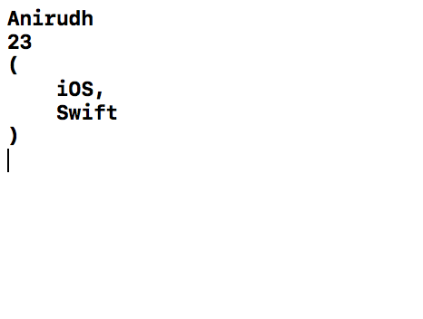
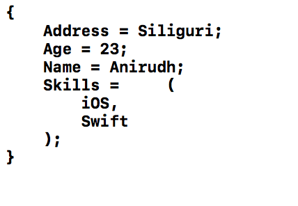

# How To Save And Retrieve Data From Plist

### Introduction

A plist is a list of properties used for storing information for your app. It stores values as key-value pair. It persists the data permanently, unlike UserDefaults which only store it temporarily.

It is super convenient to keep your settings or default values in a .plist file for your project.

Almost all applications require a mechanism to store data that will be needed at a later time. For example, you will need a way to store player scores for your game, some static data for tables, or words and sentences for your app localisation. For the previously mentioned cases, property lists (aka plist) are the convenient way to store, organise and access small amounts of data.

There can be two ways to create a plist file:

- Manually - Inside App Bundle
- Programmatically - Inside Documents Directory

### Sample Project

**Step 1**

Create a project named `PropertyList`.

**Step 2**

Create a new PropertyList file named `Settings.plist` in the App Bundle.



**Step 3**

Inside the `Settings.plist`, create some values:



### Reading Data from Settings.plist within App Bundle

#### Approach 1

```
import UIKit

class ViewController: UIViewController {

    override func viewDidLoad() {
        super.viewDidLoad()
        // Do any additional setup after loading the view, typically from a nib.
        
        let values = Bundle.contentsOfFile(plistName: "Settings.plist")
        print(values["Name"]!)
        print(values["Age"]!)
        print(values["Skills"]!)
    }

    override func didReceiveMemoryWarning() {
        super.didReceiveMemoryWarning()
        // Dispose of any resources that can be recreated.
    }
}

public extension Bundle {
    public static func contentsOfFile(plistName: String, bundle: Bundle? = nil) -> [String : AnyObject] {
        let fileParts = plistName.components(separatedBy: ".")
        
        guard fileParts.count == 2,
            let resourcePath = (bundle ?? Bundle.main).path(forResource: fileParts[0], ofType: fileParts[1]),
            let contents = NSDictionary(contentsOfFile: resourcePath) as? [String : AnyObject]
            else { return [:] }
        
        return contents
    }
}
```

**Output:**



#### Approach 2

```
import UIKit

class ViewController: UIViewController {

    override func viewDidLoad() {
        super.viewDidLoad()
        // Do any additional setup after loading the view, typically from a nib.
        
        let path = Bundle.main.path(forResource: "Settings", ofType: "plist")
        let dictRoot = NSDictionary(contentsOfFile: path!)
        var arr = [AnyObject]()
        if let dict = dictRoot {
            print(dict["Name"] as! String)
            print(dict["Age"] as! Int)
            arr = dict["Skills"] as! Array
        }
        print(arr[0])
    }

    override func didReceiveMemoryWarning() {
        super.didReceiveMemoryWarning()
        // Dispose of any resources that can be recreated.
    }
}
```

**Output:**


### Writing and Reading Data from Settings.plist within Documents Directory

We make a copy of the Settings.plist of Bundle into Documents Directory and then write and read data from that Plist.

```
import UIKit

class ViewController: UIViewController {

    override func viewDidLoad() {
        super.viewDidLoad()
        // Do any additional setup after loading the view, typically from a nib.

        var paths = NSSearchPathForDirectoriesInDomains(.documentDirectory, .userDomainMask, true)[0] as String
        var path = paths.appending("Settings.plist")
        
        var fileManager = FileManager.default
        if (!(fileManager.fileExists(atPath: path)))
        {
            var bundle : String = Bundle.main.path(forResource: "Settings", ofType: "plist")!
            do {
                try fileManager.copyItem(atPath: bundle, toPath: path)
            } catch {
                
            }
        }
        var data : NSMutableDictionary = NSMutableDictionary(contentsOfFile: path)!
        data.setObject("Siliguri", forKey: "Address" as NSCopying)
        data.write(toFile: path, atomically: true)
        
        self.readData()
    }
    
    func readData() {
        var paths = NSSearchPathForDirectoriesInDomains(.documentDirectory, .userDomainMask, true)[0] as String
        var path = paths.appending("Settings.plist")
        let save = NSDictionary(contentsOfFile: path)
        
        print(save!)
    }

    override func didReceiveMemoryWarning() {
        super.didReceiveMemoryWarning()
        // Dispose of any resources that can be recreated.
    }
}
```

**Output:**



### Refer

[http://sweettutos.com/2015/06/03/swift-how-to-read-and-write-into-plist-files/](http://sweettutos.com/2015/06/03/swift-how-to-read-and-write-into-plist-files/)