# Localization in iOS 10 and Xcode 8

# Introduction

Localization is the process of translating your app into multiple languages. But before you can localize your app, you internationalize it.

Internationalization is the process of making your app able to adapt to different languages, regions, and cultures.

Because a single language can be used in multiple parts of the world, your app should adapt to the regional and cultural conventions of where a person resides. An internationalized app appears as if it is a native app in all the languages and regions it supports.

The App Store is available in over 150 different countries, and internationalizing your app is the first step to reach this global market. Using iTunes Connect, you specify whether your app is available in all territories or specific territories. Then you customize your app for each target market that you want to support. Users in other countries want to use your app in a language they understand and see dates, times, and numbers in familiar, regional formats.

# Sample Project

### Step 1

Create a new project. Select Single View Application. Give it some name. I named my project as "ADLocalization".

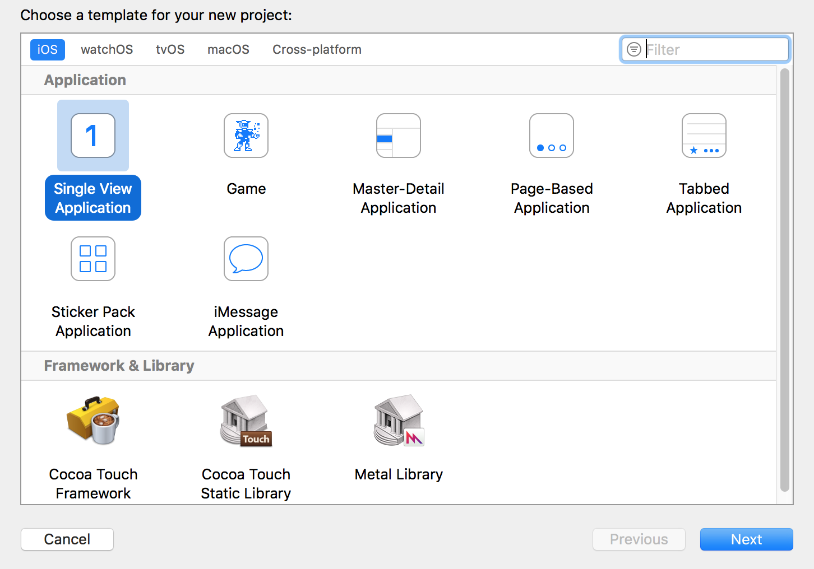

### Step 2

On the storyboard file, add two labels. Add text of footer label as "World" from storyboard. Clear the default text of the header label, and add it's outlet onto the view controller file.

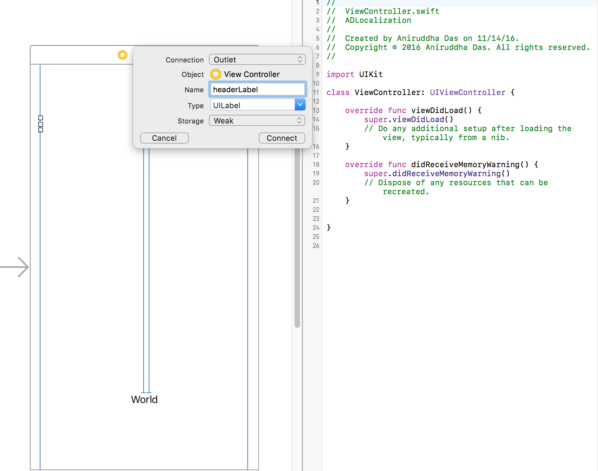

Set the text of the header label programatically.

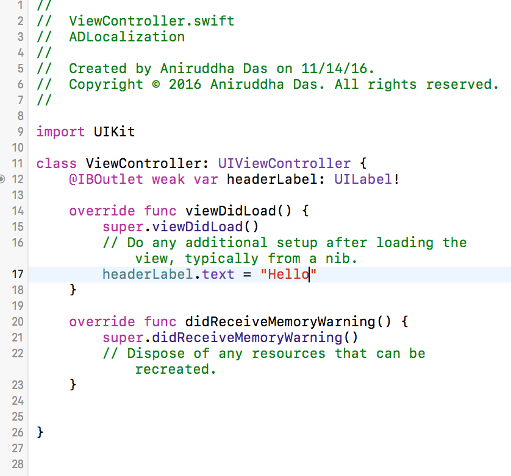

Now run the app.

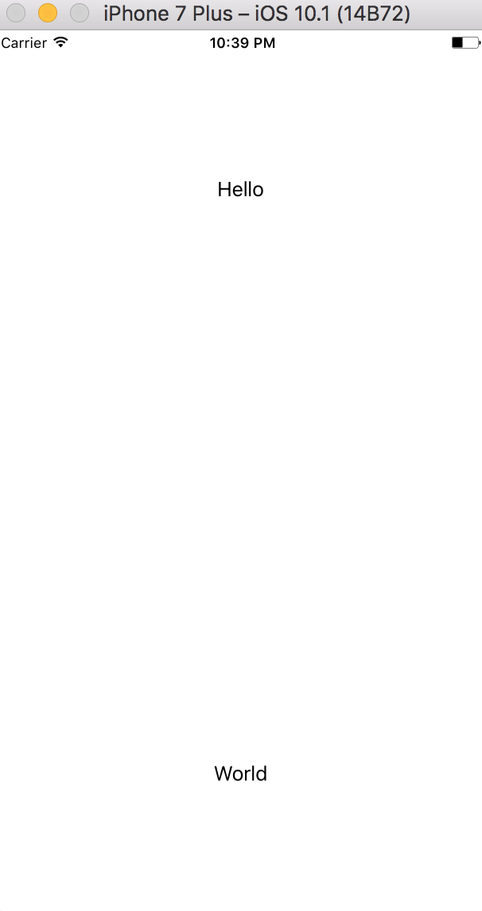

### Step 3

Select the footer label from storyboard and check it's localization option (English). Make sure it's localizable string. Notice that two new files under storyboard has been generated.

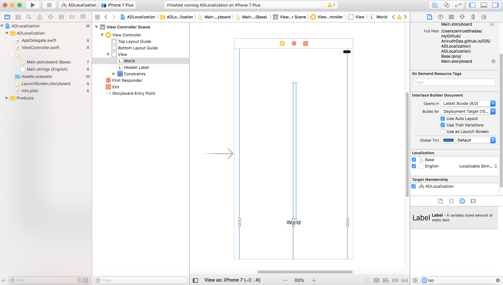

### Step 4

Go to the view controller, and change the text value as NSLocalizableString. Provide an unique key (Header) and a comment (label for header).

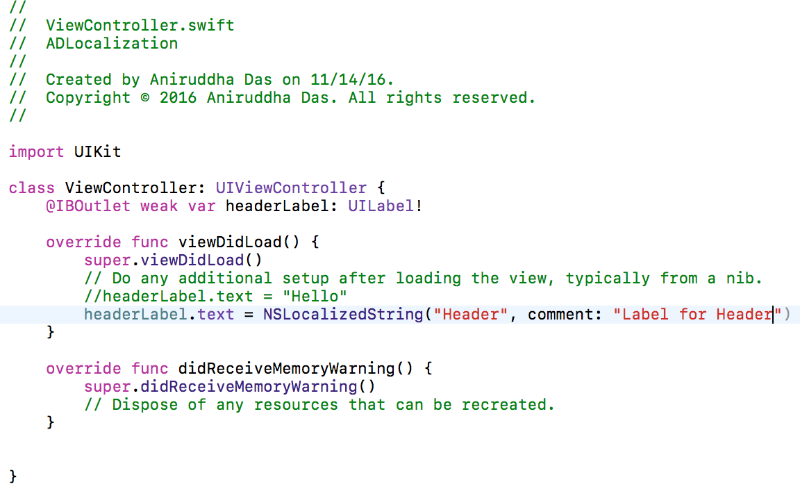

### Step 5

Now open terminal and get into the project directory. Type "genstrings *.swift"

It generates "Localizable.strings" file. Add it into Xcode Project and copy it's reference.

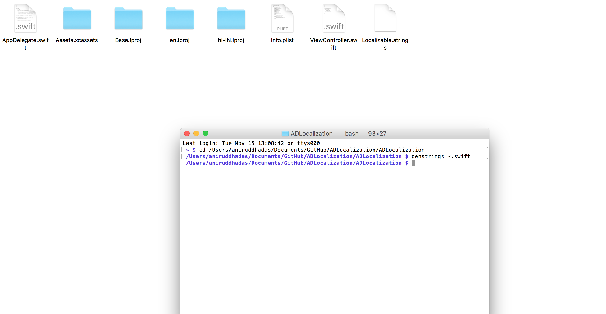

Or alternatively, you can add a new "strings" file. Name it as "Localizable" and save it in en.lproj folder.

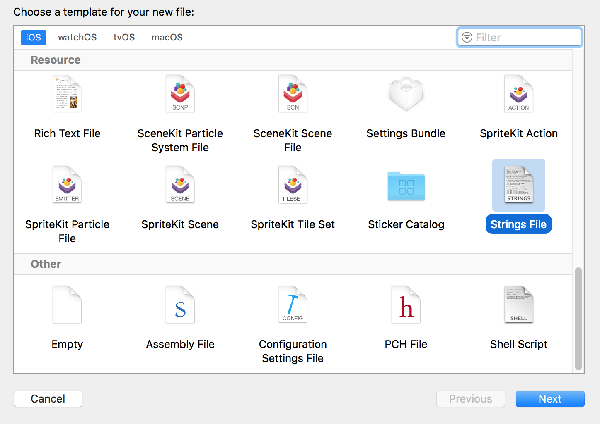

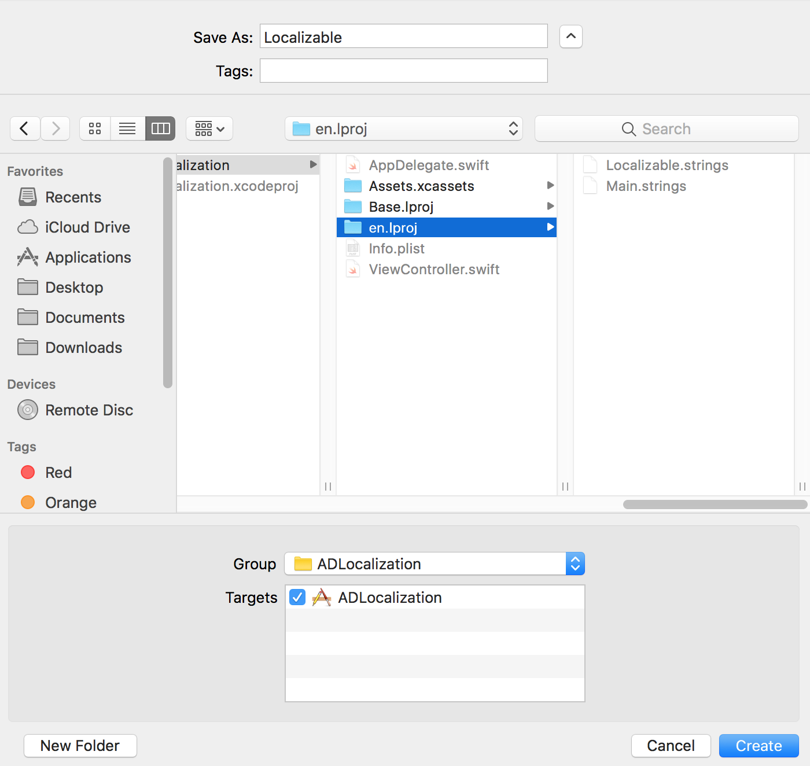

### Step 6

Add the key (Header) along with string to replace (Hello).

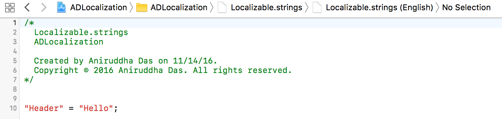

### Step 7

Click the + option above "Use base internationalization". Select any language you want your app to support. Here, I select Hindi.

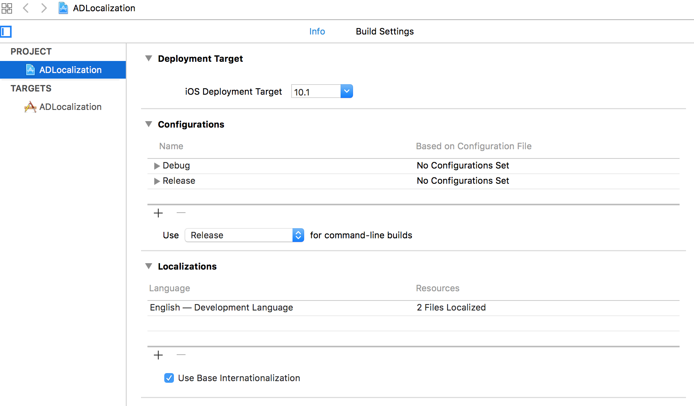

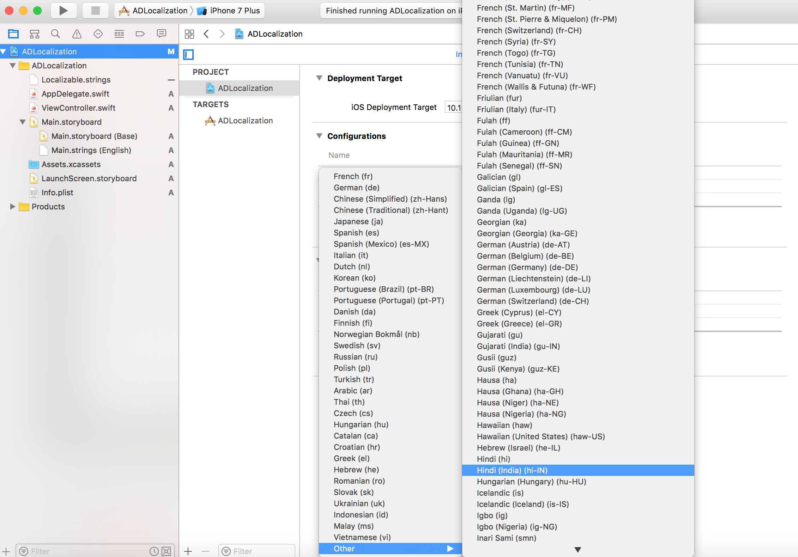

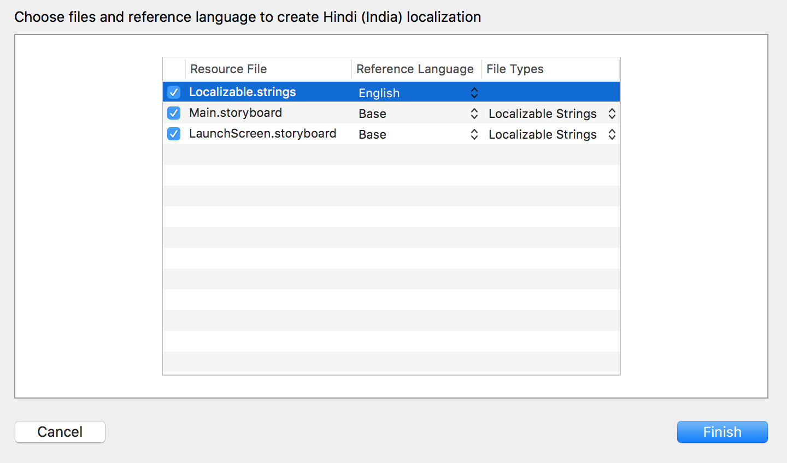

### Step 8

Under the localizable file, in the hindi localizable file, add the translated word for "Hello" corresponding to the same key (Header).

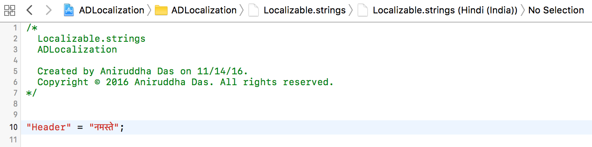

### Step 9

Under the storyboard, in the hindi localizable file, add the translated word for "World" corresponding to the same key (Nt1-vK-FrR.text).

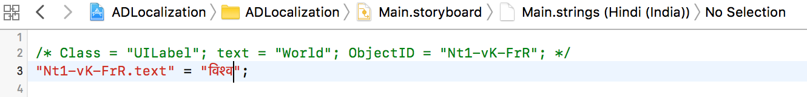

### Step 10

Now run the app. By default it supports English, since base localization was English.

### Step 11

To run the app in Hindi localization:

App Target -> Edit Scheme -> Run -> Options -> Application Language -> Hindi

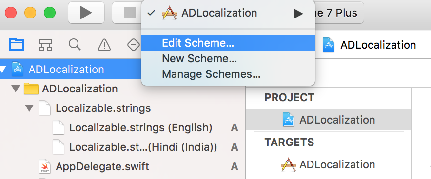

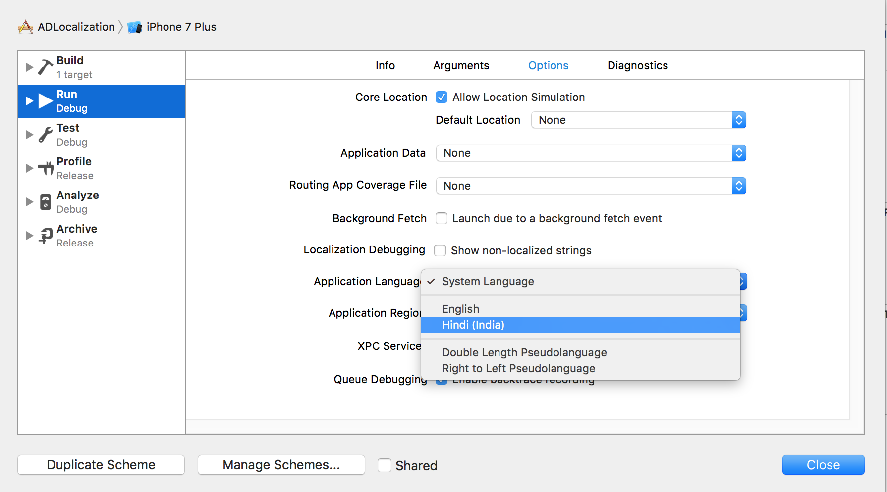

Now run the app.

