# Localization using `'Localize-Swift'`

### Step 1

Create a project named `LocalizationDemo`.

### Step 2

Create a `Podfile` and inside it write the following code:

```
target 'LocalizationDemo' do
  use_frameworks!

  # Pods for Sample
  pod 'Localize-Swift'
end
```

Run `pod install` command. And use `LocalizationDemo.xcworkspace` from now on.

### Step 3

Create a `.strings` file named **"Localizable"**.

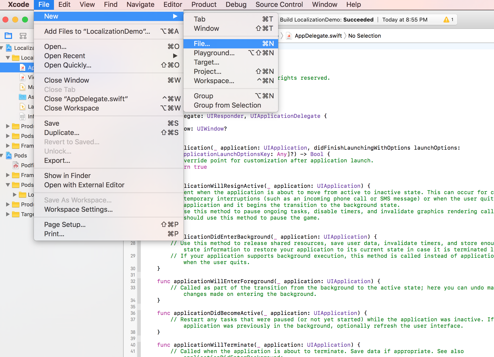

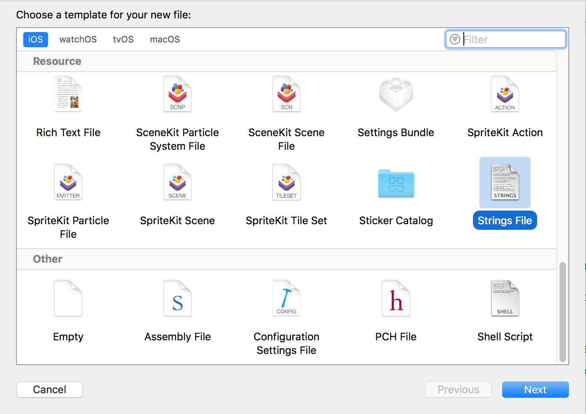


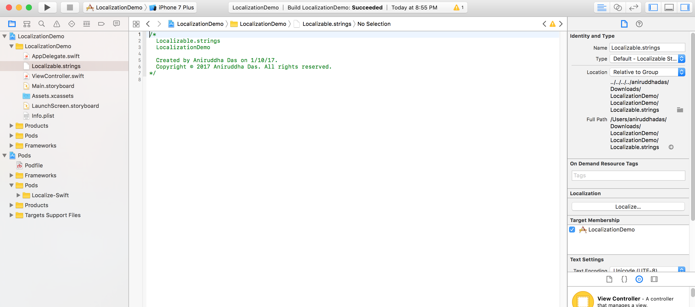

**Note:** The name of the strings file can only be "Localizable" and NOTHING ELSE.

### Step 4

Next you need to "localize" the `Localizable.strings` file, and change the default language from `Base` to `English`.

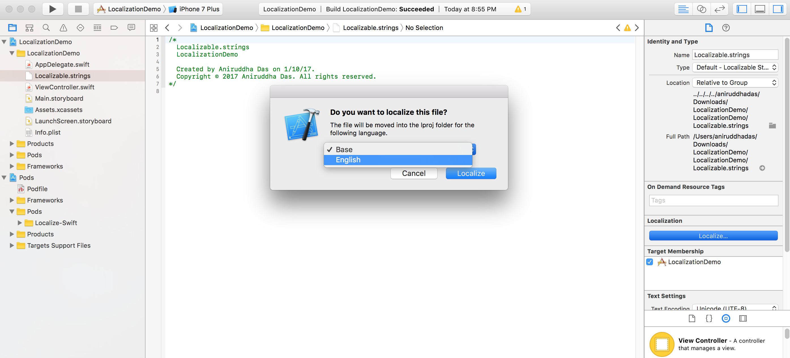

### Step 5

Add a `base internationalization language` from project settings. Let's say I add `Hindi`. Add it's target only as `Localizable.strings`, uncheck `Main.storyboard` and `LaunchScreen.storyboard`.

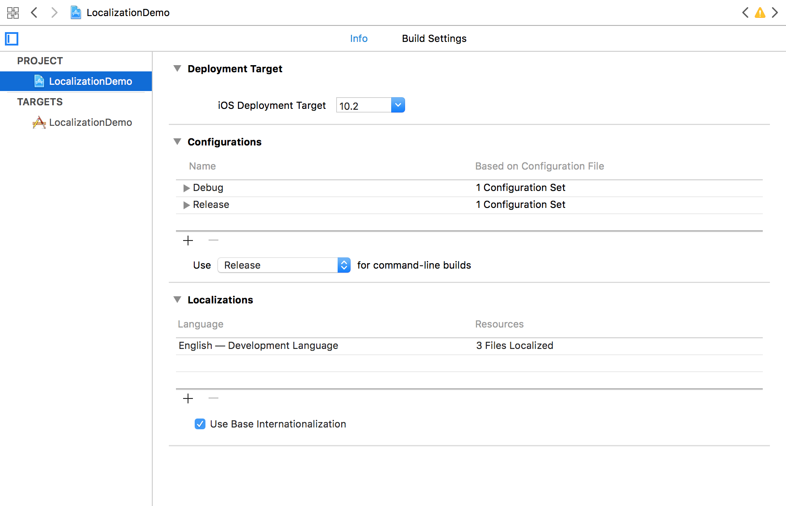

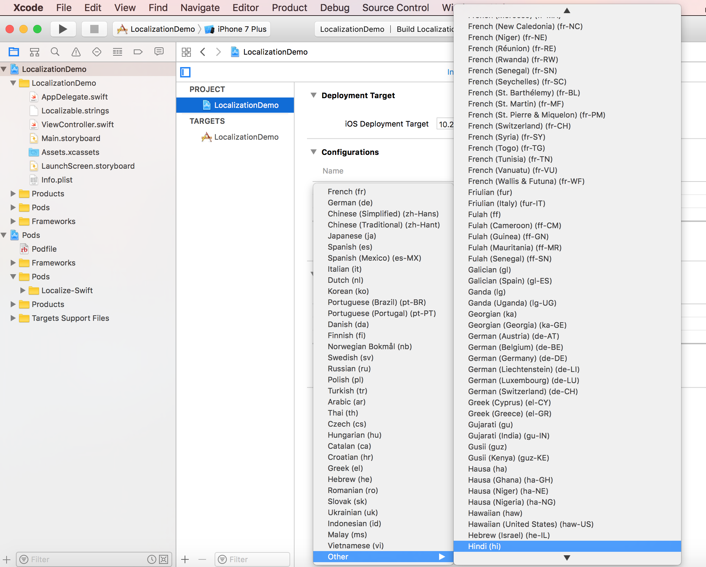

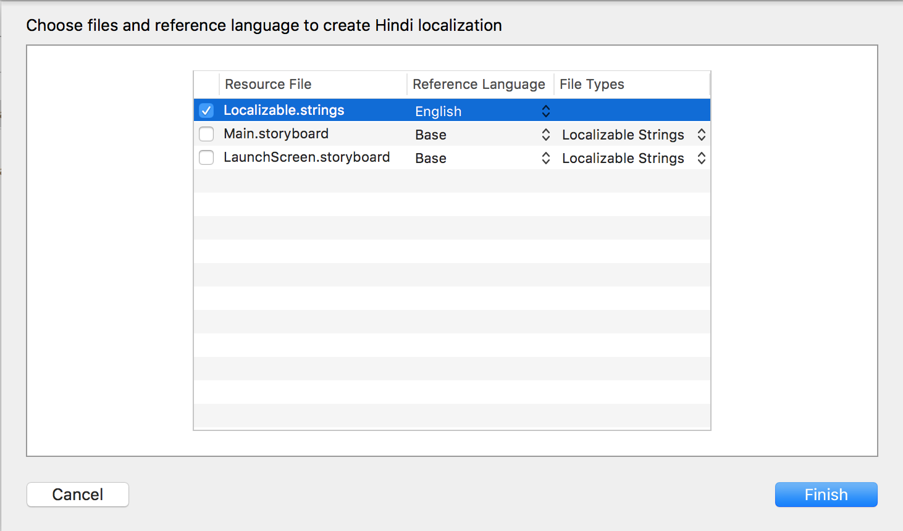

### Step 6

Add a **key** and it's corresponding **value** in `.strings` files of all the languages. Use the same keys in all the files.

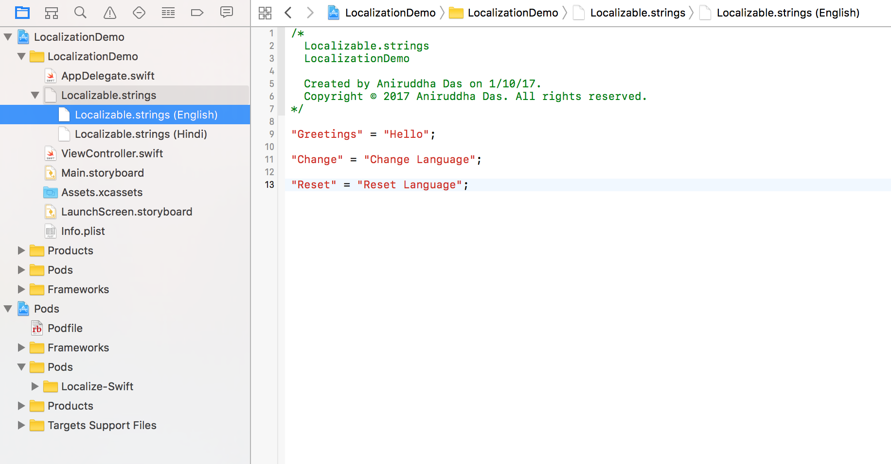


### Step 7

In the storyboard, use two buttons and one label.

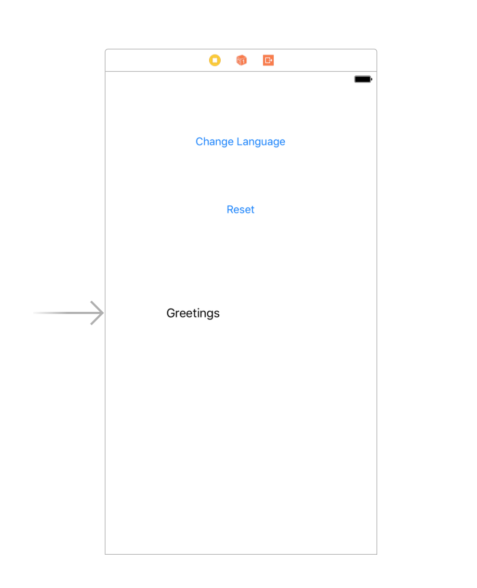

### Step 8

In your `ViewController.swift`, add the following code.

```
import UIKit
import Localize_Swift

class ViewController: UIViewController {
    @IBOutlet weak var lblGreetings: UILabel!
    @IBOutlet weak var btnChange: UIButton!
    @IBOutlet weak var btnReset: UIButton!
    
    var actionSheet: UIAlertController!
    
    let availableLanguages = Localize.availableLanguages()
    
    override func viewDidLoad() {
        super.viewDidLoad()
        // Do any additional setup after loading the view, typically from a nib.
        self.setText()
    }
    
    override func viewWillAppear(_ animated: Bool) {
        super.viewWillAppear(animated)
        NotificationCenter.default.addObserver(self, selector: #selector(setText), name: NSNotification.Name( LCLLanguageChangeNotification), object: nil)
    }
    
    // Remove the LCLLanguageChangeNotification on viewWillDisappear
    override func viewWillDisappear(_ animated: Bool) {
        super.viewWillDisappear(animated)
        NotificationCenter.default.removeObserver(self)
    }
    
    override func didReceiveMemoryWarning() {
        super.didReceiveMemoryWarning()
        // Dispose of any resources that can be recreated.
    }
    
    func setText(){
        lblGreetings.text = "Greetings".localized() //Here "Greetings" is the key
        btnChange.setTitle("Change".localized(), for: UIControlState.normal) //Here "Change" is the key
        btnReset.setTitle("Reset".localized(), for: UIControlState.normal) //Here "Reset" is the key
    }
    
    @IBAction func change(_ sender: UIButton) {
        actionSheet = UIAlertController(title: nil, message: "Switch Language", preferredStyle: UIAlertControllerStyle.actionSheet)
        for language in availableLanguages {
            let displayName = Localize.displayNameForLanguage(language)
            let languageAction = UIAlertAction(title: displayName, style: .default, handler: {
                (alert: UIAlertAction!) -> Void in
                Localize.setCurrentLanguage(language)
            })
            actionSheet.addAction(languageAction)
        }
        let cancelAction = UIAlertAction(title: "Cancel", style: UIAlertActionStyle.cancel, handler: {
            (alert: UIAlertAction) -> Void in
        })
        actionSheet.addAction(cancelAction)
        self.present(actionSheet, animated: true, completion: nil)
    }
    
    @IBAction func reset(_ sender: UIButton) {
        Localize.resetCurrentLanguageToDefault()
    }
}
```

### Step 9

Run the app on simulator. It should look something like this.

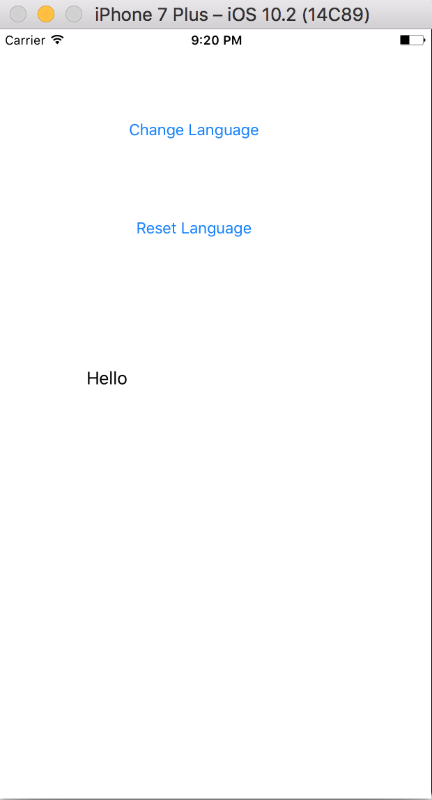

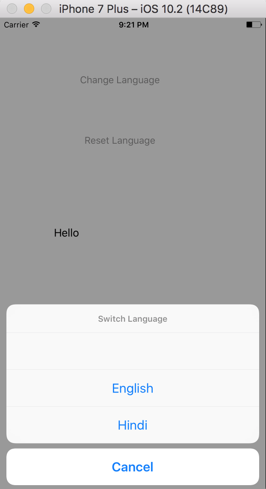

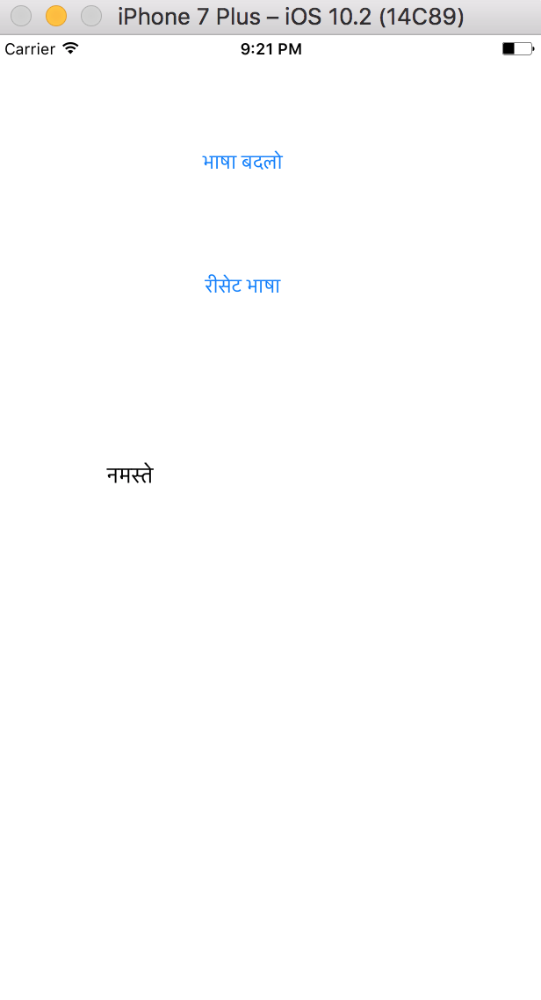

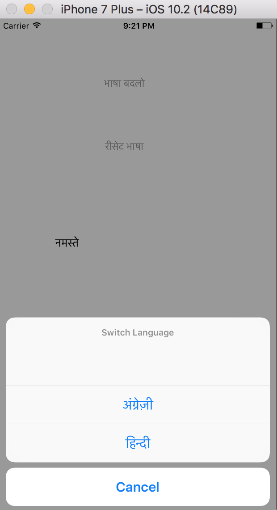