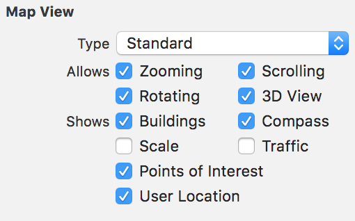
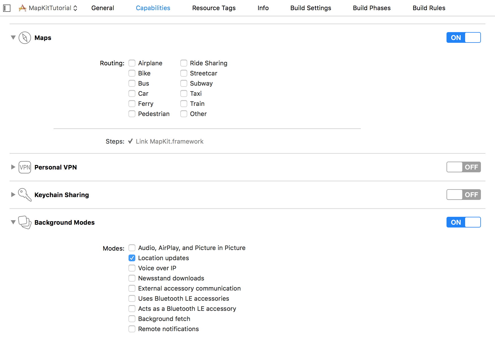

# MapKit in iOS - Drawing annotation at user's current location, circle, polyline and polygon

### Step 1

Create a project `MapKitTutorial`.

### Step 2

Embed the view controller in a navigation controller.

### Step 3

Drag a MapKitView onto the view controller.

Make sure you check the `User Location` option from the attributes inspector.



### Step 4

In the app settings, under `capablities`, make sure your settings look like:



### Step 5

Add a swift class named `LocationManagerHelper.swift`, and inside it write:

```
import UIKit
import MapKit
import CoreLocation

public class LocationManagerHelper: NSObject {
    let locationManager = CLLocationManager()
    static let sharedInstance = LocationManagerHelper()
    var latitude = Double()
    var longitude = Double()
    var userLocation = CLLocation()
    
    public func updateUserLocation() {
        locationManager.requestWhenInUseAuthorization()
        locationManager.requestAlwaysAuthorization()
        locationManager.delegate = self
        locationManager.desiredAccuracy = kCLLocationAccuracyBest
        locationManager.startUpdatingLocation()
    }
    
    public func getLocation(latitude: Double, longitude: Double) -> CLLocation {
        return CLLocation(latitude: latitude, longitude: longitude)
    }
}

extension LocationManagerHelper: CLLocationManagerDelegate {
    public func locationManager(_ manager: CLLocationManager, didUpdateLocations locations: [CLLocation]) {
        let currentLocation = manager.location
        if currentLocation != nil {
            latitude = (manager.location?.coordinate.latitude)!
            longitude = (manager.location?.coordinate.longitude)!
            print("latitude :\(latitude)")
            print("longitude :\(longitude)")
        }
        
        // Create a location
        userLocation = CLLocation(latitude: latitude, longitude: longitude)
        print(userLocation)
    }
    
    public func locationManager(_ manager: CLLocationManager, didFailWithError error: Error) {
        print("Failed to get the current location of user \(error.localizedDescription)")
    }
}
```

### Step 6

Inside `ViewController.swift`, create an @IBOutlet of the mapview and write:

```
import UIKit
import MapKit

class ViewController: UIViewController {
    @IBOutlet weak var mapView: MKMapView!
    
    let objLocationManager = LocationManagerHelper.sharedInstance
    
    override func viewDidLoad() {
        super.viewDidLoad()
        // Do any additional setup after loading the view, typically from a nib.
        
        self.navigationItem.rightBarButtonItem = UIBarButtonItem(barButtonSystemItem: .refresh, target: self, action: #selector(self.refreshMap))
        self.navigationItem.leftBarButtonItem = UIBarButtonItem(title: "Draw", style: .plain, target: self, action: #selector(self.drawOnMap))
        
        objLocationManager.updateUserLocation()
        
    }
    
    func refreshMap() {
        let overlays = self.mapView.overlays
        self.mapView.removeOverlays(overlays)
        addAnnotation()
    }
    
    func drawOnMap() {
        let alertController = UIAlertController(title: "Draw On Map", message: "", preferredStyle: .actionSheet)
        
        let circle = UIAlertAction(title: "Circle", style: .default) { (action: UIAlertAction) in
            self.drawCircle()
        }
        
        let polygoan = UIAlertAction(title: "Polygon", style: .default) { (action: UIAlertAction) in
            self.drawPolygon()
        }
        
        let polyline = UIAlertAction(title: "Polyline", style: .default) { (action: UIAlertAction) in
            self.drawPolyline()
        }
        
        let cancelAction = UIAlertAction(title: "Cancel", style: .destructive) { (action: UIAlertAction) in
            self.dismiss(animated: true, completion: nil)
        }
        alertController.addAction(circle)
        alertController.addAction(polygoan)
        alertController.addAction(polyline)
        alertController.addAction(cancelAction)
        
        self.present(alertController, animated: true, completion: nil)
        
    }
    
    func drawPolyline() {
        
        //let locations = [CLLocationCoordinate2D(latitude: 19.0176147, longitude: 72.8561644), CLLocationCoordinate2D(latitude: 18.5204303,longitude: 73.8567437)]
        
        //This is also how you draw a route on the map
        
        let locations = [CLLocationCoordinate2D(latitude: 19.0176147, longitude: 72.8561644), CLLocationCoordinate2D(latitude: 18.5204303,longitude: 73.8567437), CLLocationCoordinate2D(latitude: 19.0945700, longitude: 74.7384300)]
        let polyline = MKPolyline(coordinates: locations, count: locations.count)
        self.mapView.add(polyline)
    }
    
    func drawPolygon() {
        let locations = [CLLocationCoordinate2D(latitude: 19.0176147, longitude: 72.8561644), CLLocationCoordinate2D(latitude: 18.5204303,longitude: 73.8567437), CLLocationCoordinate2D(latitude: 19.0945700, longitude: 74.7384300), CLLocationCoordinate2D(latitude: 19.0176147, longitude: 72.8561644)]
        
        let polygon = MKPolygon(coordinates: locations, count: locations.count)
        self.mapView.add(polygon)
    }
    
    func drawCircle() {
        let circle = MKCircle(center: objLocationManager.userLocation.coordinate, radius: 300)
        self.mapView.add(circle)
    }
    
    func addAnnotation() {
        print(objLocationManager.userLocation.coordinate.latitude)
        print(objLocationManager.userLocation.coordinate.longitude)
        
        // 1 Create span - It zooms in from a birds eye view till the user location
        var span = MKCoordinateSpanMake(0.05, 0.05)
        span.latitudeDelta = 0.02
        span.longitudeDelta = 0.02
        let region = MKCoordinateRegion(center: objLocationManager.userLocation.coordinate, span: span)
        mapView.setRegion(region, animated: true)
        
        
        // 2 Add Annotation on map
        let annotations = mapView.annotations
        mapView.removeAnnotations(annotations)
        let annotation = MKPointAnnotation()
        annotation.coordinate = objLocationManager.userLocation.coordinate
        annotation.title = "Pune India"
        annotation.subtitle = "Kharadi Bypass"
        mapView.addAnnotation(annotation)
    }

    override func didReceiveMemoryWarning() {
        super.didReceiveMemoryWarning()
        // Dispose of any resources that can be recreated.
    }


}


extension ViewController: MKMapViewDelegate {
    func mapView(_ mapView: MKMapView, rendererFor overlay: MKOverlay) -> MKOverlayRenderer {
        if overlay is MKCircle {
            let circle = MKCircleRenderer(overlay: overlay)
            circle.strokeColor = UIColor.red
            circle.fillColor = UIColor(red: 255, green: 0, blue: 0, alpha: 0.1)
            circle.lineWidth = 1
            return circle
        }
        
        if overlay is MKPolygon {
            let polygon = MKPolygonRenderer(overlay: overlay)
            polygon.fillColor = UIColor.red
            polygon.strokeColor = UIColor.black
            polygon.lineWidth = 1
            return polygon
        }
        
        if overlay is MKPolyline {
            let line = MKPolylineRenderer(overlay: overlay)
            line.fillColor = UIColor.blue
            line.strokeColor = UIColor.red
            line.lineWidth = 2
            return line
        }
        
        return overlay as! MKOverlayRenderer
    }
}
```

### Output

