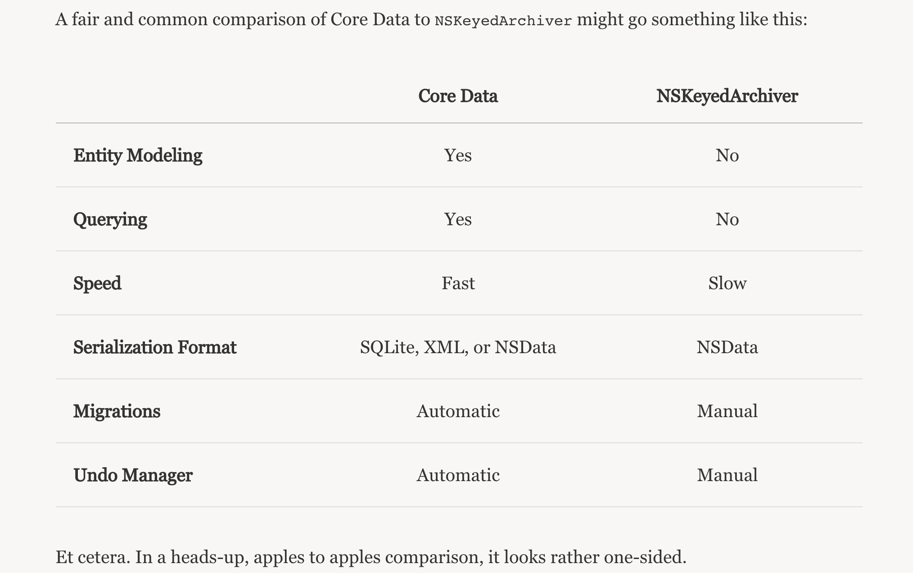
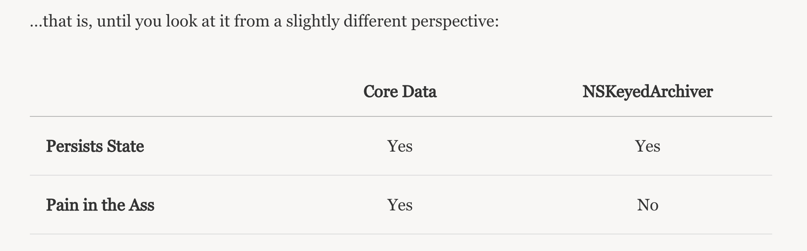

# What is 'NSCoder' class?

### Introduction

Among the most important architectural decisions made when building an app is how to persist data within the app between it's launches. The question of how to re-create the state of the app from the time it was last opened; of how to describe the object graph in such a way that it can be flawlessly reconstructed next time.

On iOS and OS X, Apple provides two options: Core Data or NSKeyedArchiver / NSKeyedUnarchiver (which serializes <NSCoding>-compliant classes to and from a data representation).

When it comes to modeling, querying, traversing and persisting complex object graphs, there is no substitute for Core Data. Core Data is a big hammer, but not every problem is a nail—much less a sufficiently large nail.




By these measures, NSKeyedArchiver becomes a perfectly reasonable choice in certain situations. Not all apps need to query data. Not all apps need automatic migrations. Not all apps work with large or complex object graphs. And even apps that do may have certain components better served by a simpler solution.

### NSCoding

NSCoding is a simple protocol, with two methods:

1. initWithCoder
2. encodeWithCoder

Classes that conform to NSCoding can be serialized and deserialized into data that can be either be archived to disk or distributed across a network.

For example:

```
class Book: NSObject, NSCoding {
    var title: String
    var author: String
    var pageCount: Int
    var categories: [String]
    var available: Bool

    // Memberwise initializer
    init(title: String, author: String, pageCount: Int, categories: [String], available: Bool) {
        self.title = title
        self.author = author
        self.pageCount = pageCount
        self.categories = categories
        self.available = available
    }

    // MARK: NSCoding

    required convenience init?(coder decoder: NSCoder) {
        guard let title = decoder.decodeObjectForKey("title") as? String,
            let author = decoder.decodeObjectForKey("author") as? String,
            let categories = decoder.decodeObjectForKey("categories") as? [String]
            else { return nil }

        self.init(
            title: title,
            author: author,
            pageCount: decoder.decodeIntegerForKey("pageCount"),
            categories: categories,
            available: decoder.decodeBoolForKey("available")
        )
    }

    func encodeWithCoder(coder: NSCoder) {
        coder.encodeObject(self.title, forKey: "title")
        coder.encodeObject(self.author, forKey: "author")
        coder.encodeInt(Int32(self.pageCount), forKey: "pageCount")
        coder.encodeObject(self.categories, forKey: "categories")
        coder.encodeBool(self.available, forKey: "available")
    }
}
```

Of course, serialization is only one part of the story. Determining where this data will persist is another question. Again, there are two approaches: writing to the ```local file system``` and using ```NSUserDefaults```.

### File System

NSKeyedArchiver and NSKeyedUnarchiver provide a convenient API to read / write objects directly to / from disk.

An NSCoding-backed table view controller might, for instance, set its collection property from the file manager

* Archiving

```
NSKeyedArchiver.archiveRootObject(books, toFile: "/path/to/archive")
```

* Unarchiving

```
guard let books = NSKeyedUnarchiver.unarchiveObjectWithFile("/path/to/archive") as? [Book] else { return nil }
```

### NSUserDefaults

Each app has its own database of user preferences, which can store and retrieve any NSCoding-compatible object or C value.

While it is not advisable to store an entire object graph into NSUserDefaults, it can be useful to encode compound objects in this way, such as “current user” objects. (Use **Keychain** instead).

* Archiving

```
let data = NSKeyedArchiver.archivedDataWithRootObject(books)
NSUserDefaults.standardUserDefaults().setObject(data, forKey: "books")
```

* Unarchiving

```
if let data = NSUserDefaults.standardUserDefaults().objectForKey("books") as? NSData {
    let books = NSKeyedUnarchiver.unarchiveObjectWithData(data)
}
```

### Conclusion:

```NSCoder``` is ```abstract class``` using which we can encode and decode an object in binary format. It has ```NSKeyedArchiver``` and ```NSKeyedUnarchiver``` class, which conforms to ```NSCoding``` protocol.

1. func encodeWithCoder(coder: NSCoder)		// Used to encode object 
2. init?(coder decoder: NSCoder)		// Used to decode object

### Source

To read more, refer this [article](http://nshipster.com/nscoding/).
