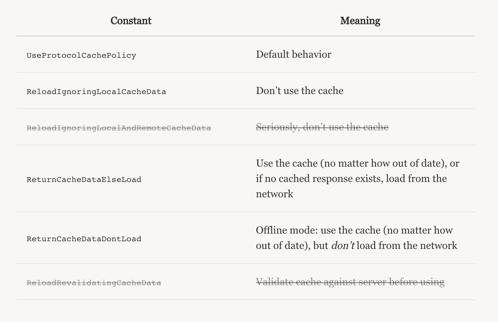

# NSURLCache

### Introduction

NSURLCache provides a composite in-memory and on-disk caching mechanism for URL requests to your application. As part of Foundation’s URL Loading System, any request loaded through NSURLConnection will be handled by NSURLCache.

Network caching reduces the number of requests that need to be made to the server, and improve the experience of using an application offline or under slow network conditions.

When a request has finished loading its response from the server, a cached response will be saved locally. The next time the same request is made, the locally-cached response will be returned immediately, without connecting to the server. NSURLCache returns the cached response automatically and transparently.

As of iOS 5, a shared NSURLCache is set for the application by default.

If you have some special caching requirements, you can set a shared URL cache in `didFinishLaunchingWithOptions`:

```
func application(application: UIApplication!, didFinishLaunchingWithOptions launchOptions: NSDictionary!) -> Bool {
    let URLCache = NSURLCache(memoryCapacity: 4 * 1024 * 1024, diskCapacity: 20 * 1024 * 1024, diskPath: nil)
    NSURLCache.setSharedURLCache(URLCache)

    return true
}
```

### NSURLRequestCachePolicy

There are several cache policies:



----

### Example

Let's say I need to download a file from a Url.

I create a method:

```
func downloadFile(urlString: String) {
        if let url = URL(string: urlString) {
            let rqst = URLRequest(url: url, cachePolicy: URLRequest.CachePolicy.returnCacheDataElseLoad, timeoutInterval: TimeInterval(60))
            let downloadtask = URLSession.shared.downloadTask(with: rqst) { (location: URL?, response: URLResponse?, error: Error?) -> Void in
                
                if location != nil {
                    print("Local file url is \(location)")
                }
            }
            downloadtask.resume()
        }
    }
```

And call this method like:

```
self.downloadFile(urlString: "http://publications.gbdirect.co.uk/c_book/thecbook.pdf")
```

Here, we used Cache Policy as `returnCacheDataElseLoad`.