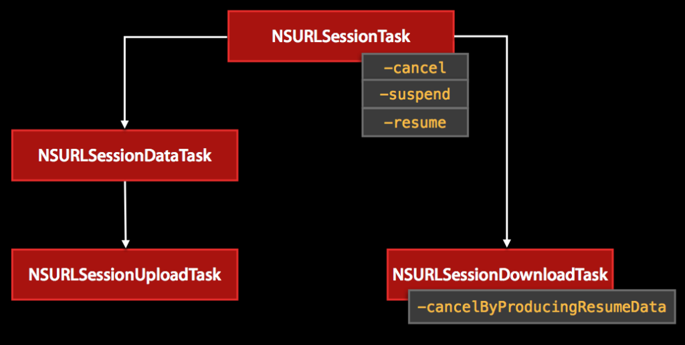

# Difference between NSURLSessionDataTask vs NSURLSessionDownloadTask

**NSURLSessionDataTask:** Data tasks exchange data using NSData. NSURLSessionDataTask is not supported in Background Sessions.

Data tasks send and receive data using NSData objects. Data tasks are intended for short, often interactive requests from your app to a server. Data tasks can return data to your app one piece at a time after each piece of data is received, or all at once through a completion handler. Because data tasks do not store the data to a file, they are not supported in background sessions.

NSURLSessionDataTask downloads files in memory, and it is up to you to determine how you want to handle the response. But, we can't resume it for later.

**NSURLSessionDownloadTask:** NSURLSessionDownloadTask directly writes the response data to a temporary file. It supports background downloads when the app is not running.

Download tasks retrieve data in the form of a file, and support background downloads while the app is not running.

NSURLSessionDownloadTask downloads files to a disk, and you then save the resulting file somewhere to use later on. It is possible to cancel a download task and resume it at a later point.

