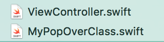
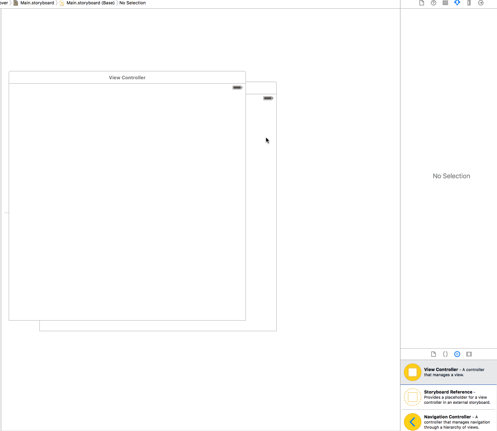
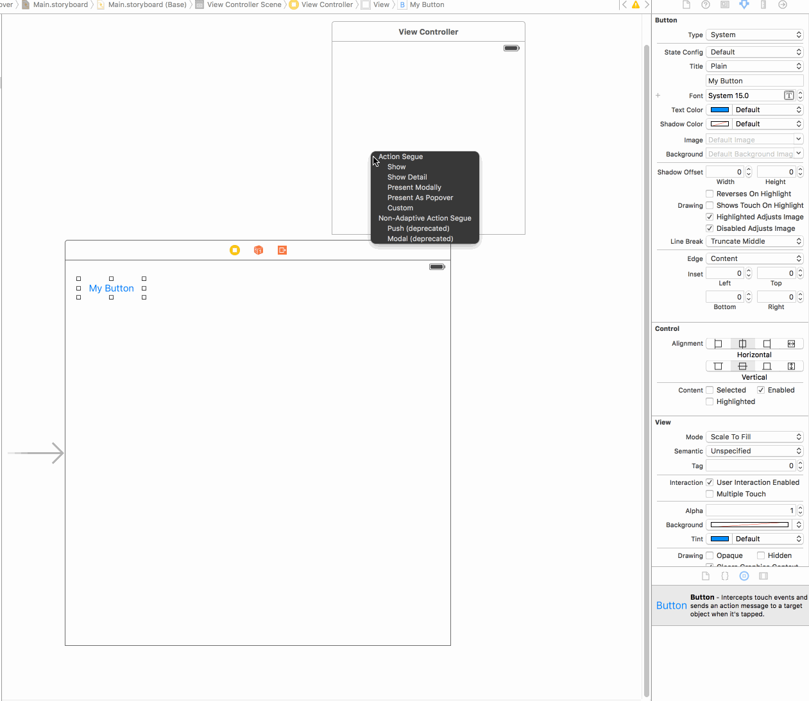
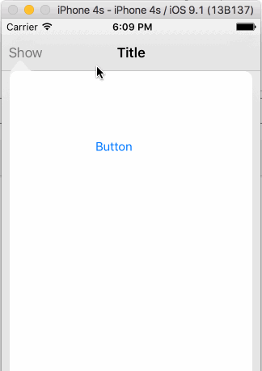

# Show Popover in iPhone and iPad

### Step 1

Open your project & make sure you've one class from where you would like to show the pop-over and another class for the pop-over.



### Step 2

Open Storyboard & add a new view controller for pop-over & resize as per your need. Make sure you also apply the class name to view-controller.



### Step 3

In your view-controller, add bar-button from where you can drag & drop segue to pop-over-controller. **Make sure you give the name to the segue**.



### Step 4

In your view-controller, you make sure to extend `UIPopoverPresentationControllerDelegate`.

### Step 5

Put following delegate method in your-view-controller.

```
func adaptivePresentationStyle(for controller: UIPresentationController) -> UIModalPresentationStyle {
    return UIModalPresentationStyle.none
}
```

### Step 6

Put following method in your-view-controller & identify segue.

```
override func prepare(for segue: UIStoryboardSegue, sender: Any?) {
    if segue.identifier == "from_home_to_popover" {
        if let vctr = segue.destination as? MyPopOverViewController {
            vctr.modalPresentationStyle = .popover
            vctr.popoverPresentationController?.delegate = self
            vctr.popoverPresentationController?.sourceView = self.view
            vctr.popoverPresentationController?.sourceRect = self.btn.frame
        }
    }
}
```

### Step 7

Put following code in your pop-over-controller under viewDidLoad.

```
override func viewDidLoad() {
    super.viewDidLoad()
    self.preferredContentSize = CGSize(width: 300, height: 300)
}
```

### Step 8

From some action, when you wish to dismiss pop-over, under your pop-over-controller put following code.

```
@IBAction func btnDoneTapped(btn: UIButton) {
    self.dismissViewControllerAnimated(true, completion: nil)
}
```

The resulting output should look like:

