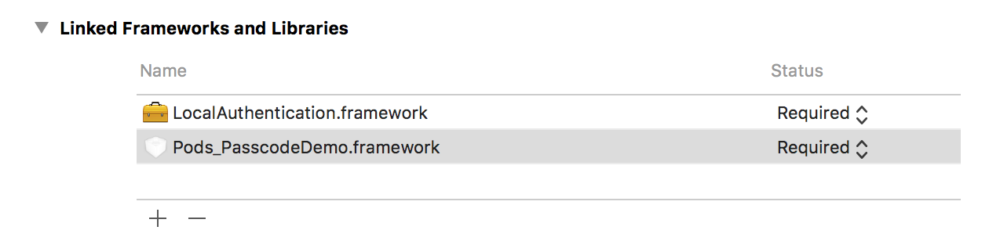

### Protecting your app with Passcode and TouchID

### Step 1

Create a project `PasscodeDemo`.

### Step 2

Add a `Podfile` to the project.

```
target "PasscodeDemo" do
  use_frameworks!
  pod 'LTHPasscodeViewController'
end
```

Use command `pod install`.

### Step 3

In the app target settings, under `Linked Frameworks and Libraries`, click on `+` button. Add `LocalAuthentication.Framework`.




### Step 4

Create a bridging header `PasscodeDemo-Bridging-Header.h` and inside it, write:

```
#import "LTHPasscodeViewController/LTHPasscodeViewController.h"
```

### Step 5

From your `Info.plist`, remove item `Main Storyboard File Base Name`.


### Step 6

Design your Storyboard like:


Make sure you create the **StoryboardID** for the view controller as `rootView`.


Create an `@IBOutlet` for every element on the storyboard in the `ViewController.swift`.

### Step 7

Inside your `ViewController.swift`, write:

```
import UIKit
import LTHPasscodeViewController
import LocalAuthentication

class ViewController: UIViewController, LTHPasscodeViewControllerDelegate {
    
    @IBOutlet weak var changePasscode: UIButton!
    
    @IBOutlet weak var enablePasscode: UIButton!
    
    @IBOutlet weak var testPasscode: UIButton!
    
    @IBOutlet weak var turnOffPasscode: UIButton!
    
    @IBOutlet weak var typeLabel: UILabel!
    
    @IBOutlet weak var touchIDLabel: UILabel!
    
    @IBOutlet weak var typeSwitch: UISwitch!
    
    @IBOutlet weak var touchIDSwitch: UISwitch!
    
    func refreshUI() {
        if LTHPasscodeViewController.doesPasscodeExist() {
            self.enablePasscode.isEnabled = false
            self.changePasscode.isEnabled = true
            self.turnOffPasscode.isEnabled = true
            self.testPasscode.isEnabled = true
        } else {
            self.enablePasscode.isEnabled = true
            self.changePasscode.isEnabled = false
            self.turnOffPasscode.isEnabled = false
            self.testPasscode.isEnabled = false
        }
        
        
        self.typeSwitch.isOn = LTHPasscodeViewController.sharedUser().isSimple()
        
        self.touchIDSwitch.isOn = LTHPasscodeViewController.sharedUser().allowUnlockWithTouchID
    }
    
    override func viewDidLoad() {
        super.viewDidLoad()
        // Do any additional setup after loading the view, typically from a nib.
        
        self.title = "Passcode Demo"
        
        LTHPasscodeViewController.sharedUser().delegate = self
        
        if self.isTouchIDAvailable() {
            typeLabel.isHidden = false
            typeSwitch.isHidden = false
            touchIDLabel.isHidden = false
            touchIDSwitch.isHidden = false
            touchIDSwitch.addTarget(self, action: #selector(touchIDPasscodeType), for: .valueChanged)
            
        } else {
            typeLabel.isHidden = false
            typeSwitch.isHidden = false
            touchIDLabel.isHidden = true
            touchIDSwitch.isHidden = true
        }
        
        
        self.turnOffPasscode.setTitle("Turn Off", for: .normal)
        
        self.changePasscode.setTitle("Change", for: .normal)
        
        self.testPasscode.setTitle("Test", for: .normal)
        
        self.enablePasscode.setTitle("Enable", for: .normal)
        
        self.typeLabel.text = "Simple"
        
        self.refreshUI()
        
        self.changePasscode.addTarget(self, action: #selector(changesPasscode), for: .touchUpInside)
        
        self.enablePasscode.addTarget(self, action: #selector(enablesPasscode), for: .touchUpInside)
        
        self.testPasscode.addTarget(self, action: #selector(testsPasscode), for: .touchUpInside)
        
        self.turnOffPasscode.addTarget(self, action: #selector(turnsOffPasscode), for: .touchUpInside)
        
        self.typeSwitch.addTarget(self, action: #selector(switchPasscodeType), for: .valueChanged)
        
    }
    
    
    func turnsOffPasscode() {
        self.showLockViewForTurningPasscodeOff()
    }
    
    
    func changesPasscode() {
        self.showLockViewForChangingPasscode()
    }
    
    func enablesPasscode() {
        self.showLockViewForEnablingPasscode()
    }
    
    func testsPasscode() {
        self.showLockViewForTestingPasscode()
    }
    
    func switchPasscodeType(sender: UISwitch) {
        LTHPasscodeViewController.sharedUser().setIsSimple(sender.isOn, in: self, asModal: true)
    }
    
    func touchIDPasscodeType(sender: UISwitch) {
        LTHPasscodeViewController.sharedUser().allowUnlockWithTouchID = sender.isOn
    }
    
    func showLockViewForEnablingPasscode() {
        LTHPasscodeViewController.sharedUser().showForEnablingPasscode(in: self, asModal: true)
    }
    
    func showLockViewForTestingPasscode() {
        LTHPasscodeViewController.sharedUser().showLockScreen(withAnimation: true, withLogout: false, andLogoutTitle: nil)
    }

    func showLockViewForChangingPasscode() {
        LTHPasscodeViewController.sharedUser().hidesCancelButton = false
        
        LTHPasscodeViewController.sharedUser().hidesBackButton = false
        
        LTHPasscodeViewController.sharedUser().showForChangingPasscode(in: self, asModal: false)
    }
    
    func showLockViewForTurningPasscodeOff() {
        LTHPasscodeViewController.sharedUser().showForDisablingPasscode(in: self, asModal: false)
    }
    
    func isTouchIDAvailable() -> Bool {
        
        //if UIDevice.currentDevice.systemVersion.compare("8.0", options: NSString.CompareOptions.NumericSearch) != ComparisonResult.OrderedAscending {
        if #available(iOS 8, *) {
            //iOS 8+ code here.
            return LAContext().canEvaluatePolicy(.deviceOwnerAuthenticationWithBiometrics, error: nil)
        }
        
        return false
    }
    
    func passcodeViewControllerWillClose() {
        print("Passcode View Controller Will Be Closed")
        self.refreshUI()
    }
    
    func maxNumberOfFailedAttemptsReached() {
        LTHPasscodeViewController.deletePasscodeAndClose()
        print("Max Number of Failed Attemps Reached")
    }
    
    func passcodeWasEnteredSuccessfully() {
        print("Passcode Was Entered Successfully")
    }
    
    func logoutButtonWasPressed() {
        print("Logout Button Was Pressed")
    }
    
    func passcodeWasEnabled() {
        print("Passcode Was Enabled")
    }
        
    override func didReceiveMemoryWarning() {
        super.didReceiveMemoryWarning()
        // Dispose of any resources that can be recreated.
    }
}
```

### Step 8

Inside your `AppDelegate.swift`, write:

```
import UIKit
import LTHPasscodeViewController

@UIApplicationMain
class AppDelegate: UIResponder, UIApplicationDelegate {

    var window: UIWindow?


    func application(_ application: UIApplication, didFinishLaunchingWithOptions launchOptions: [UIApplicationLaunchOptionsKey: Any]?) -> Bool {
        // Override point for customization after application launch.
        
        
        self.window = UIWindow(frame: UIScreen.main.bounds)
        let storyboard = UIStoryboard(name: "Main", bundle: nil)
        let viewControllerObj = storyboard.instantiateViewController(withIdentifier: "rootView") as! ViewController
        let navController = UINavigationController(rootViewController: viewControllerObj)
        
        self.window?.rootViewController = navController
        self.window?.makeKeyAndVisible()
        
        
        //LTHPasscodeViewController.useKeychain(false)
        
        if LTHPasscodeViewController.doesPasscodeExist() && LTHPasscodeViewController.didPasscodeTimerEnd() {
            LTHPasscodeViewController.sharedUser().showLockScreen(withAnimation: true, withLogout: false, andLogoutTitle: nil)
            
        }
        
        return true
    }

    func applicationWillResignActive(_ application: UIApplication) {
        // Sent when the application is about to move from active to inactive state. This can occur for certain types of temporary interruptions (such as an incoming phone call or SMS message) or when the user quits the application and it begins the transition to the background state.
        // Use this method to pause ongoing tasks, disable timers, and invalidate graphics rendering callbacks. Games should use this method to pause the game.
    }

    func applicationDidEnterBackground(_ application: UIApplication) {
        // Use this method to release shared resources, save user data, invalidate timers, and store enough application state information to restore your application to its current state in case it is terminated later.
        // If your application supports background execution, this method is called instead of applicationWillTerminate: when the user quits.
    }

    func applicationWillEnterForeground(_ application: UIApplication) {
        // Called as part of the transition from the background to the active state; here you can undo many of the changes made on entering the background.
    }

    func applicationDidBecomeActive(_ application: UIApplication) {
        // Restart any tasks that were paused (or not yet started) while the application was inactive. If the application was previously in the background, optionally refresh the user interface.
    }

    func applicationWillTerminate(_ application: UIApplication) {
        // Called when the application is about to terminate. Save data if appropriate. See also applicationDidEnterBackground:.
    }


}
```

### Output

Run the App. Often you need to enable `Toggle Software Keyboard`, if you are running on simulator.


