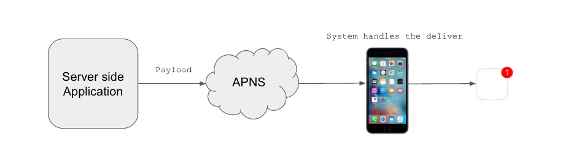
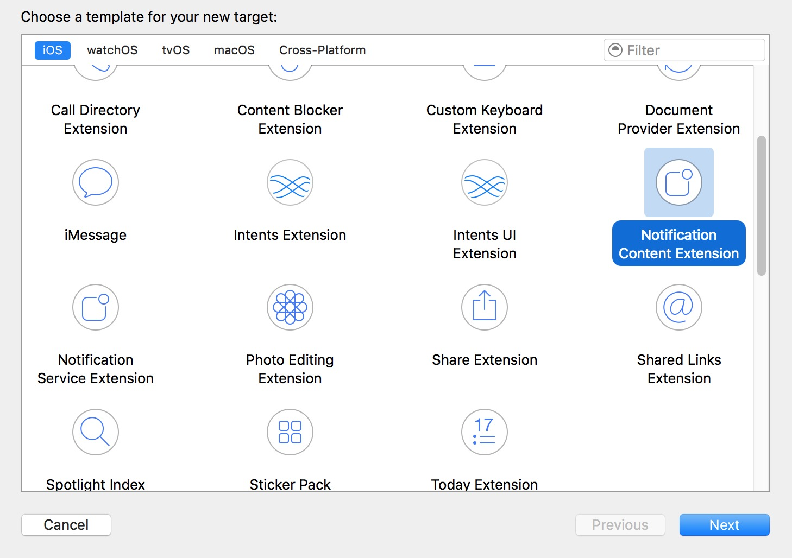
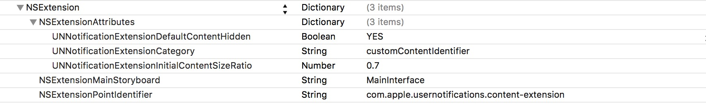
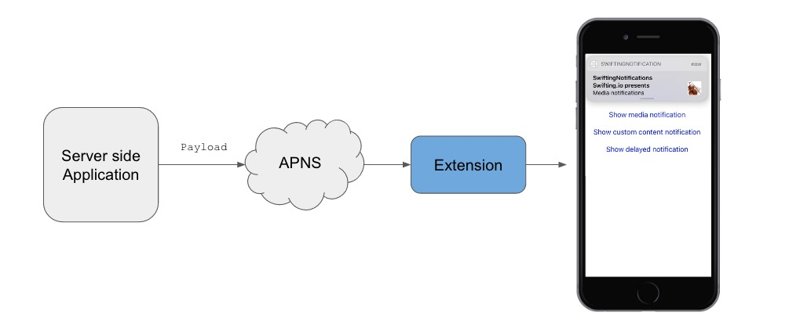
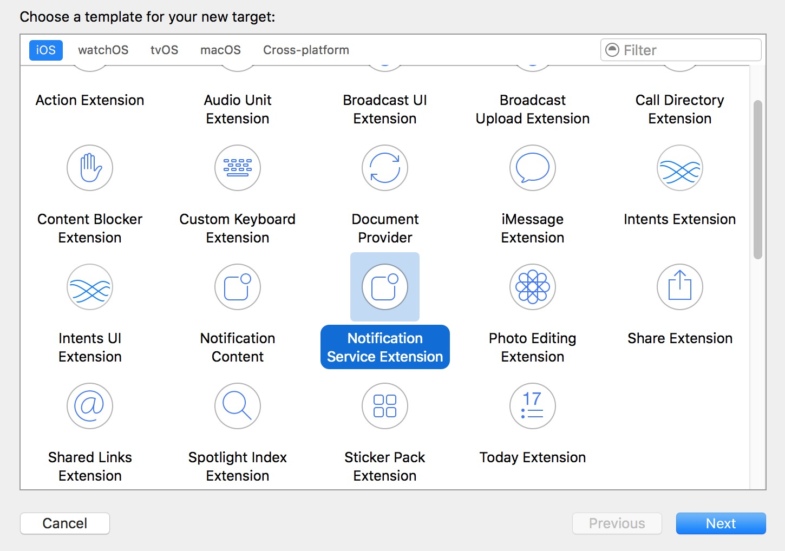

# Rich Notifications in iOS 10 (UserNotifications Framework)

### Introduction

iOS 10 gave us new rich notifications with a lot more functionalities comparing to old ones. We can view photos and videos or respond to a message right from our notifications.

### Quick APNs overview

Apple Push Notification service transports and routes remote notifications for your apps from your provider to each user’s device. Provider sends the notification and a device token to the APNs servers. The APNs servers handle the routing of that notification to the correct user device, and the operating system handles the delivery of the notification to your client app.



A few important facts:

- Max Payload 4kB
- HTTP/2 network protocol
- TLS 1.2 is required between backend and APNs
- 2 environments (development and production)

### New notifications Features in general

I strongly recommend watching two WWDC sessions:

- [Introduction to Notifications](https://developer.apple.com/videos/play/wwdc2016/707/)
- [Advanced Notification](https://developer.apple.com/videos/play/wwdc2016/708/)

### Registration of notification

Registration is needed for local and remote notifications. To turn it on just run below method in **application(_:didFinishLaunchingWithOptions:launchOptions:)** :

```
UNUserNotificationCenter.current().requestAuthorization([.alert, .sound, .badge]
 { (granted, error) in
...
}
```

As we see what we can authorize is:

- Banners
- Sound alerts
- Badging

### Get Settings

iOS 10 gives you the ability to access user settings in your application so you can be smarter about the notifications that you want to send to the user depending upon their preferences:

```
UNUserNotificationCenter.current().getNotificationSettings { (settings) in 
... 
}
```

**Note:** `settings` is a `UNNotificationSettings` object, which contains the authorization settings for your app.

### Token Registration

If we want to handle remote notifications we need to send device token (which identifies the device to APNs) to our backend, to do this in UIApplication() use old method:

```
func application(_ application: UIApplication,
                     didRegisterForRemoteNotificationsWithDeviceToken deviceToken: Data) {
...
}
```

After calling the `requestAuthorization` method of the `UIApplication` object, the app calls this method when device registration completes successfully.

### Triggers

We have 3 types of triggers:

- **Time Interval** - Using time trigger you can set how often do you want to run notification, or how big delay do you want to set.

```
UNTimeIntervalNotificationTrigger(timeInterval: 120,
repeats: false)
```

- **Calendar** - Using calendar trigger you can set exact time for triggering.

```
let date = NSDateComponents()
date.hour = 8
date.minute = 30
UNCalendarNotificationTrigger(dateMatching: dateComponents,
repeats: false)
```

- **Location** - This kind of trigger is used to schedule notification delivery when you enter or leave certain location, for example when you are leaving your workplace.

```
let center = CLLocationCoordinate2DMake(37.335400, -122.009201)
let region = CLCircularRegion.init(center: center, radius: 2000.0,
                                   identifier: "Headquarters")
region.notifyOnEntry = true
region.notifyOnExit = false
UNLocationNotificationTrigger(region: region, repeats: false)
```

### Schedule

- **For local:**

```
let content = UNMutableNotificationContent()
content.title = "Swifting.io Notifications"
 
let request = UNNotificationRequest(identifier: Consts.requestIdentifier, content: content, trigger: nil)
UNUserNotificationCenter.current().add(request) { error in
    UNUserNotificationCenter.current().delegate = self
    if (error != nil){
        //handle here
    }
}
```

A `UNNotificationRequest` object is used to schedule a local notification and manages the content for a delivered notification. A notification request object contains: `UNNotificationContent` object with the contents of the notification and `UNNotificationTrigger` object that specifies the conditions that trigger the delivery of the notification.

- **For remote:**

Backend sends notification payload directly to APNs servers:

```
{
	"aps" : {
    	"alert" : {
        ...
       },
    },
}
```

### Rich Notifications

In iOS 10 now we have much more content build comparing to old ones:

- title
- subtitle
- body
- attachment

**Let’s create a local notification:**

```
let content = UNMutableNotificationContent()
content.title = "Swifting.io Notifications"
content.subtitle = "Swifting.io presents"
content.body = "Rich notifications"
```

**And remote:**

```
{
 "aps" : {
    "alert" : {
        "title" : "Swifting.io Notifications",
        "subtitle" : "Swifting.io presents",
        "body" : "Rich notifications" 
        },
    },
}
```

### Attachments as part of rich notifications

Quick overview about media attachment in new iOS notifications:

- Can be used in both: local and remote notifications
- Support: image, audio, video
- Download in the service extension for remote notification (more in section: ‘Service Extension’)
- Limited processing time and size

**Local:**

```
let attachment = try? UNNotificationAttachment(identifier: Consts.imageIdentifier,
                                                       url: url,
                                                       options: [:])
if let attachment = attachment {
    content.attachments.append(attachment)
}                                              
```

Here, `url` is a url to image saved in local space on device.

**Remote:**

```
{
 aps: {
 alert: { … },
 mutable-content: 1
 }
 my-attachment: "https://example.com/photo.jpg"
}
```

### Notification Content Extension

It displays custom user interface upon notification expanasion. Below the most important things:

- Custom views
- No interaction with views (possible only with notification actions)
- Respond to notification actions (UNNotificationAction)
- Create in Xcode as a new target Notification Content Extension
- Support for remote and local notifications

**How to create a Notification Content Extension?**

**1) Add a new target:**



**2) Set an identifier for UNNotificationExtensionCategory key in extension’s Info.plist:**



**3) Create custom view in NotificationViewController.swift**

When creating new notifications we need to add new category key and set its value to what we typed in the Info.plist in step 2):

**Local:**

```
let content = UNMutableNotificationContent()
content.title = "Swifting.io Notifications"
content.subtitle = "Swifting.io presents"
content.body = "Custom notifications"
conrent.category = "io.swifting.notification-category"
```

**Remote:**

```
{
 aps: {
 alert: { … },
 category: 'io.swifting.notification-category' 
 }
}
```

Notifications can contain images, gifs, and videos (up to 50 megabytes in size).

What is also worth mentioning is keys of Info.plist in Content Extension target:

- `UNNotificationExtensionInitialContentSizeRatio`: number that represents the initial size of your view controller’s view expressed as a ratio of its height to its width.
- `UNNotificationExtensionDefaultContentHidden`: When set to YES, the system displays only your custom view controller in the notification interface. When set to NO, the system displays the default notification content in addition to your view controller’s content.

**Note:** Unfortunately, at this moment debugging is not possible. Breakpoints set in NotificationViewController.swift don’t work.

### Notification Service Extension

Service extension lets you customize the content of a remote notification before it is delivered to the user:



Main aspects:

- Non UI iOS Extension
- Augment or replace the content of visible Remote Notifications
- Short execution time

For example, you could use the extension to decrypt an encrypted data block or to download images associated with the notification:

```
// Adding an attachment to a user notification
public class NotificationService: UNNotificationServiceExtension {
 override public func didReceive(_ request: UNNotificationRequest,
 withContentHandler contentHandler: (UNNotificationContent) -> Void) {
     let fileURL = // ...
         let attachment = UNNotificationAttachment(identifier: "image",
         url: fileURL,
         options: nil)
     let content = request.content.mutableCopy as! UNMutableNotificationContent
     content.attachments = [ attachment ]
     contentHandler(content)
 }
}
```

**How to create a Notification Service Extension?**

Just add a new target to your project:



### Handling Notifications

- **Application in foreground**

If you would like to present your notification in foreground, don’t forget to implement `UNUserNotificationCenterDelegate` method:

```
extension ViewController: UNUserNotificationCenterDelegate {
	func userNotificationCenter(_ center: UNUserNotificationCenter,
	 willPresent notification: UNNotification,
	 withCompletionHandler completionHandler:
	 (UNNotificationPresentationOptions) -> Void) {
	      completionHandler( [.alert,.sound])
	 }
}
```

- **For interacting purposes**

```
func userNotificationCenter(_ center: UNUserNotificationCenter, didReceive response: UNNotificationResponse, withCompletionHandler completionHandler: () -> Void) {
	print("Tapped in notification")   
}
```

It will be called when a user responded to the notification by opening the application, dismissing the notification or choosing a `UNNotificationAction`.

### Notifications Actions

#### How to add a custom action?

**1) First of all we have to set up new category and add to this category our actions:**

```
let action = UNNotificationAction(identifier:”reply", title:"Reply",options:[])
let category = UNNotificationCategory(identifier: "io.swifting.notification-request", actions: [action], minimalActions: [action], intentIdentifiers: [], options: [])
UNUserNotificationCenter.current().setNotificationCategories([category])
```

**2) Then, exactly as documentation says: The UNNotificationCategory’s actions will be displayed on notifications when the UNNotificationCategory’s identifier matches the UNNotificationRequest’s categoryIdentifier:**

```
...
content.categoryIdentifier = "io.swifting.notification-category"
        
let request = UNNotificationRequest(identifier: "io.swifting.notification-request", content: content, trigger: nil)
...
```

**Local:**

```
content.categoryIdentifier = "io.swifting.notification-category"
```

**Remote:**

```
{
aps : {
    alert : “Swifting.io Notifications”,
    category: "io.swifting.notification-category"
    }
}
```

### Refer

- [http://www.appcoda.com/ios10-user-notifications-guide/](http://www.appcoda.com/ios10-user-notifications-guide/)

- [https://swifting.io/blog/2016/08/22/23-notifications-in-ios-10/](https://swifting.io/blog/2016/08/22/23-notifications-in-ios-10/)

- [https://www.youtube.com/watch?v=Svul_gCtzck](https://www.youtube.com/watch?v=Svul_gCtzck)

- [https://www.youtube.com/watch?v=wbqLhwSAbeo](https://www.youtube.com/watch?v=wbqLhwSAbeo)