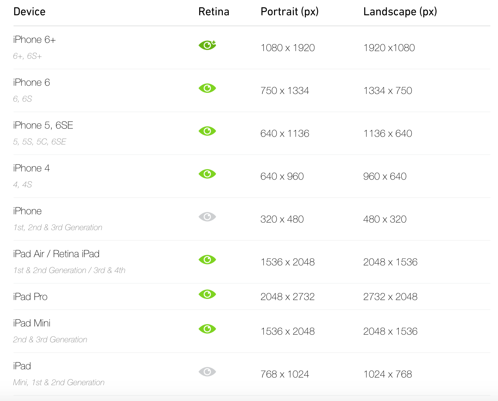
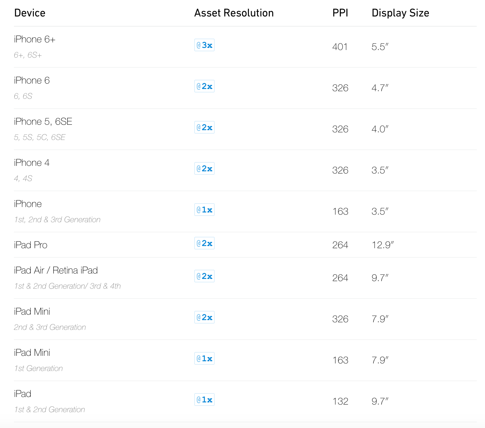

# iPhone Screen Sizes and Resolutions

```
iPhone 4, 4S => (3.5 inch) => 640 X 960
```

```
iPhone 5, 5S, 5C, 5SE => (4 inch) => 640 X 1136
```

```
iPhone 6, 6S => (4.7 inch) => 750 X 1334
```

```
iPhone 6 Plus, 6S Plus => (5.5 inch) => 1242 X 2208
```

# iPad Screen Sizes and Resolutions

```
iPad Mini => (7.9 inch) => 1536 X 2048
```

```
iPad Air => (9.7 inch) => 1536 X 2048
```

```
iPad Pro => (12.9 inch) => 2048 x 2732
```

----





----

### Refer

- [https://www.paintcodeapp.com/news/ultimate-guide-to-iphone-resolutions](https://www.paintcodeapp.com/news/ultimate-guide-to-iphone-resolutions)

- [http://ivomynttinen.com/blog/ios-design-guidelines](http://ivomynttinen.com/blog/ios-design-guidelines)