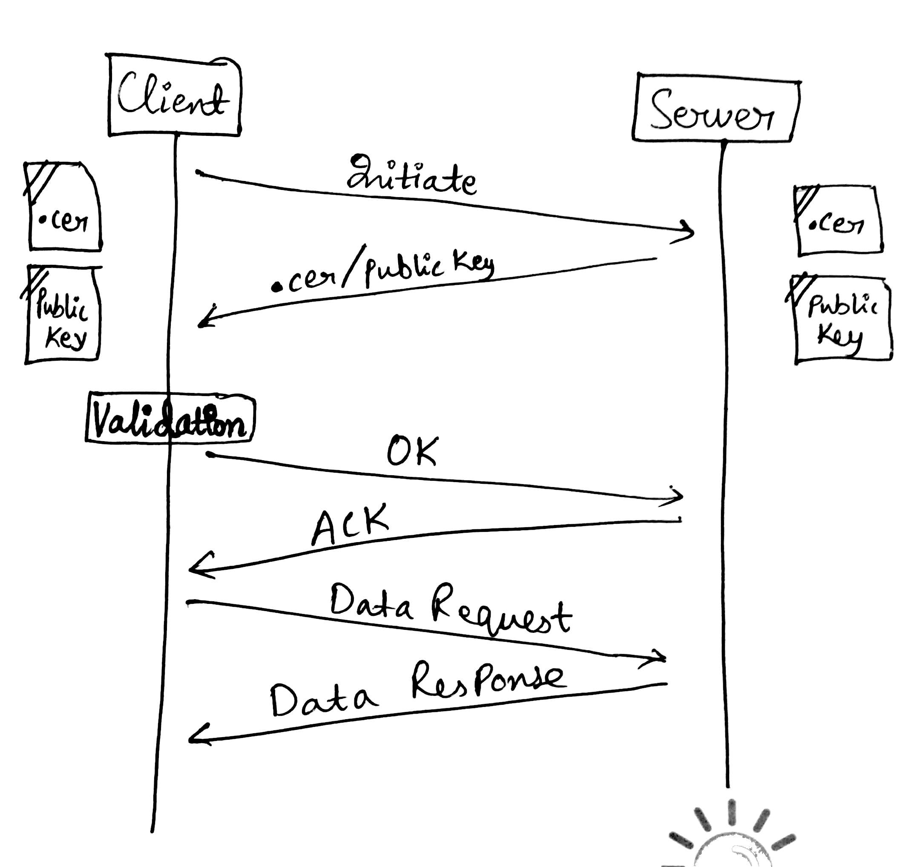

# Security in iOS Apps

We can secure our iOS apps mainly in two ways:

1. KeyChain Access
2. SSL Pinning

### KeyChain Access

We can save username, password and other sensitive information into device keychain, which is an encrypted container.

The 3 methods for doing this are:

1. secItemAdd()
2. secItemDelete()
3. secItemUpdate()

To read more, refer this [article](https://www.raywenderlich.com/92667/securing-ios-data-keychain-touch-id-1password).

### SSL Pinning

It secures the communication path between the client app and server during web-service calls. Mostly, when we use SSL Pinning for less secure HTTP (not HTTPS) connections.

There are **two ways of achieving SSL Pinning**:

1. **Certificate Pinning**
2. **Public Key Pinning**

We need SSL certificate of the target server in ```.cer``` or ```.der``` format file, which can be generated through command line. We need to drag and drop that .cer or .der file of the server into our project bundle.

Whenever the app sends a request to that server, it exchanges certificates first. The client app then verifies if the certificate received from the server is same as that in its project bundle. If yes, it communicates further. Else connection is terminated.

The flow chart is shown below:



**Public Key Pinning is better than Certificate Pinning.** Because certificates have an expiry date. Once expired, we need to issue it again and upload the app again. Public key never expires.

**SSL pinning can be covered using:**

1. NSURLSession (delegate methods like ```CanAutheticateAgainstProtectionSpace```, ```willSendRequestForAuthenticationChallenge```, ```didReceivedAuthenticationChallenge```)
2. AlamoFire
3. AFNetworking (using ```AFHTTPRequestOperationManager```)

To read more, refer this [article](https://infinum.co/the-capsized-eight/how-to-make-your-ios-apps-more-secure-with-ssl-pinning) and this [video](https://www.youtube.com/watch?v=is8lHjEkk7U).