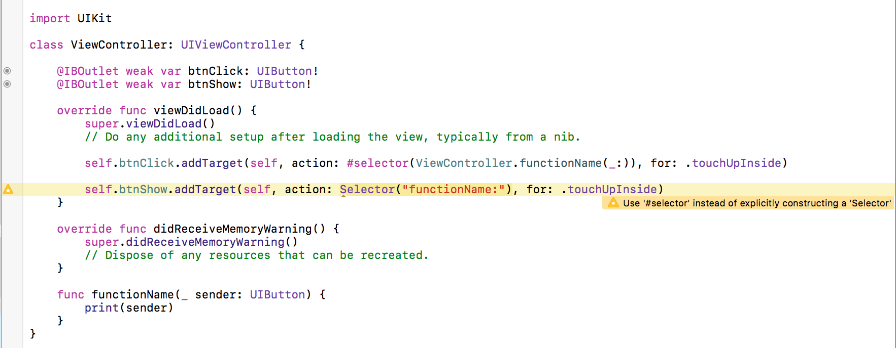
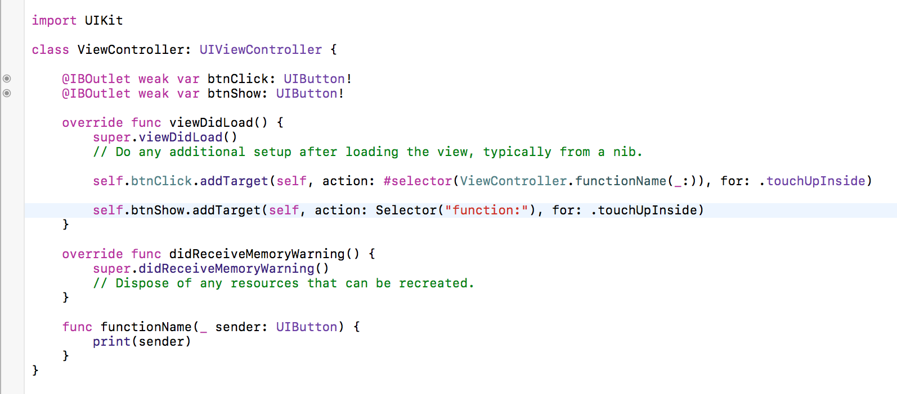
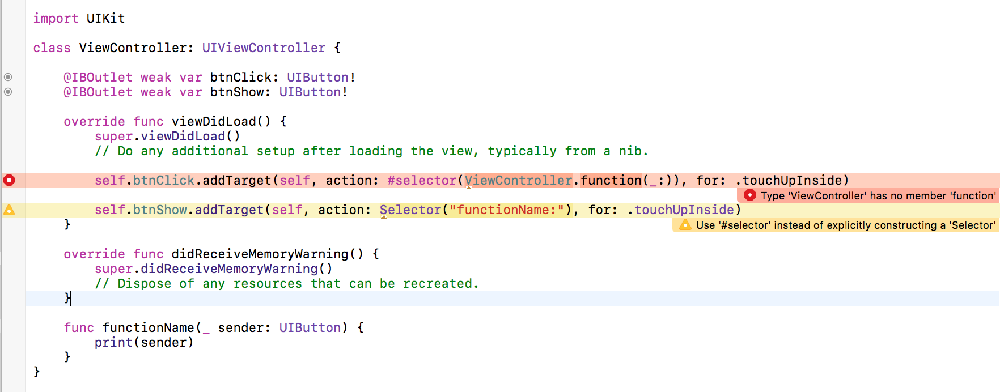
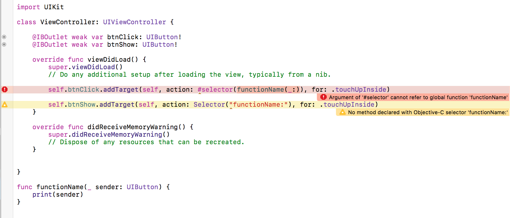

# Selectors in Swift

`#selector` in Swift is equivalent to `@selector` in Objective-C.

The `selector` is key to Objective-C’s dynamic runtime nature. You can tag a method to some event at runtime.

Before Swift 2.2, selectors were string literals and prone to error because we, as humans invented, and still contribute to typos whenever given the chance to write something without autocomplete.

However, our selectors are now much safer in Swift 2.2

Selectors aren’t part of the default Swift runtime behavior, because sending arbitrary messages to objects can be unsafe. The compiler can’t guarantee that the receiving object actually responds to that selector.

`#selector` was introduced in Swift 2.2. Prior versions of Swift used a String mechanism to automatically convert selector-looking strings into selectors. If you use this syntax today, you will get a deprecation warning.

You can also use `Selector("functionName:")` as an alternative syntax, but the compiler will give you a warning suggesting you use `#selector`, assuming it has seen this selector anywhere before.

Using selectors, we can send ONLY `sender` objects. Any other values like Int, Double, String can't be passed.

### Example

```
import UIKit

class ViewController: UIViewController {

    @IBOutlet weak var btnClick: UIButton!
    @IBOutlet weak var btnShow: UIButton!
    
    override func viewDidLoad() {
        super.viewDidLoad()
        // Do any additional setup after loading the view, typically from a nib.
        
        self.btnClick.addTarget(self, action: #selector(ViewController.functionName(_:)), for: .touchUpInside)
        
        self.btnShow.addTarget(self, action: Selector("functionName:"), for: .touchUpInside)
    }

    override func didReceiveMemoryWarning() {
        super.didReceiveMemoryWarning()
        // Dispose of any resources that can be recreated.
    }
    
    func functionName(_ sender: UIButton) {
        print(sender)
    }
}
```

We can use `selector` in two ways:



It works fine, but we see the compiler suggests us to use `#selector` instead of `Selector`.

----

If we use any function name with `Selector`, even if the function does not exist anywhere, the compiler does not throw any error.



At runtime, when it can't find the appropiate method, the app crashes.

----

But if we try using a function that does not exist, with `#selector`, the compiler immediately throws an error.



----

Also, the selectors can work only with class level methods, not global functions.

