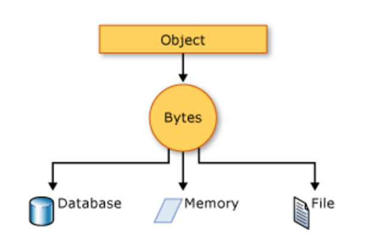

# What is Serialization and Deserialization?

### Serialization

Serialization is the process of converting an object (in RAM) into a stream of bytes in order to store the object or transmit it to memory, a database, a file (in HDD) or share through the stream.

Its main purpose is to save the state of an object in order to be able to recreate it when needed.

### Deserialization

Deserialization is process of converting that sequence of bytes into object. It is the reverse of Serialization.