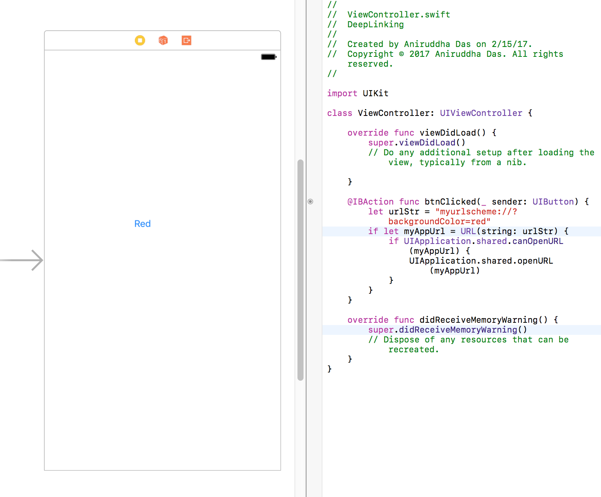

# Sharing Data between Apps using URL Schemes

### Step 1

Create a project named `URLSchemesDemo`.

### Step 2

Add an URL Scheme for your app which should be unique in the user's phone amongst all his apps.

For identifier, add your `bundle id`.

There are two ways to do this:

**Approach 1:**


**Approach 2:**


### Step 3

Inside the `AppDelegate.swift`, add this method:

```
func application(_ app: UIApplication, open url: URL, options: [UIApplicationOpenURLOptionsKey : Any] = [:]) -> Bool {
        // When you type "myurlscheme://red" in the search bar in Safari
        let urlScheme = url.scheme
        let host = url.host //red
        
            if (host == "red") {
                let vc = UIViewController()
                vc.view.backgroundColor = UIColor.red
                vc.title = host
                let navController = UINavigationController(rootViewController: vc)
                let barButtonItem = UIBarButtonItem(barButtonSystemItem: .done, target: self, action: #selector(dismiss))
                vc.navigationItem.leftBarButtonItem = barButtonItem
                self.window?.rootViewController?.present(navController, animated: true, completion: nil)
                return true
            }
        return false
    }
    
    func dismiss() {
        self.window?.rootViewController?.dismiss(animated: true, completion: nil)
    }
```

**OR**

```
func application(_ app: UIApplication, open url: URL, options: [UIApplicationOpenURLOptionsKey : Any] = [:]) -> Bool {
        
        // When you type "myurlscheme://?backgroundColor=red" in the search bar in Safari from your app or from some other app
        let urlComponents = NSURLComponents(url: url, resolvingAgainstBaseURL: false)
        let items = (urlComponents?.queryItems)! as [NSURLQueryItem] // {name = backgroundcolor, value = red}
        if (url.scheme  == "myurlscheme") {
            var color: UIColor? = nil
            var vcTitle = ""
            if let _ = items.first, let propertyName = items.first?.name, let propertyValue = items.first?.value {
                vcTitle = propertyName
                if (propertyValue == "red") {
                    color = .red
                } else if (propertyValue == "green") {
                    color = .green
                }
            }
            
            
            if (color != nil) {
                let vc = UIViewController()
                vc.view.backgroundColor = color
                vc.title = vcTitle
                let navController = UINavigationController(rootViewController: vc)
                let barButtonItem = UIBarButtonItem(barButtonSystemItem: .done, target: self, action: #selector(dismiss))
                vc.navigationItem.leftBarButtonItem = barButtonItem
                self.window?.rootViewController?.present(navController, animated: true, completion: nil)
                return true
            }
        }
        return false
    }
    
    func dismiss() {
        self.window?.rootViewController?.dismiss(animated: true, completion: nil)
    }
```

**Before moving to Step 4 or Step 5, make sure you install / run the app once in your device.**

### Step 4

To test this from Safari browser, run the app.


**OR**


### Step 5

To test this from another app, create another app named `DeepLinking`.

Inside it's `Info.plist`, add:


Add a button in your view controller and in it's IBAction, write this:

```
@IBAction func btnClicked(_ sender: UIButton) {
        let urlStr = "myurlscheme://?backgroundColor=red"
        if let myAppUrl = URL(string: urlStr) {
            if UIApplication.shared.canOpenURL(myAppUrl) {
                UIApplication.shared.openURL(myAppUrl)
            }
        }
    }
```



Now run the app.

