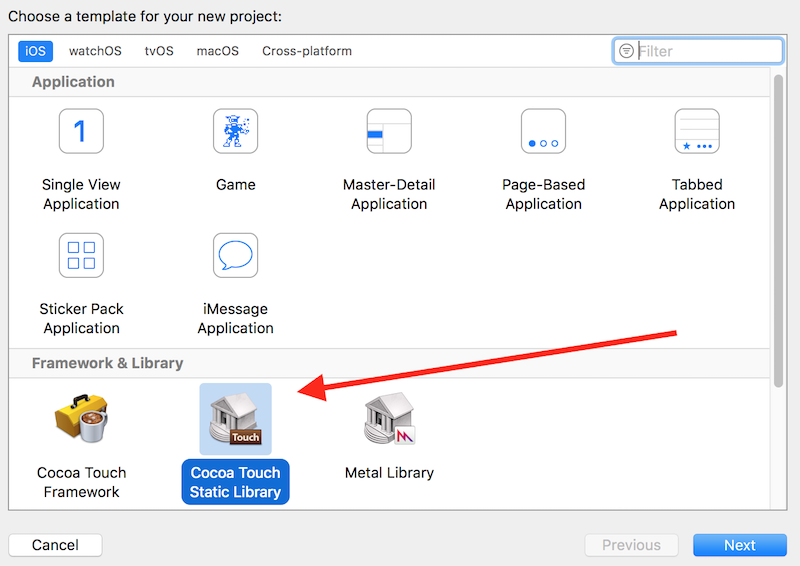

# Static Library VS Frameworks

* Static library is a set of precompiled classes packaged in the form of a file with ".a" extension, which we can reuse in several projects and also distribute in our team.

* Framework is also a set of precompiled classes, which can have images, resources, xibs in the same bundle. But static library can't have all of them in the same bundle. We need to distribute them in separate bundles.

* If we need to distribute everything in same bundle, we go for framework. Whereas, if we want to distribute code and resources as separate bundles, we opt for static library.

* Both provide us means to hide our source code from others. We only distribute precompiled classes for usablity.

* There are two types of frameworks:

	1) Embedded Framework
	
	2) Shared Framework

### How to create a static library?

1. Start Xcode. And click on new Xcode project as indicated below.

	

2. Choose project template.

	

3. Add Objective-C code into the project. And compile your code. Once you compile your code, as an end result, a static library will be generated.

	

4.  Right click on your product ```libMyStaticLibrary```, select `Show in finder` option to locate generated static library.

	

5. Import library by drag and drop into other objective-c projects.

### When to use static library?

To share library created by you with a number of people, but not allow them to see your code.

## Note: Swift doesn't support static library.

If you try to add Swift files, you will end up getting compilation errors as shown below.


