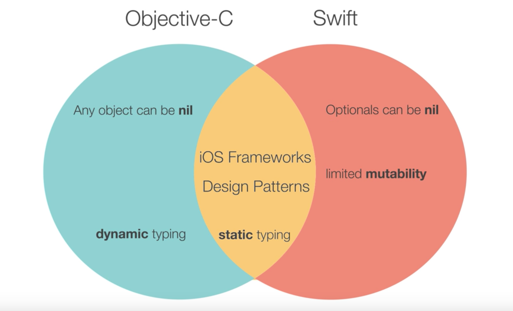

# Swift VS Objective C

# Features of Objective C

In Swift, constants are constant, variables vary, and by default we are encouraged to favor constants. In Objective-C mutability is limited by certain classes and property attributes; by default all objects are mutable.

Objective-C classes with limited mutability include all Foundation collections. For example, NSStrings are not mutable; to make a change to a string one must either make a new string or use NSMutableString. The same goes for NSArray and NSMutableArray, NSDictionary and NSMutableDictionary, NSSet and NSMutableSet

Swift is static-ly typed. The type of every entity is known at compile time.

Obj C uses a combination of both static and dynamic typing. For most entities, types is declared at compile time. But we can also declare an object as type `id`. It means it's type is `to be determined at runtime`.

In Obj C, arrays are not typed.

Dynamic Method Resolution:

How objects are bound to the methods they invoke.
In swift, method binding/resolution happens at compile time.
In Obj C, method binding/resolution happens at run time.

Both dynamic typing and dynamic method resolution place more power in the hands of the developer, rather than the hands of the compiler. You could call a method on an instance of a class, and even if that class doesn't implement that method your code will still compile. You can even change or add method implementations at runtime.

# Refer

http://stackoverflow.com/questions/211616/hidden-features-of-objective-c

https://www.udacity.com/course/objective-c-for-swift-developers--ud1009