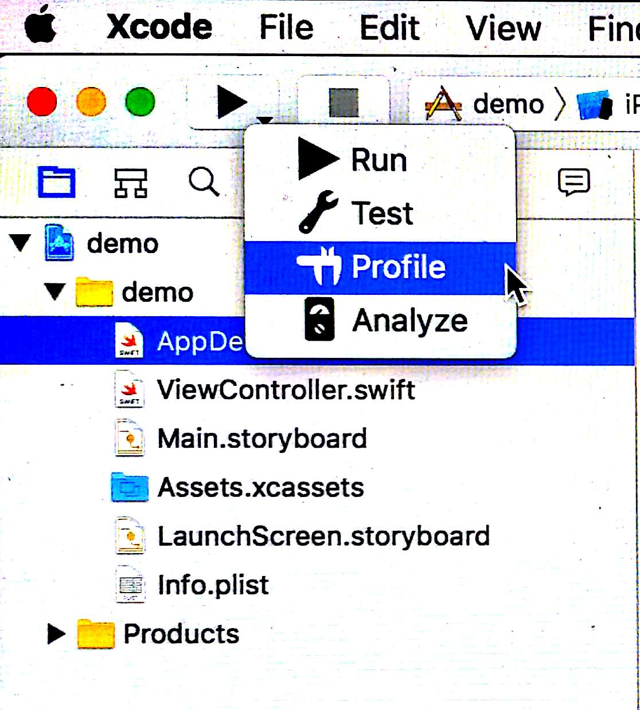
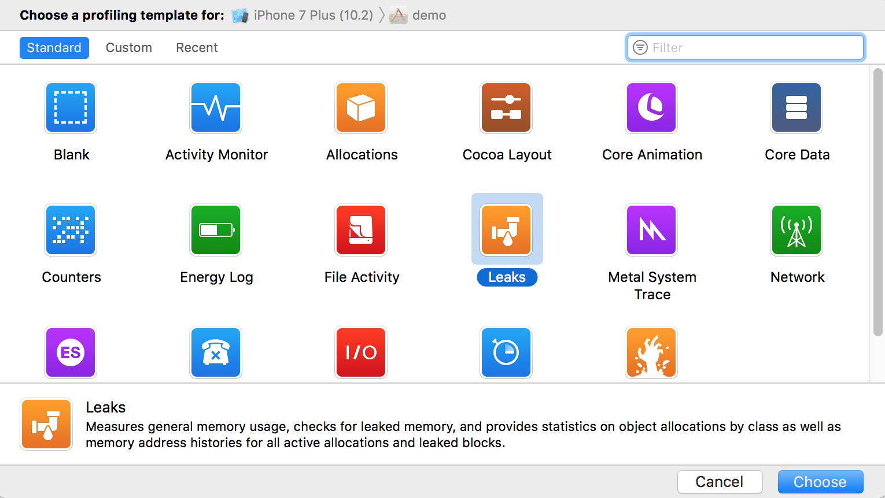
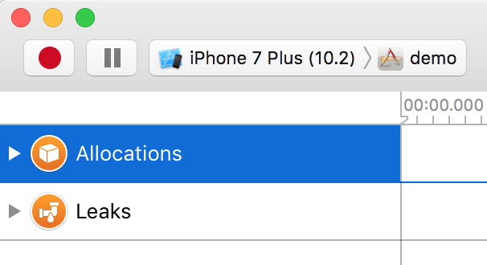
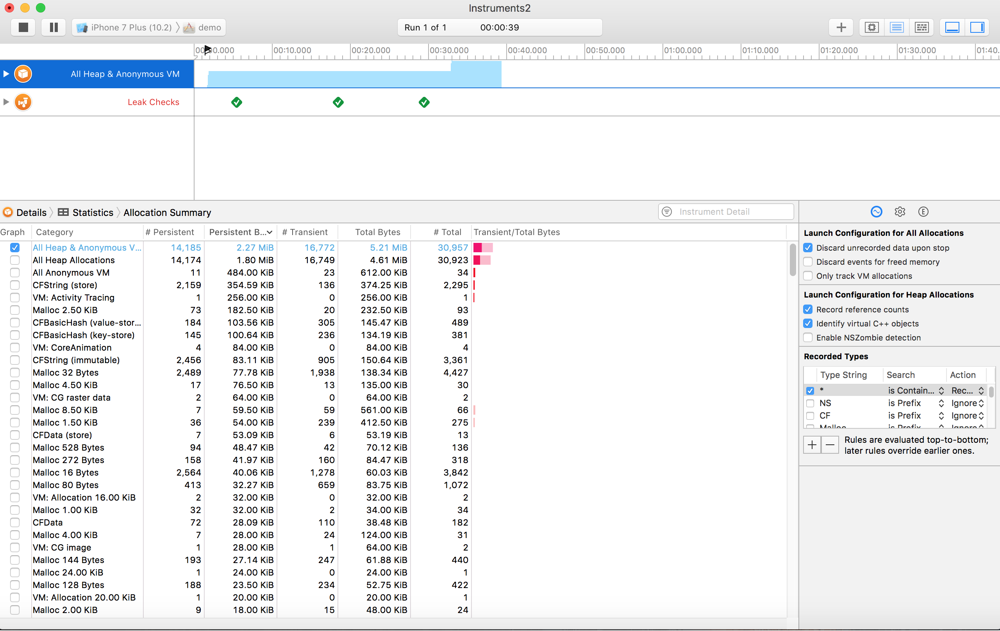
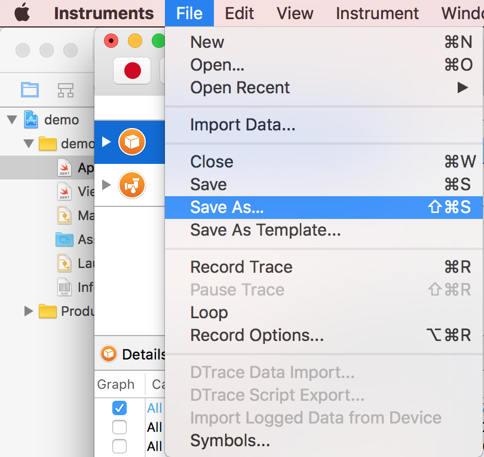
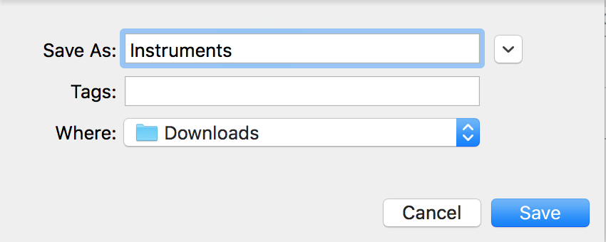

# Explain the process for tracing and fixing a memory leak

Xcode provides a tool called ```instruments``` where we can record the activity of an application. And we can capture the memory leaks.

### Step 1

- Choose any simulator.
- Run the App.
- Stop running the App.

### Step 2

- Hold and press on the arrow below `Run` option in Xcode. You will then see `Profile` option. Click on it.



- Select `Leaks` option.



### Step 3

- Click on the red button to start leak tracing.



- You can see reports on the window. All green checks means app has no memory issues. If any check is read, it means there is some memory issue with your app.



### Step 4

You can now save this report of Profile Test.



