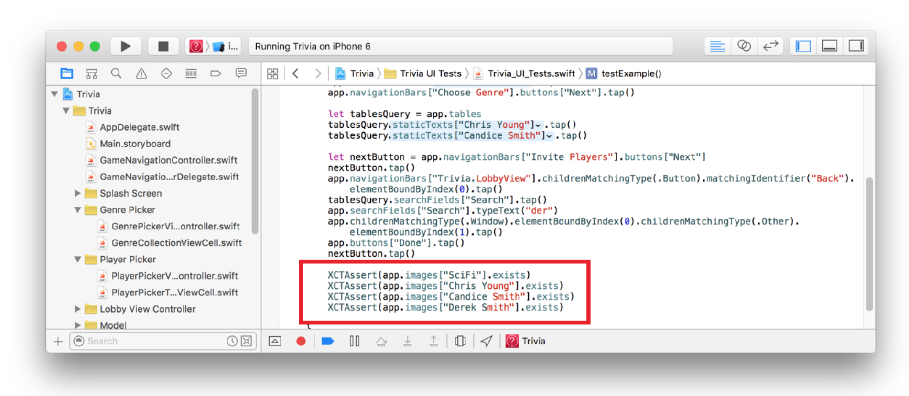
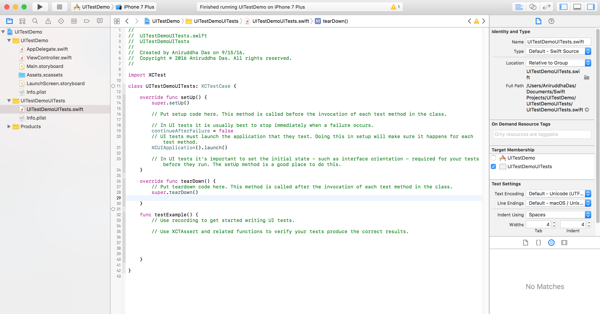

# UI Testing

Xcode can record steps in a unit test as you use your app in Simulator. After recording the test, add assertions that check if interface elements are in the expected state.

# Recording a Test

Recording UI tests requires:

- A UI test target for your project
- Accessibility information for your UI elements
- OS X v10.11 or greater
- iOS 9 or greater

Once your app is ready to record a test, open a source file in the UI test target and insert the cursor in a test method. You can add to an existing test method or create a new one. Click the Record button, and Xcode launches your app in Simulator. Perform the actions that make up the test. Each time you touch an element on the screen, Xcode adds a line of code to your test method. Click the Record button again to stop adding actions to the method.

Add assertions to check if the user interface is in the correct state after the test completes. You can use assertions to test parts of the interface including strings in text fields or buttons, the number of table view cells, the existence of a particular button, and much more.

### Example

For more detail on writing, running, and viewing tests, see [Testing with Xcode](https://developer.apple.com/library/content/documentation/DeveloperTools/Conceptual/testing_with_xcode/chapters/01-introduction.html#//apple_ref/doc/uid/TP40014132).
