# Understanding OAuth2

Let's say I have an app which acts as `Client` or `My Server` and Facebook has a server `Server` / `Facebook Server`. Now, I want some information from the Facebook server, but facebook does not know that I am an authentic client.


So we can use `OAuth` here. OAuth can identify my app as an `OAuth Client` and Facebook has already implemented an `OAuth Provider`.

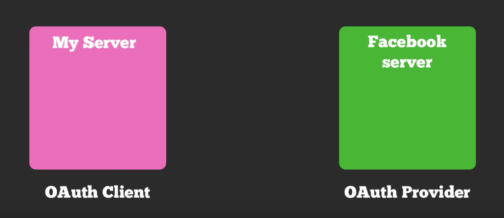

So first of all, we manually go to Facebook Developer Console and register our app. The moment we do this, the OAuth Provider generates a `client_id` and a `client_secret` for us.

We then register our app as an OAuth Client by feeding those same `client_id` and `client_secret` into our app.

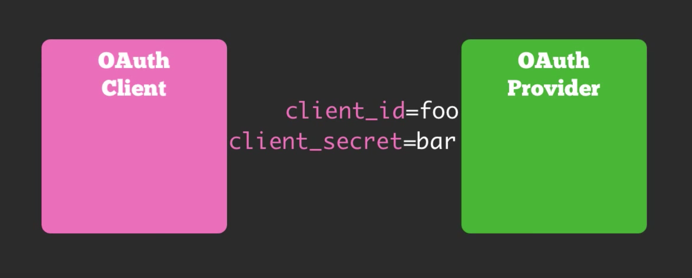

Once we have those credentials, we can send an user over from the OAuth Client app to the OAuth Provider and tell the OAuth Provider that we are looking for authorization for this user and that we want information regarding this user from the OAuth Provider.

In this request, we also need to send the `client_id` and the `redirect_uri`.

```
GET: provider.com/oauth/authorize? client_id="foo"&redirect_uri="client.com/oauth_accept"
```

By the `client_id`, the OAuth Provider remembers who we are. In the `redirect_uri`, we implement custom code to catch the user as they are coming back into the system.

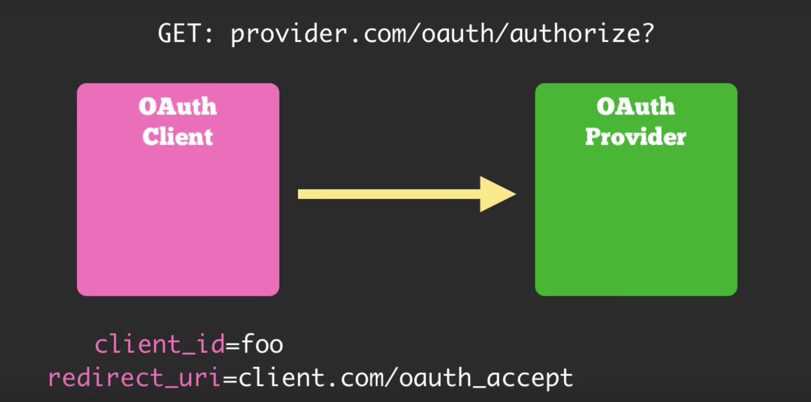

Upon receiving the request from the client, the OAuth Provider would want to know if it's okay with the user to allow the app to access their information.

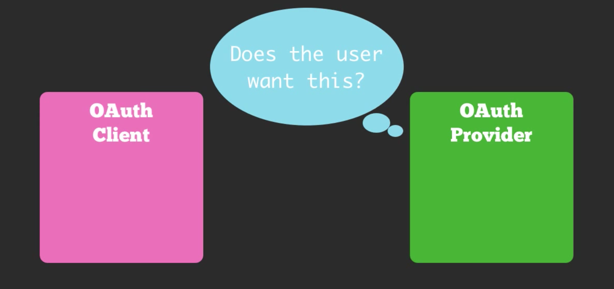

So the provider will typically show a screen to the user asking them whether or not they would allow access to the app.

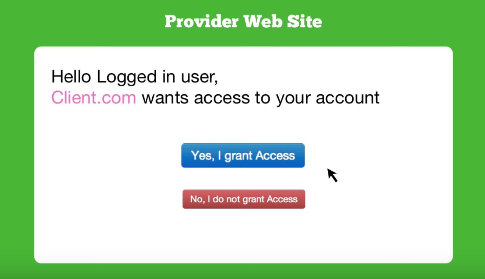

If they say `Yes. I grant access`, then the OAuth Provider will respond by redirecting the user back to the `redirect_uri` given by the OAuth Client. In addition to this, it will also include a parameter of `code`. This code will have an `one-time-use unique token` that can later be used as to get an **access_token** for subsequent requests that the client makes to the server.

```
GET: client.com/oauth_accept?code="foobahz"
```

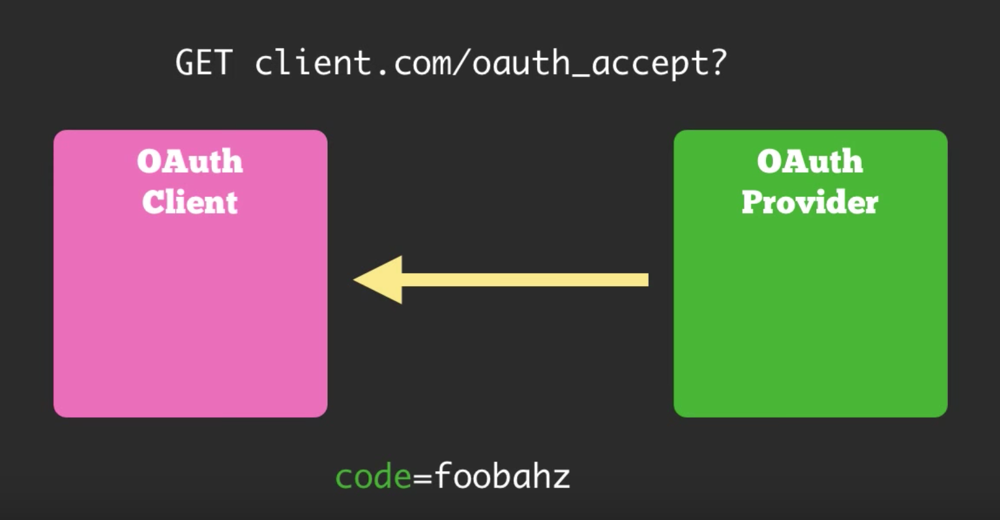

The OAuth Client app will then take this `code` and issue a POST to the OAuth Provider at a given URL. In this POST request, the client includes the `code`, the `client_id` and the `client_secret` that it had got previously.

This is required so that the OAuth Provider knows two things:

- No one is actually faking to be a OAuth Client. This is ensured by the `client_id` and the `client_secret`.

- The user indeed give access to the app to fetch the information on their behalf. This is ensured by the `code`.

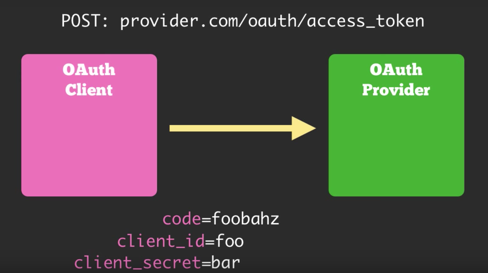

Once the OAuth Provider gets all those and all those are correct, then it will send back an `access_token` back to the OAuth Client.

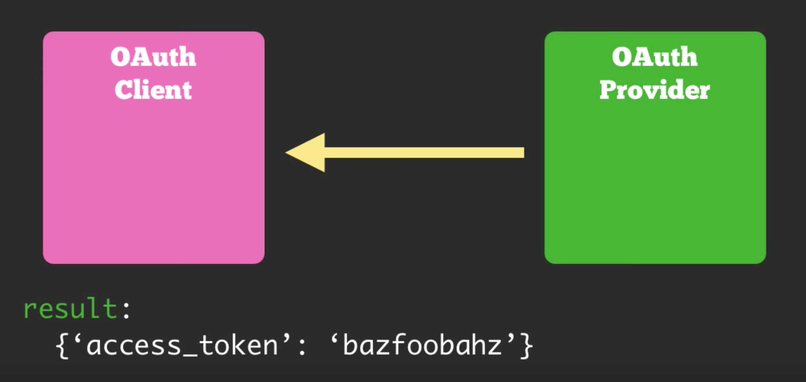

The OAuth Client then has got access.

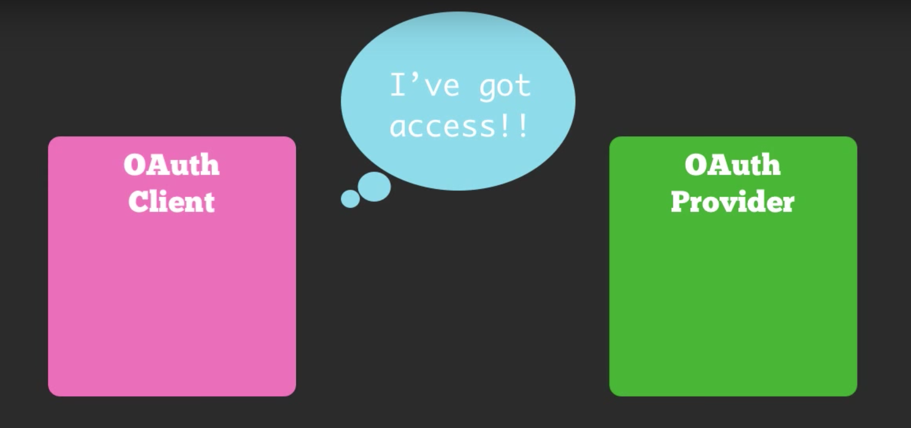

The OAuth Client can then do any request to the OAuth Provider. They just need to send the `access_token` along with any URL Requests.

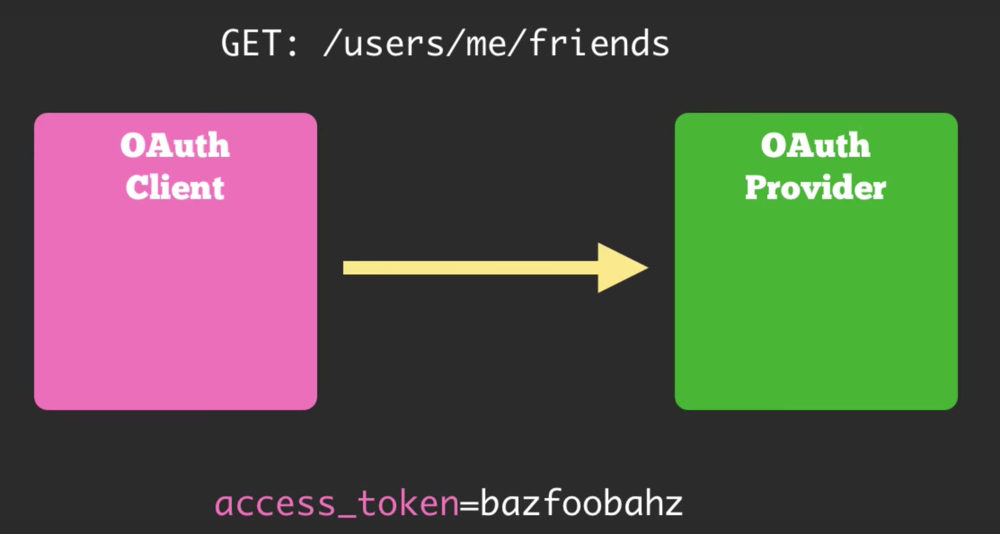

The OAuth Provider now knows that they are a valid user with an `access_token`.

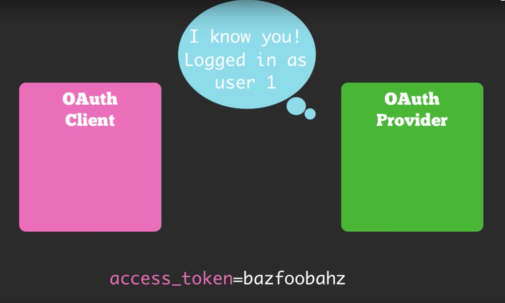

The OAuth Provider then responds back with appropiate results.

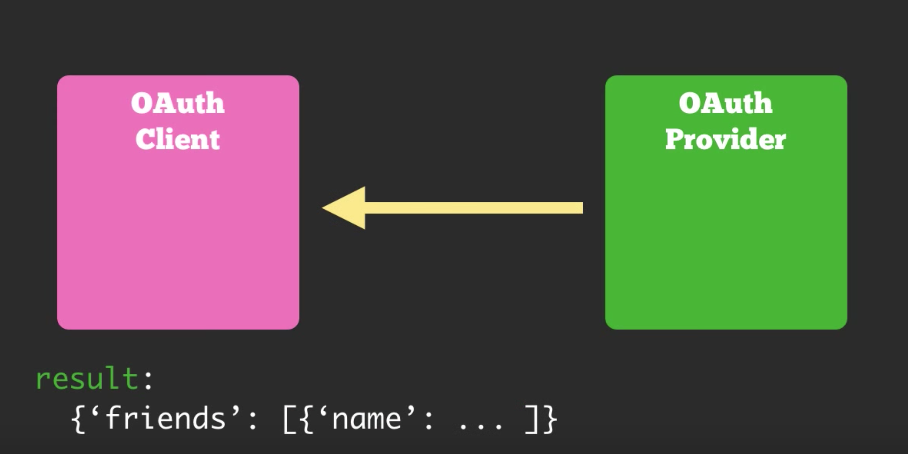