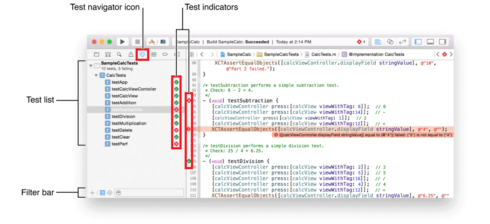
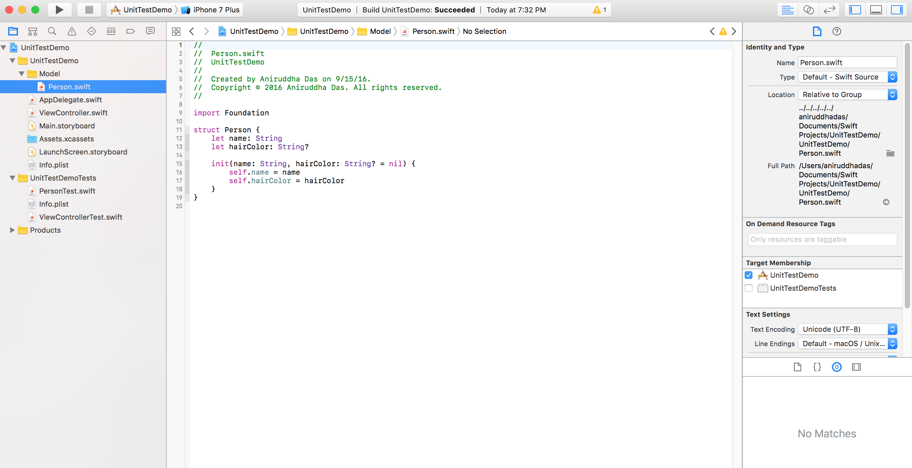
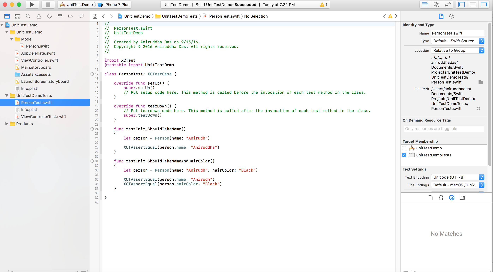
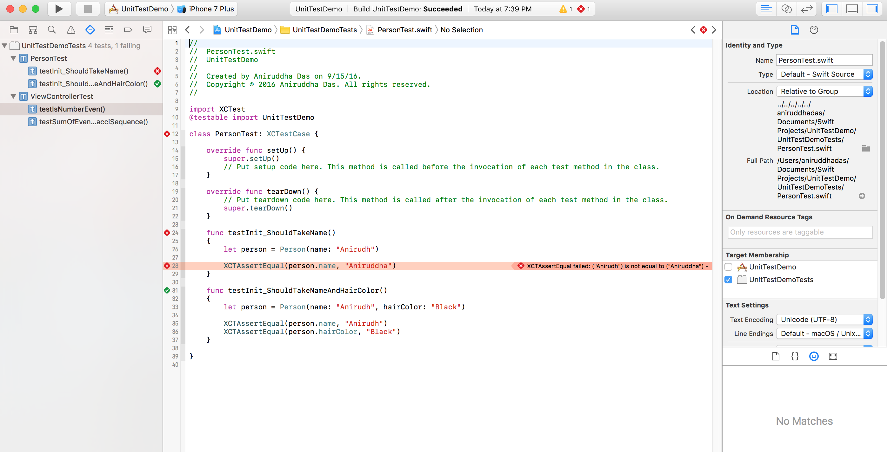
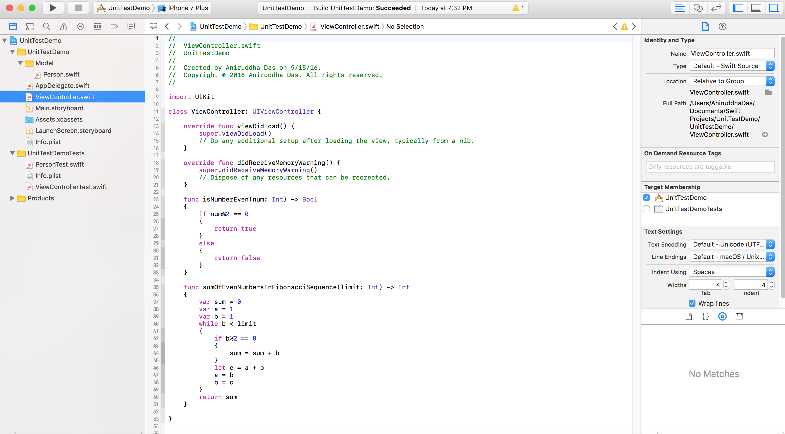
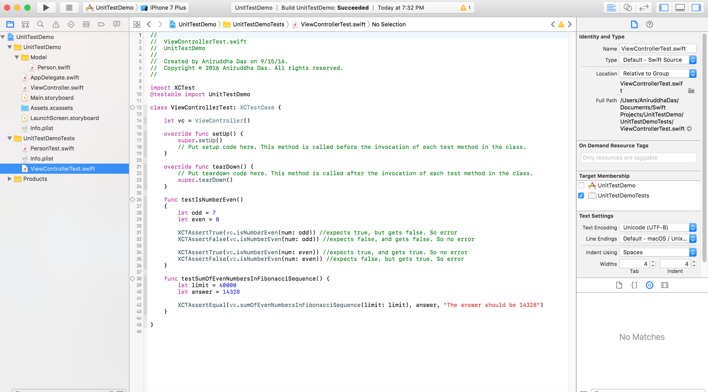
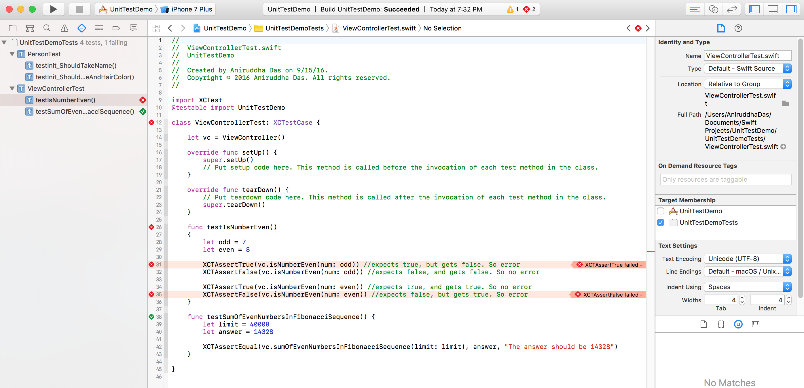

# Unit Testing

When you create a project or a target, Xcode includes a unit test target in the scheme that builds the app. The implementation file for the target includes stubs for the setUp,
tearDown, and testExample methods. Complete these stub implementations and add other code as necessary to perform unit tests on your app.

Run all tests by choosing Product > Test. Click the Test Navigator icon to view the status and results of the tests. You can add a test target to a project (or add a class to a test) by clicking the Add button (+) in the bottom-left corner of the test navigator. To view the source code for a particular test, select it from the test list. The file opens in the source code editor.

To run a test suite, click the arrow to the right of the name. To run a subset of test methods, select them in the test navigator and choose Product > Perform Action > Run Test Methods. To run an individual test method, click the arrow to the right of the method name. Choose Product > Test to run all tests in the active scheme.

When a test succeeds, a green diamond with a checkmark denoting success appears to the right of the test name. When a test fails, a red diamond with an X denoting failure appears to the right of the test name and the issue is displayed in the issue navigator. To see the issue, click the Issue Navigator button in the navigator bar.

To view only the failed tests, click the Failed Test button at the bottom of the test navigator. Select a failed method to examine it in the source code editor. After addressing the reason for the failure, click the failed test indicator (a red diamond with an X) to rerun the test. Show related test methods in an assistant editor by choosing either the Test Classes or Test Callers category from the Assistant pop-up menu.

### Example

For more detail on writing, running, and viewing tests, see [Testing with Xcode](https://developer.apple.com/library/content/documentation/DeveloperTools/Conceptual/testing_with_xcode/chapters/01-introduction.html#//apple_ref/doc/uid/TP40014132).