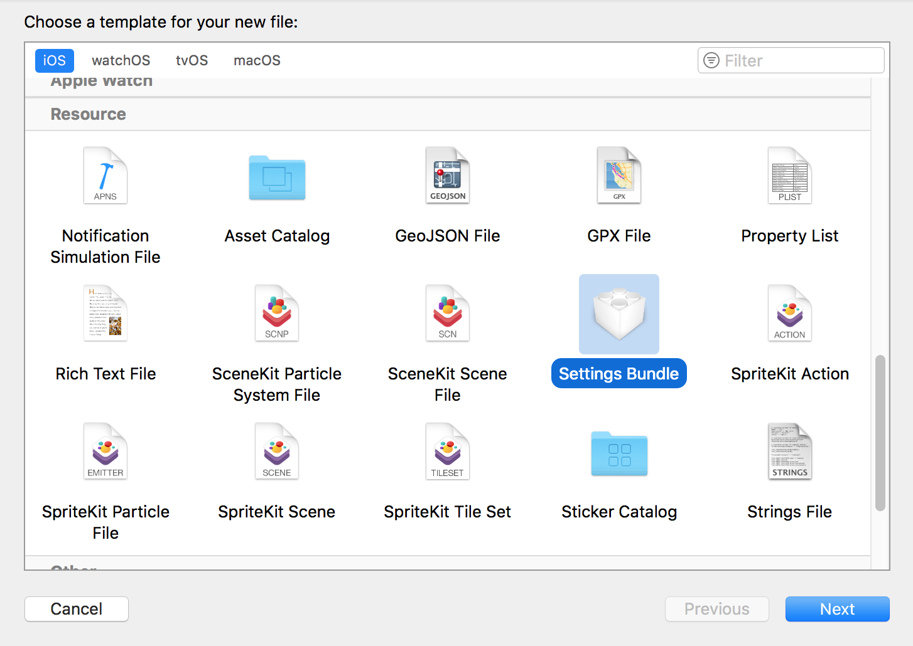
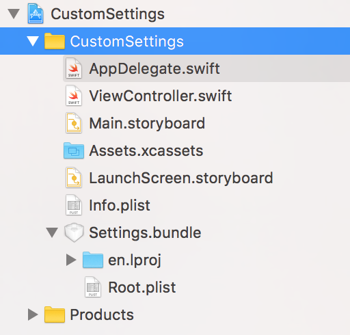
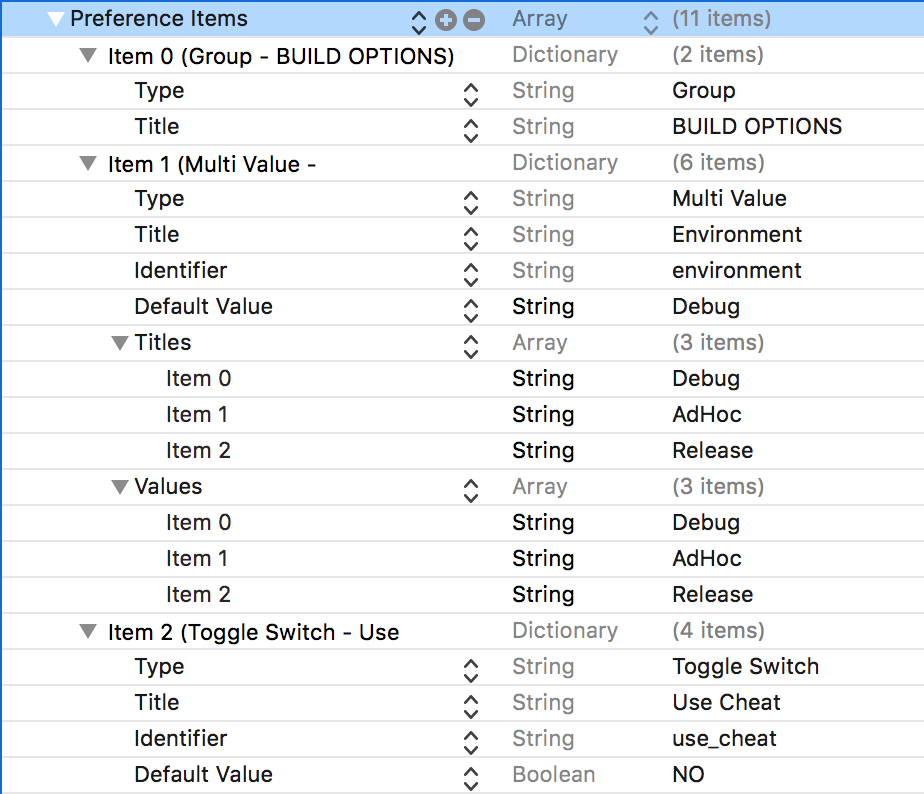
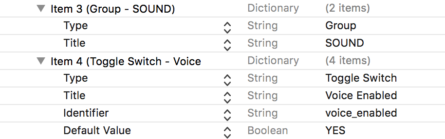
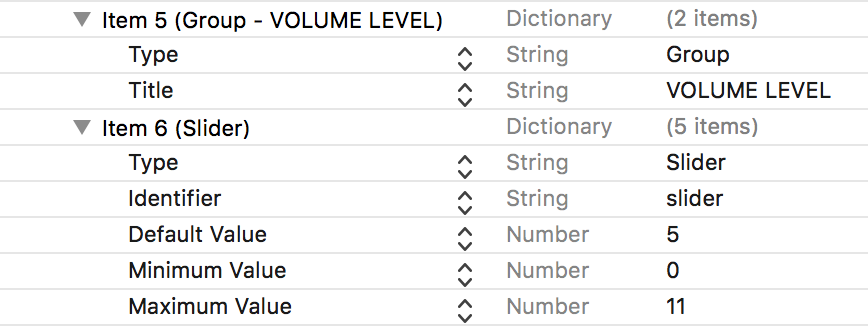
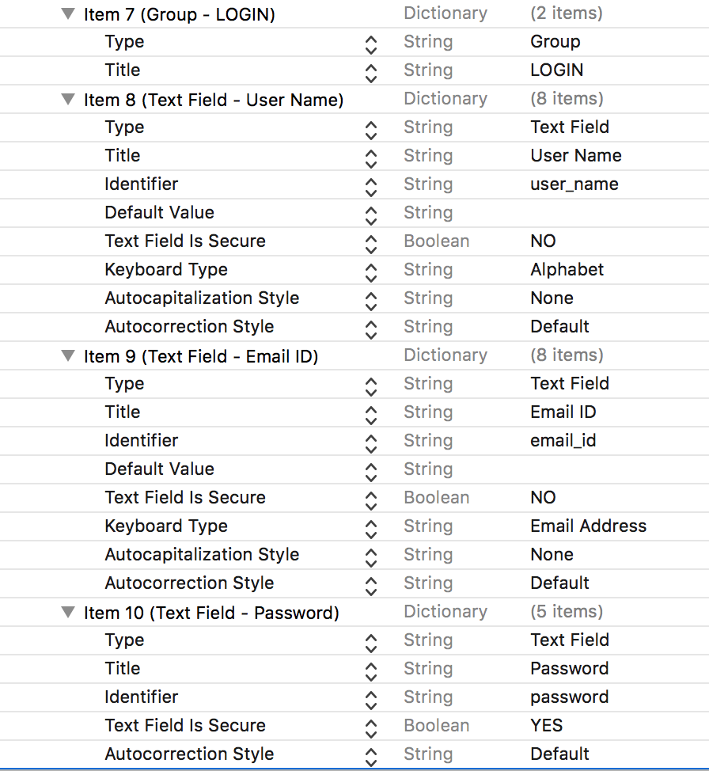
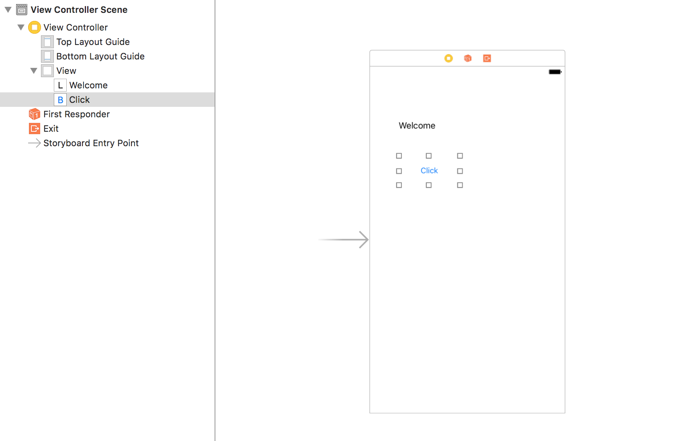
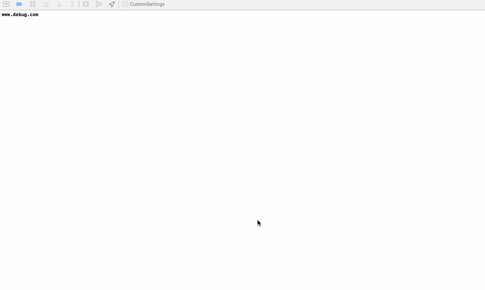
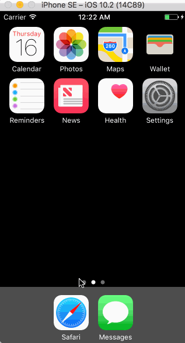

# Using Settings Bundle In Swift

Settings Bundle comes with a `Root.plist`, where we define the elements we want to show to the user.

It stores values in `UserDefaults`, and we keep track of it by using `NotificationCenter`.

----

### Step 1

Create a project named `CustomSettings`.

### Step 2

Add a Settings Bundle File and name it `Settings`.





### Step 3

Inside the `Root.plist`, add:









### Step 4

Design your View Controller with a label and a button, with IBAction.



### Step 5

Inside the `ViewController.swift`, write:

```
import UIKit

class ViewController: UIViewController {

    var buildEnvironment: String? = ""
    var cheat: Bool?
    var sound: Bool?
    var volume: Int?
    var name: String? = ""
    var email: String? = ""
    var password: String? = ""
    
    let userDefaults = UserDefaults.standard
    
    override func viewDidLoad() {
        super.viewDidLoad()
        // Do any additional setup after loading the view, typically from a nib.
        
        UserDefaults.standard.register(defaults: [String : Any]())
        
        if let buildEnvironment = userDefaults.string(forKey: "environment") {
            self.buildEnvironment = buildEnvironment
        }
        self.cheat = userDefaults.bool(forKey: "use_cheat")
        self.sound = userDefaults.bool(forKey: "voice_enabled")
        self.volume = userDefaults.integer(forKey: "slider")
        
        if let name = userDefaults.string(forKey: "user_name") {
            self.name = name
        }
        if let email = userDefaults.string(forKey: "email_id") {
            self.email = email
        }
        if let password = userDefaults.string(forKey: "password") {
            self.password = password
        }
        
        self.getBuildEnvironment(buildEnvironment: self.buildEnvironment!)
    }
    
    func getBuildEnvironment(buildEnvironment: String) {
        switch self.buildEnvironment! {
        case "Debug":
            print("www.debug.com")
        case "AdHoc":
            print("www.adhoc.com")
        case "Release":
            print("www.release.com")
        default:
            print("www.debug.com")
        }
    }
    
    override func viewDidAppear(_ animated: Bool) {
        super.viewDidAppear(animated)
        
        
        
    }
    
    override func viewWillAppear(_ animated: Bool) {
        super.viewWillAppear(animated)
        NotificationCenter.default.addObserver(self, selector: #selector(ViewController.settingsChanged), name: UserDefaults.didChangeNotification, object: nil)
    }

    override func didReceiveMemoryWarning() {
        super.didReceiveMemoryWarning()
        // Dispose of any resources that can be recreated.
    }

    
    func settingsChanged(notification: NSNotification) {
        
        print("Previous Values are: \(buildEnvironment!), \(cheat!), \(sound!), \(volume!), \(name!), \(email!), \(password!)")
        if let buildEnvironment = userDefaults.string(forKey: "environment") {
            self.buildEnvironment = buildEnvironment
        }
        self.cheat = userDefaults.bool(forKey: "use_cheat")
        self.sound = userDefaults.bool(forKey: "voice_enabled")
        self.volume = userDefaults.integer(forKey: "slider")
        if let name = userDefaults.string(forKey: "user_name") {
            self.name = name
        }
        if let email = userDefaults.string(forKey: "email_id") {
            self.email = email
        }
        if let password = userDefaults.string(forKey: "password") {
            self.password = password
        }
        print("Changes Values are: \(buildEnvironment!), \(cheat!), \(sound!), \(volume!), \(name!), \(email!), \(password!)")
        
        self.getBuildEnvironment(buildEnvironment: self.buildEnvironment!)
    }
    
    
    @IBAction func btnClicked(_ sender: UIButton) {
        let alertController = UIAlertController(title: "Open Settings", message: "Do you want to open settings?", preferredStyle: .alert)
        
        let settingsAction = UIAlertAction(title: "Settings",style: .default, handler: { (alertAction) -> Void in
            if let appSettings = NSURL(string: UIApplicationOpenSettingsURLString) {
                UIApplication.shared.openURL(appSettings as URL)
            }
        })
        
        alertController.addAction(settingsAction)
        
        let cancelAction = UIAlertAction(title: "Cancel", style: .cancel, handler: nil)
        alertController.addAction(cancelAction)
        
        self.present(alertController, animated: true, completion: nil)
    }

}
```

The Output is:



### Step 6

You can also write values into the Settings Bundle.

In the `ViewController.swift`, change the `viewWillAppear` as:

```
override func viewWillAppear(_ animated: Bool) {
        super.viewWillAppear(animated)
        NotificationCenter.default.addObserver(self, selector: #selector(ViewController.settingsChanged), name: UserDefaults.didChangeNotification, object: nil)
        
        userDefaults.setValue("cse.anirudh@gmail.com", forKey: "email_id")
        userDefaults.synchronize()
    }
```

The Output is:



### Refer

- [https://www.youtube.com/watch?v=9-iFQqGmMcw&t=1s&spfreload=10](https://www.youtube.com/watch?v=9-iFQqGmMcw&t=1s&spfreload=10)
- [https://www.youtube.com/watch?v=dP-MK0t1sRI&t=73s](https://www.youtube.com/watch?v=dP-MK0t1sRI&t=73s)