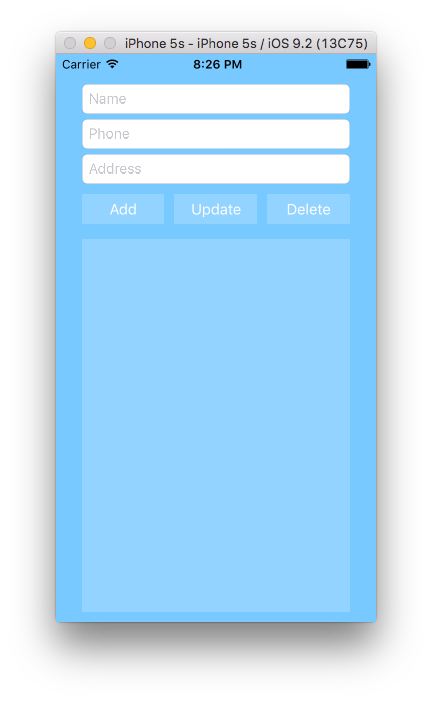
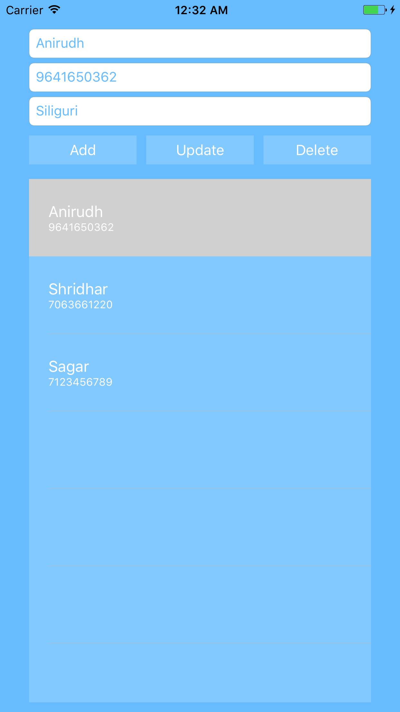

# Using Sqlite in IOS

### Introduction

Almost all apps will need to store data of some form. Maybe you need to save user preferences, progress in a game, or offline data so your app can work without a network connection. Developers have a lot of options for managing data in iOS apps, from Core Data to cloud based storage, but one elegant and reliable local storage option is SQLite.

### Getting Started

The SQLite library is written in C, and all queries happen as calls to C functions. This makes it challenging to use, as you have to be aware of pointers and data types etc. To help, you can make use of Objective-C or Swift wrappers to serve as an adapter layer.

A popular choice is **FMDB**, an `Objective-C wrapper` around SQLite. Its easy to use, but personally I prefer to not use `hard-coded SQL (Structured Query Language) commands`. For this tutorial, I will use **SQLite.swift** to create a basic contact list.

### Example

**STEP 1**

Create an App named `SqliteDemo`, and also add a `Podfile` having:

```
target "SqliteDemo" do
  use_frameworks!
  pod 'SQLite.swift'
end
```

Use terminal to get inside the project directory and use command:

```
pod install
```

**STEP 2**

Create a layout like this in your storyboard. It has 3 textfields, 3 buttons and a table view at the bottom. Use `ContactCell` as TableViewCell identifier.



**STEP 3**

Add a swift file `Contact.swift`. This is gonna be our model class.

```
import Foundation

class Contact {
    let id: Int64?
    var name: String
    var phone: String
    var address: String
    
    init(id: Int64) {
        self.id = id
        name = ""
        phone = ""
        address = ""
    }
    
    init(id: Int64, name: String, phone: String, address: String) {
        self.id = id
        self.name = name
        self.phone = phone
        self.address = address
    }
    
}
```

**Note:** The `id` is required as a parameter when creating an object, so you can reference it in the database later.

**STEP 4**

Add a swift file `DBConnector.swift`. This is gonna handle CRUD operations for us.

```
import SQLite

class DBConnector {
    
    fileprivate let contacts = Table("contacts")
    fileprivate let id = Expression<Int64>("id")
    fileprivate let name = Expression<String?>("name")
    fileprivate let phone = Expression<String>("phone")
    fileprivate let address = Expression<String>("address")
    
    static let instance = DBConnector()
    fileprivate let db: Connection?
    
    fileprivate init() {
        let path = NSSearchPathForDirectoriesInDomains(
            .documentDirectory, .userDomainMask, true
            ).first!
        
        do {
            db = try Connection("\(path)/myDatabase.sqlite3")
            createTable()
        } catch {
            db = nil
            print ("Unable to open database")
        }
    }
    
    func createTable() {
        do {
            try db!.run(contacts.create(ifNotExists: true) { table in
                table.column(id, primaryKey: true)
                table.column(name)
                table.column(phone, unique: true)
                table.column(address)
            })
        } catch {
            print("Unable to create table")
        }
    }
    
    func addContact(_ cname: String, cphone: String, caddress: String) -> Int64? {
        do {
            let insert = contacts.insert(name <- cname, phone <- cphone, address <- caddress)
            let id = try db!.run(insert)
            
            return id
        } catch {
            print("Insert failed")
            return nil
        }
    }
    
    func getContacts() -> [Contact] {
        var contacts = [Contact]()
        
        do {
            for contact in try db!.prepare(self.contacts) {
                contacts.append(Contact(
                    id: contact[id],
                    name: contact[name]!,
                    phone: contact[phone],
                    address: contact[address]))
            }
        } catch {
            print("Select failed")
        }
        
        return contacts
    }
    
    func deleteContact(_ cid: Int64) -> Bool {
        do {
            let contact = contacts.filter(id == cid)
            try db!.run(contact.delete())
            return true
        } catch {
            
            print("Delete failed")
        }
        return false
    }
    
    func updateContact(_ cid:Int64, newContact: Contact) -> Bool {
        let contact = contacts.filter(id == cid)
        do {
            let update = contact.update([
                name <- newContact.name,
                phone <- newContact.phone,
                address <- newContact.address
                ])
            if try db!.run(update) > 0 {
                return true
            }
        } catch {
            print("Update failed: \(error)")
        }
        
        return false
    }
}
```

**STEP 5**

Finally in the `ViewController.swift`, write:

```
import UIKit

class ViewController: UIViewController, UITableViewDataSource, UITableViewDelegate {
    
    @IBOutlet weak var nameTextField: UITextField!
    @IBOutlet weak var phoneTextField: UITextField!
    @IBOutlet weak var addressTextField: UITextField!
    
    @IBOutlet weak var contactsTableView: UITableView!
    
    fileprivate var contacts = [Contact]()
    fileprivate var selectedContact: Int?
    
    override func viewDidLoad() {
        super.viewDidLoad()
        // Do any additional setup after loading the view, typically from a nib.
        
        contactsTableView.dataSource = self
        contactsTableView.delegate = self
        
        contacts = DBConnector.instance.getContacts()
    }
    
    override func didReceiveMemoryWarning() {
        super.didReceiveMemoryWarning()
        // Dispose of any resources that can be recreated.
    }
    
    // MARK: Button functions
    
    @IBAction func addButtonClicked() {
        let name = nameTextField.text ?? ""
        let phone = phoneTextField.text ?? ""
        let address = addressTextField.text ?? ""
        
        if let id = DBConnector.instance.addContact(name, cphone: phone, caddress: address) {
            let contact = Contact(id: id, name: name, phone: phone, address: address)
            contacts.append(contact)
            contactsTableView.insertRows(at: [IndexPath(row: contacts.count-1, section: 0)], with: .fade)
        }
    }
    
    @IBAction func updateButtonClicked() {
        if selectedContact != nil {
            let id = contacts[selectedContact!].id!
            let contact = Contact(
                id: id,
                name: nameTextField.text ?? "",
                phone: phoneTextField.text ?? "",
                address: addressTextField.text ?? "")
            
            let _ = DBConnector.instance.updateContact(id, newContact: contact)
            
            contacts.remove(at: selectedContact!)
            contacts.insert(contact, at: selectedContact!)
            
            contactsTableView.reloadData()
        } else {
            print("No item selected")
        }
    }
    
    @IBAction func deleteButtonClicked() {
        if selectedContact != nil {
            let _ = DBConnector.instance.deleteContact(contacts[selectedContact!].id!)
            contacts.remove(at: selectedContact!)
            contactsTableView.deleteRows(at: [IndexPath(row: selectedContact!, section: 0)], with: .fade)
        } else {
            print("No item selected")
        }
    }
    
    // MARK: TableView functions
    func tableView(_ tableView: UITableView, didSelectRowAt indexPath: IndexPath) {
        nameTextField.text = contacts[indexPath.row].name
        phoneTextField.text = contacts[indexPath.row].phone
        addressTextField.text = contacts[indexPath.row].address
        
        selectedContact = indexPath.row
    }
    
    func tableView(_ tableView: UITableView, numberOfRowsInSection section: Int) -> Int {
        return contacts.count
    }
    
    func tableView(_ tableView: UITableView, cellForRowAt indexPath: IndexPath) -> UITableViewCell {
        
        let cell = tableView.dequeueReusableCell(withIdentifier: "ContactCell")!
        var label: UILabel?
        label = cell.viewWithTag(1) as? UILabel // Name label
        label?.text = contacts[indexPath.row].name
        
        label = cell.viewWithTag(2) as? UILabel // Phone label
        label?.text = contacts[indexPath.row].phone
        
        return cell
    }
}
```

### Output



### Refer

[https://www.sitepoint.com/managing-data-in-ios-apps-with-sqlite/](https://www.sitepoint.com/managing-data-in-ios-apps-with-sqlite/)