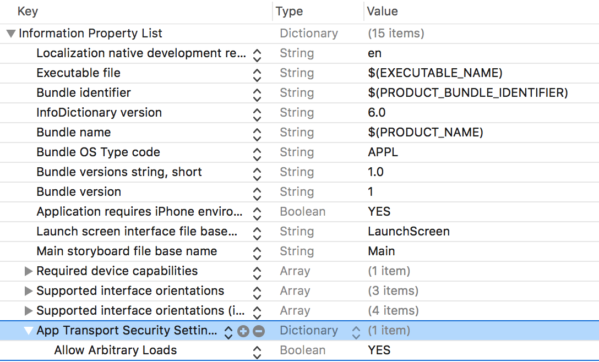

# Working With WebView

### Step 1

Create a project named `WebView`.

### Step 2

In the storyboard, drag a web view on the view controller.


### Step 3

Disable `AppTransportSecurity` in `Info.plist`.



### Step 4

In `ViewController.swift`, add:

```
import UIKit

class ViewController: UIViewController {

    @IBOutlet weak var webView: UIWebView!
    
    override func viewDidLoad() {
        super.viewDidLoad()
        let url = URL(string: "http://www.google.co.in")
        let request = URLRequest(url: url!)
        webView.loadRequest(request)
        // Do any additional setup after loading the view, typically from a nib.
    }

    override func didReceiveMemoryWarning() {
        super.didReceiveMemoryWarning()
        // Dispose of any resources that can be recreated.
    }
}
```

### Output

