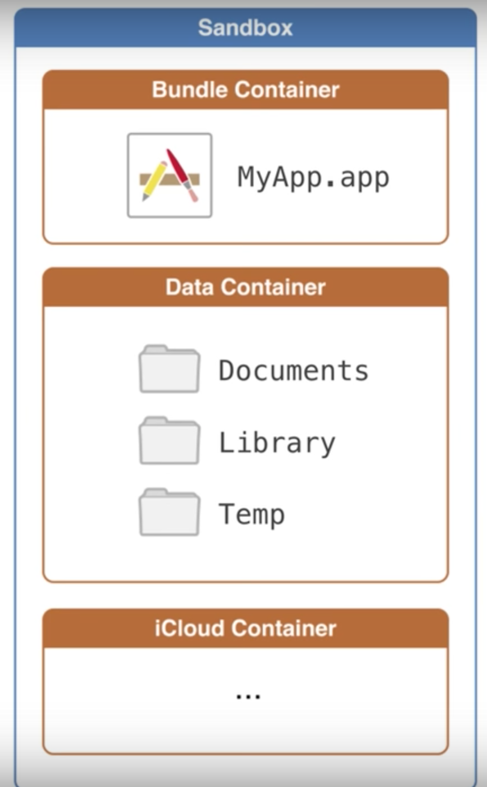
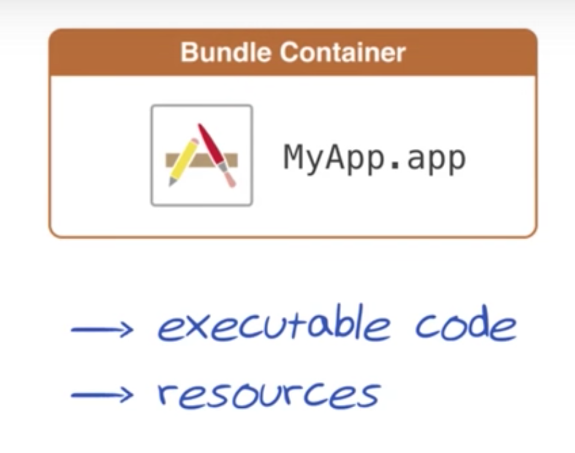
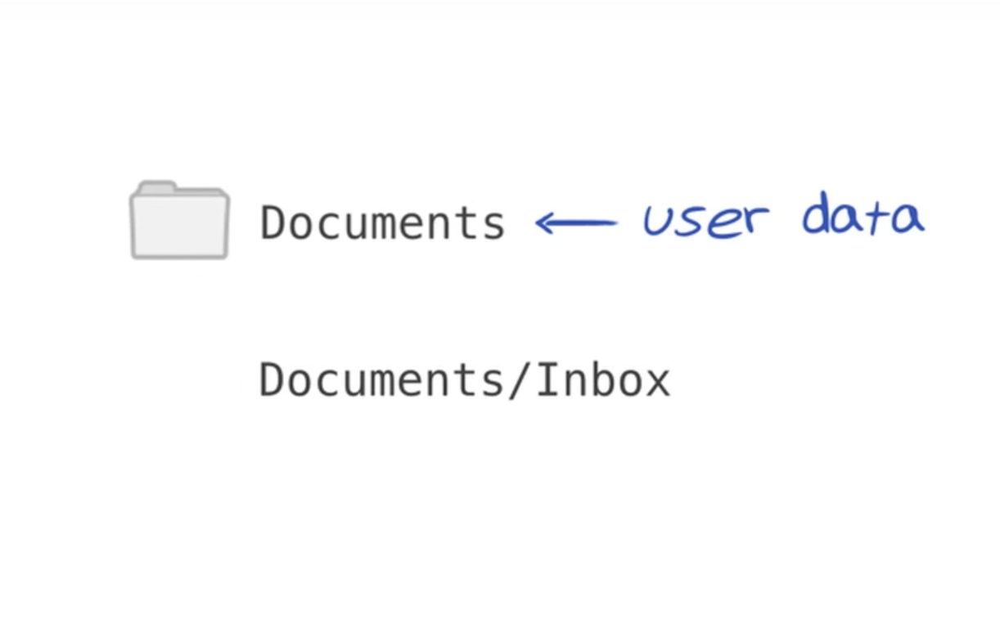
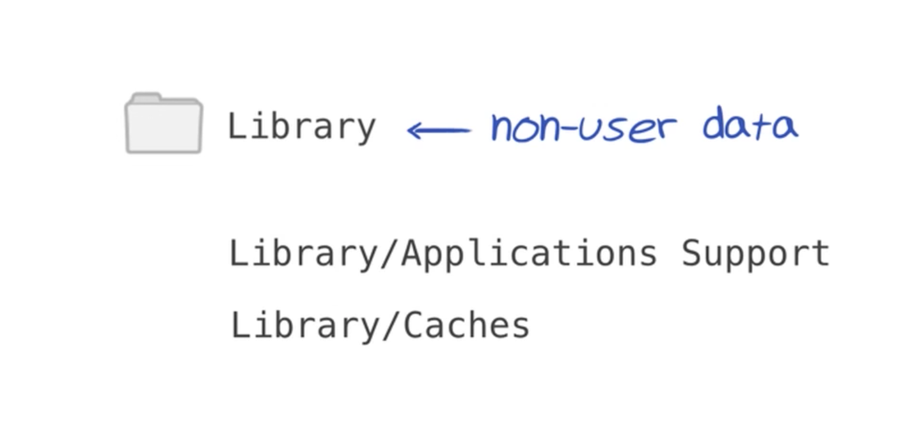
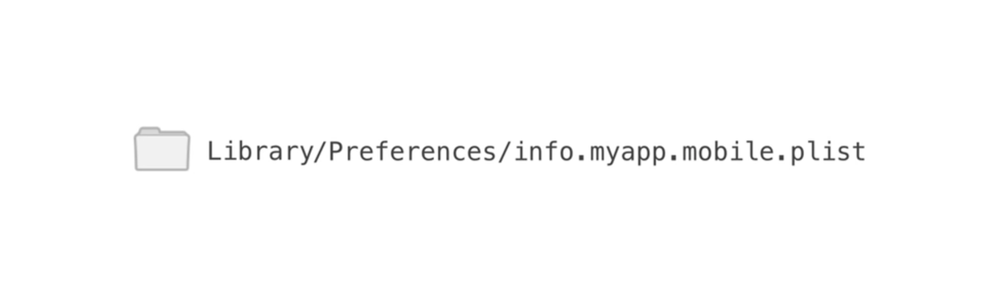

# iOS File System and Data Persistence

### Sandbox

The File System of iOS treats all apps as self contained independent area to keep all it's stuff, known as "Sandbox". There is no fixed size of any sandbox. As long as the device has sufficient overall memory, each app's sandbox can grow in size to fit it's contents.

This is what an app sandbox looks like:



The **Bundle Container** contains the `app` itself, along with `executable code` and `resources` like images and sound files.



The **Data Container** contains all `user and app data`. It has 3 sub-containers:

1. **Tmp/Caches** - Holds temporary data that doesn't need to persist between launches. iTunes and iCloud will not make backup of this folder.

	**Note:** Tmp and Caches are two different folders. The main difference is when they are deleted. Tmp will be deleted more often under normal circumstances. But Caches is not deleted more often.

2. **Documents** - Holds user data and other important information that might be necessary in the future. iTunes and iCloud will make backup of this folder and will never delete it's content.

	It has a few standard sub-directories:
	
	

3. **Library** - Non user data, or data that we don't want to expose to the user.

	It has a few standard sub-directories:
	
	
	
# Persistence in iOS

1. **UserDefaults** - Stores small sized data in binary format
2. **FileManager** - Stores data in files format
2. **CoreData** - Store big sized data in an Object Oriented Database

### UserDefaults

UserDefaults is stored within `Library`. It's exact path is:



### FileManager

In order to save data into Sandbox, we need to do 2 things:

1. **Find where the sandbox is.**

	Use `FileManager` to get the path to the sandbox.

2. **Write to a file.**

	- `String` to write/read text files.
	- `Data` to write/read binary files.

**Example:**

In the `AppDelegate.swift`, write:

```
func sandboxPlayground() {
    let fm = FileManager.default
    let urls = fm.urls(for: .documentDirectory, in: .userDomainMask)
    let url = urls.last?.appendingPathComponent("file.txt")

	//Write stuff
    do {
        try "Hi There!".write(to: url!, atomically: true, encoding: String.Encoding.utf8)
    } catch {
        print("Error while writing")
    }

	//Read stuff
    do {
        let content = try String(contentsOf: url!, encoding: String.Encoding.utf8)

        if content == "Hi There!" {
            print("yay")
        } else {
            print("oops")
        }
    } catch {
        print("Something went wrong")
    }
}

func application(_ application: UIApplication, didFinishLaunchingWithOptions launchOptions: [UIApplicationLaunchOptionsKey: Any]?) -> Bool {
    // Override point for customization after application launch.

    sandboxPlayground()
    return true
}
```

**Problem:** Storing data into files is not recommended. Use a database instead. Sometimes you need to store large amounts of data or query it in a sophisticated manner. But we still want it to be object-oriented.

**Solution:** CoreData