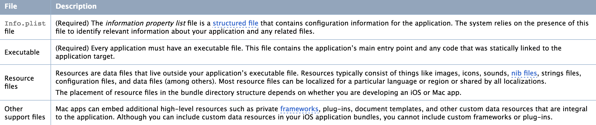

# iOS Executable Folder Structure (.app)

Every iOS application has an executable file, i.e. the `.app` file (not `.ipa` file).

We can find this at:

```
Preferences -> Location -> Debug -> Derived Data -> Build
```

### Types of files in an application bundle



### The iOS Application Bundle Structure

```
MyApp.app
   MyApp
   MyAppIcon.png
   MySearchIcon.png
   Info.plist
   Default.png
   MainWindow.nib
   Settings.bundle
   MySettingsIcon.png
   iTunesArtwork
   en.lproj
      MyImage.png
   fr.lproj
      MyImage.png
```

**Note:**

The `Base.lproj` contains `Xibs` and `Storyboards` and `.strings` files.

----

# The .ipa File

An .ipa file is an iOS application archive file which stores an iOS app. Each .ipa file includes a binary for the ARM architecture and can only be installed on an iOS device. Files with the .ipa extension can be uncompressed by changing the extension to .zip and unzipping.

Most .ipa files cannot be installed on the iPhone Simulator because they do not contain a binary for the x86 architecture. To run applications on the simulator, original project files which can be opened using the Xcode SDK are required. However, some .ipa files can be opened on the simulator by extracting and copying over the .app file found in the Payload folder. Some simple apps are able to run on the simulator through this method.

### Unsigned .ipa executables

An unsigned .ipa can be created by copying the folder with the extension .app from the Products folder of the application in Xcode to a folder called Payload and compressing the latter using the command

```
zip -0 -y -r myAppName.ipa Payload/
```

It is then possible to install unsigned .ipa files on iOS jailbroken devices using third party software; unsigned .ipa files are often used for piracy.

### Structure of a .ipa file

An IPA has a built-in structure for iTunes and App Store to recognize.

```
/Payload/
/Payload/Application.app
/iTunesArtwork
/iTunesArtwork@2x
/iTunesMetadata.plist
/WatchKitSupport/WK
```

As shown above, the Payload folder is what contains all the app data. The iTunes Artwork file is a 512×512 pixel PNG image, containing the app's icon for showing in iTunes and the App Store app on the iPad. The iTunesMetadata.plist contains various bits of information, ranging from the developer's name and ID, the bundle identifier, copyright information, genre, the name of the app, release date, purchase date, etc.